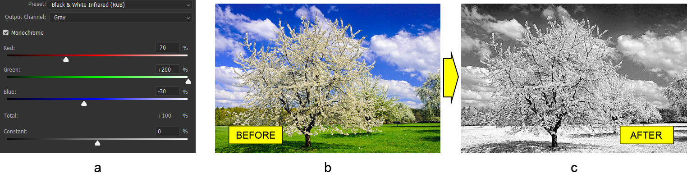

# العمل مع طبقة تعديل مزج القناة في Photoshop باستخدام Java

اليوم سنتعرف على كيفية مزج ألوان القناة في مستندات Photoshop برمجيًا باستخدام Java. نظرًا لعدم دعم محرر Photoshop لنصوص Java، سنستخدم مكتبة تلاعب بتنسيق ملف PSD خاصة تُسمى Aspose.PSD لـ Java.

تحتوي المكتبة على **واجهة برمجة تطبيقات للعمل مع قنوات الألوان**. هناك عدة طرق لمزج الألوان ولكن في هذه المقالة سنركز على طبقة تعديل مزج القناة.

تتيح واجهة برمجة طبقة تعديل مزج القناة **اللعب بقنوات الألوان** لإنشاء صور مزيفة أو تأثيرات ألوان إبداعية مختلفة أو حتى تحويل الصورة إلى صورة سوداء وبيضاء. فيما يلي، سنناقش كيفية تطبيق طبقة تعديل مزج القناة على مستند Photoshop قائم باستخدام Aspose.PSD لـ Java ولكن أولاً نحتاج إلى التحدث عن ميزات واجهة برمجة التطبيقات بشكل عام.

## نظرة عامة على واجهة البرمجة التطبيقية

لا يوجد شيء خاص في إنشاء طبقة تعديل مزج القناة. يمكن إضافتها من خلال [طريقة الصانع الافتراضية](https://reference.aspose.com/psd/java/com.aspose.psd.fileformats.psd/PsdImage#addChannelMixerAdjustmentLayer--) التي تُرجع مثيلًا لفئة ChannelMixerLayer. تحتوي هذه الفئة على وظائف عامة مثل خيار الأحادي اللوني وطريقة للحصول على قناة الإخراج. يمكن أن تكون قناة الإخراج الخاصة إحدى نوعين: [CmykMixerChannel](https://reference.aspose.com/psd/java/com.aspose.psd.fileformats.psd.layers.adjustmentlayers/CmykMixerChannel) أو [RgbMixerChannel](https://reference.aspose.com/psd/java/com.aspose.psd.fileformats.psd.layers.adjustmentlayers/RgbMixerChannel). يعتمد نوع [MixerChannel](https://reference.aspose.com/psd/java/com.aspose.psd.fileformats.psd.layers.adjustmentlayers/mixerchannel) على [وضع اللون](https://reference.aspose.com/psd/java/com.aspose.psd.fileformats.psd/PsdImage#getColorMode--) للصورة.

## جعل الصورة أحادية اللون

الآن، دعونا ننظر في مثال على تطبيق طبقة تعديل مزج القناة على مستند Photoshop قائم. نظرًا لعدم دعم هذا النوع من طبقات التعديل للتحضيرات بعد، سنقوم بإعادة إنشاء تكوين Photoshop الافتراضي للأسود والأبيض والأشعة تحت الحمراء (RGB) (a). سيتم تطبيق التكوين على صورة لشجرة متفتحة (b). كنتيجة، نريد تحقيق تأثير التصوير بالأشعة تحت الحمراء (c).

 أولًا، لإعادة إنشاء تكوين Photoshop للأسود والأبيض والأشعة تحت الحمراء (RGB) من الضروري تمكين العلم أحادي اللون وضبط القيم الخام المناسبة لكل لون (أحمر، أخضر وأزرق) لقناة الإخراج الرمادية:

```
ChannelMixerLayer channelMixerLayer = psdImage.addChannelMixerAdjustmentLayer();
channelMixerLayer.setMonochrome( **true** );
RgbMixerChannel grayOutputChannel = (RgbMixerChannel)channelMixerLayer.getChannelByIndex(0);
grayOutputChannel.setRed(( **short** )-70);
grayOutputChannel.setGreen(( **short** )200);
grayOutputChannel.setBlue(( **short** )-30);
```

يجب أن تكون الصورة في وضع الألوان RGB حتى يعمل الكود (بسبب التحويل إلى فئة RgbMixerChannel). يتم دعم وضع الألوان CMYK أيضًا ولكن فقط للصور بالوضع اللوني المقابل.

تذكر أن قيمة كل لون وكذلك الخاصية الثابتة يجب أن تكون ضمن النطاق من -200 إلى 200.

## الاستنتاج

في هذه المقالة، اعتبرنا كيفية العمل مع واجهة برمجة تطبيقات طبقة مزج القناة في Aspose.PSD لـ Java لضبط الألوان في قنوات ألوان بالإضافة إلى تحويل الصورة إلى أبيض وأسود.