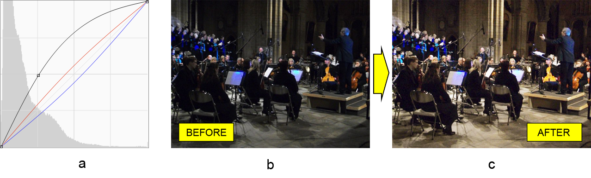
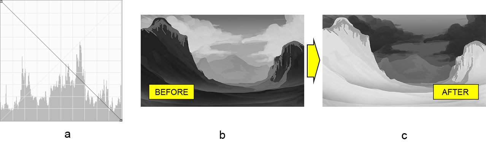

# العمل مع طبقة تعديل المنحنيات في فوتوشوب باستخدام جافا

هدف هذه المقالة هو عرض إمكانيات مكتبة Aspose.PSD لجافا أثناء **العمل مع طبقات تعديل المنحنيات** في مستندات Adobe® Photoshop®. المكتبة مستقلة تمامًا، ولذلك فهي تعمل بدون الحاجة إلى تثبيت محرر الصور فوتوشوب. يمكن العثور على [قائمة كاملة بالميزات](https://docs.aspose.com/psd/java/features/) في قاعدة المعرفة الخاصة بنا. حسنًا، الآن عودة إلى المنحنيات.

## نظرة عامة على واجهة التطبيق

يمكن تمثيل أداة المنحنيات على شكل خط مائل (منحنى) على رسم بياني مع إبرازات في الزاوية العلوية اليمنى والظلال في الزاوية السفلى اليمنى.

توفر المكتبة واجهة برمجة تطبيقات للعمل مع المنحنى، وتحديدًا فئة [CurvesLayer](https://reference.aspose.com/psd/java/com.aspose.psd.fileformats.psd.layers.adjustmentlayers/CurvesLayer). ومع ذلك، تحتوي هذه الفئة على **نهجين مختلفين تمامًا** للعمل مع المنحنى. وبالتالي، يمكن تحريره في أحد وسائط في وقت واحد:

- استمراري (المنحنى الممثل كمسار بنُقاط في أماكن الانثناء)
- متقطع (المنحنى الممثل كخط متقطع)

لذا، تحتوي المكتبة على طريقتين لتعديل المنحنى باستخدام [مدير الاستمراري](https://reference.aspose.com/psd/java/com.aspose.psd.fileformats.psd.layers.layerresources/curvescontinuousmanager) و [مدير المتقطع](https://reference.aspose.com/psd/java/com.aspose.psd.fileformats.psd.layers.layerresources/CurvesDiscreteManager) على التوالي. سنشرح بعد ذلك كيفية استخدام كل منهما على مثال محدد.

## ضبط اللون والدرجة باستخدام مدير المنحنيات المستمر

يقوم [مدير المنحنيات المستمر](https://reference.aspose.com/psd/java/com.aspose.psd.fileformats.psd.layers.layerresources/CurvesContinuousManager)  **بتكوين نقاط الانثناء لمنحنى مستمر** للقناة المركبة (RGB) وأيضًا لكل قنوات الألوان الفردية. لأغراض العرض، سيتم تطبيق بعض ضبط المنحنيات (أ) على صورة مظلمة لفرقة موسيقية (ب) للحصول على صورة مضيئة بألوان دافئة أكثر (ج):



نظرًا لوجود مديرين، من الضروري تحديد واحد بوضوح (مدير مستمر في هذه الحالة)، قبل الحصول عليه. بعد ذلك، يمكننا إضافة مباشرة نقاط منحنى في إحداثيات معينة لقنوات الألوان المرغوبة (RGB المركبة، الأحمر والأزرق على التوالي) لإعادة إنشاء شكل المنحنى:

```
CurvesLayer curvesLayer = psdImage.addCurvesAdjustmentLayer();

curvesLayer.setContinuousManagerUsed(true);
CurvesContinuousManager curvesContinuousManager = (CurvesContinuousManager)curvesLayer.getCurvesManager();

curvesContinuousManager.addCurvePoint(0, (byte)65, (byte)125);
curvesContinuousManager.addCurvePoint(1, (byte)120, (byte)135);
curvesContinuousManager.addCurvePoint(3, (byte)135, (byte)120);
```

أصل الإحداثيات هو في الزاوية السفلى اليمنى. قيمة الإحداثيات القصوى للنقطة محدودة لنوع البيانات (نصف بايت) وتساوي 255 (127 للنوع الموقعي). 

هناك أيضًا بعض [الطرق الأخرى](https://reference.aspose.com/psd/java/com.aspose.psd.fileformats.psd.layers.layerresources/CurvesContinuousManager) يمكنك استخدامها.

## ضبط الدرجة باستخدام مدير المنحنيات المتقطع

يسمح مدير المنحنيات المتقطع أيضًا بوضع نقاط منحنى (تغيير اللون والدرجة بالفعل)، لكن الفرق هو أنه يفعلون ذلك بشكل مختلف. أولًا، **يتكون المنحنى من نقاط** أو نقاط (ليس خطًا صلبًا). ثانيًا، هذا المدير **لا يضع نقطة في أي مكان** في الرسم البياني. بل، **يحرك النقطة لأعلى أو لأسفل** بنطاق قيم بين 255 و 0 على التوالي. بشكل افتراضي،  تزداد قيم نقاط المنحنى بشكل تزايدي لتشكيل منحنى يكون بزاوية 45 درجة.

لذا، بوجود هذا في الاعتبار، من السهل إعادة إنشاء التضبيط المسبق للفوتوشوب "السلبي (RBG)" (أ) وتطبيقه على صورة طبيعية باللون الرمادي لوادي (ب) للحصول في النهاية على تمثيل سلبي للوادي (ج).

 أولًا وقبل كل شيء تأكد من تحديد المدير المناسب لتكون قادرًا على استخدامه، ثم قم بتعيين قيم النقطة للمنحنى بترتيب تنازلي ابتداءً من 255 إلى 0 لكل نقطة منحنى (255 بالإجمالي):

```
CurvesLayer curvesLayer = psdImage.addCurvesAdjustmentLayer();

curvesLayer.setDiscreteManagerUsed(true);
CurvesDiscreteManager curvesDiscreteManager = (CurvesDiscreteManager)curvesLayer.getCurvesManager();

for (int i = 0; i < 255; i++)
{
    curvesDiscreteManager.setValueInPosition(0, (byte)i, (byte)-i);
}
```

يوفر المدير أيضًا بعض [الطرق الأخرى](https://reference.aspose.com/psd/java/com.aspose.psd.fileformats.psd.layers.layerresources/curvesdiscretemanager) لإدارة المنحنى.

## الاستنتاج

في هذه المقالة، تعلمنا كيفية العمل مع طبقات تعديل المنحنيات في مستندات فوتوشوب باستخدام Aspose.PSD لجافا بطريقتين مختلفتين تمامًا (مدير مستمر ومدير متقطع).