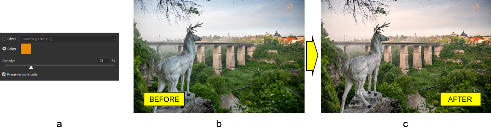

# العمل مع طبقة ضبط تصفية الصور في فوتوشوب باستخدام جافا

اليوم سنرى كيفية تطبيق طبقة ضبط تصفية الصور على مستند فوتوشوب الحالي باستخدام Aspose.PSD لجافا وهي المكتبة المخصصة لتلاعب بتنسيق ملف PSD.

**API لطبقة ضبط تصفية الصور** تقوم بتغيير توازن الألوان في الصورة باستخدام تلوين. ستبدو الصورة الناتجة مثل الصورة بعد استخدام فلتر كاميرا حقيقية. لاحظ أن API لطبقة ضبط تصفية الصور في المكتبة تختلف قليلاً عن فوتوشوب لعدم وجود فلاتر محددة مسبقًا حتى الآن. ومع ذلك، فهي نفسها من جميع النواح الأخرى. يعني ذلك أنه يمكنك تعيين لون التلوين وتغيير كثافته (كثافته) واستخدام خيار الحفاظ على السطوع.

## نظرة عامة على الواجهة البرمجية

واجهة برمجة التطبيقات لطبقة ضبط تصفية الصور بسيطة نسبيًا للاستخدام. هناك الفئة الرئيسية [PhotoFilterLayer](https://reference.aspose.com/psd/java/com.aspose.psd.fileformats.psd.layers.adjustmentlayers/photofilterlayer) التي تكون نقطة الدخول إلى هذه الطبقة التكييفية وتحتوي على ثلاث خصائص عامة فقط، وهي اللون والكثافة والحفاظ على السطوع التي من خلالها تحدث الضبط.

## ضبط توازن الألوان

نظرًا لعدم وجود الكثير للحديث عنه، دعونا ننظر **إلى مثال عن ضبط توازن الألوان** باستخدام تصفية الصور على الفور. سنقوم بإضافة فلتر تدفئة (أ) يدويًا لصورة نصب الأيل (ب) للحصول على الصورة بألوان دافئة (ج) التي تكون أكثر إبهارًا للنظر إليها.

أولاً، لاحظ أن [طريقة الإنشاء](https://reference.aspose.com/psd/java/com.aspose.psd.fileformats.psd/PsdImage#addPhotoFilterLayer-com.aspose.psd.Color-) تختلف عن الخاصه بـ [طبقات الضبط الأخرى](https://docs.aspose.com/display/psdjava/PSD+Adjustment+Layers) لعدم وجود طريقة افتراضية (بدون وسيطات). لذلك، يُطلب فقط وجود وسيط واحد لإضافة طبقة ضبط تصفية الصور لمستند فوتوشوب المحمل وهو لون. لذلك، لإعادة إنشاء تأثير التصفية التدفئة، فقط قم بتمرير اللون البرتقالي كوسيط إلى طريقة الإنشاء، ثم قم بتعيين الكثافة باستخدام المعدنات المقابلة:

    PhotoFilterLayer photoFilterLayer = psdImage.addPhotoFilterLayer(Color._fromArgb_(236, 138, 0));
    photoFilterLayer.setDensity(25);

من الجدير بالذكر أن خاصية الكثافة لها قيمة افتراضية وهي 100 بالإضافة إلى أن القيمة الافتراضية لخاصية الحفاظ على السطوع هي true (لهذا السبب لا نقوم بتمكين هذا الخيار صراحة).

## الاستنتاج

في هذه المقالة قمنا بمراجعة استخدام API لطبقة ضبط تصفية الصور من Aspose.PSD لجافا. هذه الأداة سهلة الاستخدام وتسمح بإضافة لون لصورة بكثافة متغيرة. إنها طريقة سريعة لضبط توازن الألوان في الصورة بأكملها.