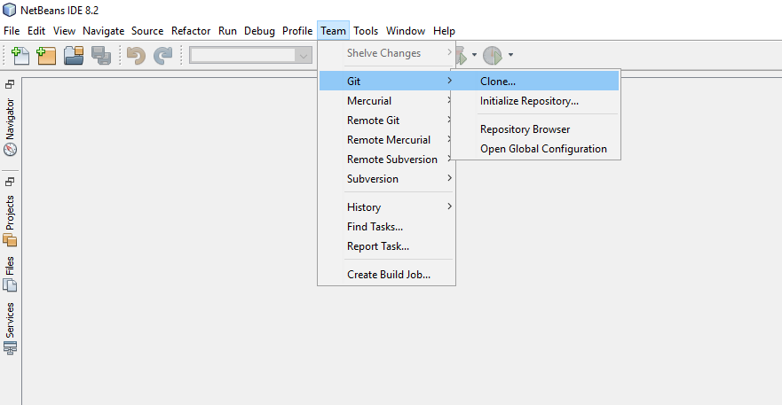

## **تنزيل من Github**
جميع أمثلة Aspose.PSD لـ Java مستضافة على [Github](https://github.com/aspose-psd/Aspose.PSD-for-Java). يمكنك إما نسخ المستودع باستخدام عميل Github أو تنزيل ملف ZIP من [هنا](https://github.com/aspose-psd/Aspose.PSD-for-Java/archive/master.zip).

استخرج محتويات ملف ZIP على جهاز الكمبيوتر الخاص بك. ستجد مجلد **Examples**. جميع الأمثلة موجودة داخل مجلد **Examples**.

يمكنك تشغيل/تنفيذ هذه الأمثلة باستخدام أي بيئة تطوير متكاملة تفضلها، ومع ذلك، لأغراض العرض، نحن نستخدم **NetBeans**. استخدم الخيار **File -> Open Project** لاستيراد الأمثلة التي تختارها وحدد المسار.

أضف ملفات JAR المطلوبة (المكتبات) في المشروع.

يحتوي المجلد **Resources** على المستندات/الملفات الداخلية التي تم الإشارة إليها في الأمثلة.

{} 

يمكنك أيضًا استيراد الأمثلة مباشرة من مستودع Github.

{} 

## **المساهمة**
إذا كنت ترغب في إضافة أو تحسين أمثلة، نشجعك على المساهمة في المشروع. جميع الأمثلة ومشاريع العرض في هذا المستودع مفتوحة المصدر ويمكن استخدامها بحرية في تطبيقاتك الخاصة.

يمكنك المساهمة عن طريق عمل نسخ شخصية من المستودع، تحرير الشيفرة المصدرية وإنشاء طلب دمج. سنراجع التغييرات وسنضمها إلى المستودع إذا وُجدت مفيدة.