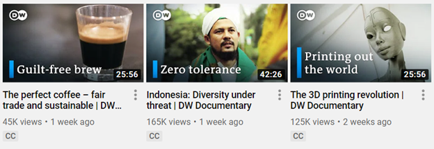

## **المقدمة**
غرض هذا الوثيقة هو توضيح استخدام واجهة برمجة التطبيقات (API) لبعض الأدوات المركبة من [أسوس.بي اس دي لجافا](https://products.aspose.com/psd/java) على مثال حقيقي. في هذه المقالة، سيتم كتابة وشرح **برنامج Java بسيط يولِّد صور مصغرة ليوتيوب** لقناة [DW Documentary](https://www.youtube.com/channel/UCW39zufHfsuGgpLviKh297Q). تم اختيار هذه القناة من الحياة الواقعية لأن صور المصغرة بها معيارية تامة، وتوضح استخدام بعض أدوات أسوس.بي اس دي الشهيرة في جافا (مثل تأثير [ظل](/psd/ar/java/manipulating-photoshop-formats/#manipulatingphotoshopformats-supportdropshadoweffect)، تعبير حلقي متدرج، رسم النصوص والأشكال):



## **كيفية العمل بشكل موجز**
يأخذ برنامج Java بسيط واجهتين كإدخال: تسمية وصورة. يتم إنشاء **مستند Photoshop (PSD) في الذاكرة** من هذا الإدخال باستخدام أسوس.بي اس دي لجافا. بعد ذلك، يقوم البرنامج بتحويل المستند من صيغة PSD إلى ملف PNG للحصول على صورة مصغرة ليوتيوب بحجم 1280x720 بيكسل. تبدو الصورة الناتجة مشابهة للتالي:


## **المتطلبات التقنية**
التقنيات التالية مطلوبة لنجاح تشغيل كود هذه المقالة:

- جافا 6+
- [أسوس.بي اس دي لجافا](/psd/ar/java/installation/) (الأحدث)

## **البدء**
كما تم ذكره بالفعل، يستخدم البرنامج PSD في الذاكرة لإنشاء صورة مصغرة. لذلك، دعنا(**ننشئ مستند PSD**) لنبدأ:

```java
PsdImage psdImage = new PsdImage(1280, 720);
```

إذا نظرت بشكل أقرب إلى صورة المصغرة على يوتيوب أعلاه قد تلاحظ أنها **تتكون من عدة مكونات**:

1. صورة خلفية (تطبع القناع)
1. تدرج حلقي PSD (يسلط الضوء على المنطقة في الزاوية العلوية اليمنى)
1. شعار مع تأثير ظل
1. تسمية ورسم بسيط (مستطيل أزرق)

دعنا نتعمق لنرى كيفية تنفيذ كل من هذه المكونات باستخدام أسوس.بي اس دي لجافا في الأقسام التالية.

## **1. إضافة صورة خلفية**
تُعتبر ترتيب الطبقات مهمة. لذلك، يجب إضافة صورة خلفية أولاً لعدم تداخل الطبقات الأخرى. كن حذرًا من أنه يتم دعم فقط [صيغ ملفات الرسوم النقطية](/psd/ar/java/supported-file-formats/) في الوقت الراهن.
### **1.1. إضافة صورة خلفية إلى طبقة في Photoshop**
لكي **تضيف صورة نقطية إلى PSD**, يجب تمرير تيار الإدخال كوسيط أثناء بناء الطبقة (انظر المزيد من [أمثلة تحميل صور نقطية](https://docs.aspose.com/display/psdnet/Creating%2C+Opening+and+Saving+Images)):

```java

```

1.2. اجعل الصورة الخلفية تناسب القماش

الإجراءتان التاليتان (تغيير الحجم والتموضع) مفيدتان لحالات تختلف فيها حجم الصورة عن حجم القماش، على الرغم من أن حجم الصورة في هذه المقالة هو نفس حجم القماش (اعتبر أنه لن يكون دائمًا هكذا).

تأكد من أن الصورة المحمَّلة تناسب حجم القماش (انظر المزيد من [أمثلة تغيير الحجم](https://docs.aspose.com/display/psdnet/Crop%2C+Rotate+and+Resize+Images#Crop,RotateandResizeImages-ResizingImages)):

```java

```

بعد تغيير الحجم، يتغيّر موضع الصورة. لذلك ، لـ**إعادة تعيين موضع الصورة** بعد تحجيمها، قم بنقل الصورة المحجمة إلى الزاوية اليسرى العلوية:

```java

```

## **2. إضافة تدرج حلقي**
هناك **طريقتان لإضافة تدرج حلقي**, باستخدام:

- تأثير تراكب التدرج (/psd/java/aspose-psd-for-java-20-4-release-notes/#-~-text=psdjava-163) على طبقة موجودة (تأثير التدرج يرتبط بالطبقة الحالية ويُطبق على محتواه)
- طبقة تعبئة تدرج جديدة (/psd/java/support-of-fill-layers/#supportoffilllayers-supportoffilllayerswithgradientfill) (طبقة منفصلة تحتفظ بتكوين مستقل للتدرج)

يكفي استخدام تأثير تراكب التدرج لهذا المثال. ومع ذلك، من المثير للاهتمام والمفيد حول هذه المقالة **استخدام طبقة تعبئة التدرج** لأن جميع تأثيرات الطبقة تُطبق بنفس الطريقة وسيتم استخدام تأثير طبقة آخر في القسم التالي.
### **2.1. إضافة طبقة تعبئة تدرج حلقي**
يتكون عملية إضافة طبقة تعبئة تدرج جديدة من خطوتين:

١. من الضروري **تعريف إعدادات تعبئة التدرج** لعدم وجود التكوينات المحددة مسبقًا. يبدو التكوين الأدنى المطلوب مثل ما يلي (يُفترض أن نوع التدرج، والمقياس، ولون النقطة والشفافية هي خصائص مطلوبة):

```java

```

يقوم التكوين أعلاه بتعريف تدرج حلقي شفاف على الأطراف وأزرق داكن في المركز. الموضع التدرج هو في منتصف القماش بشكل افتراضي.

لعكس تعبئة التدرج وتحويلها قليلاً إلى الزاوية العليا اليمنى، استخدم الخصائص الاختيارية المطابقة:

```java

```

٢. عند الانتهاء من التكوين، أضف طبقة تعبئة تدرج مع إعداداتها إلى PSD:

```java

```

## **إضافة شعار مع ظل**
**ظل الهبوط** هو تأثير يتيح إضافة ظل مخصص على طول حافة الكائن (صورة، نص الخ.).
### **3.1. إضافة شعار إلى طبقة في Photoshop**
يمكن استخدام نفس النهج كما في القسم 1.1. لـ **إضافة شعار إلى PSD**:

```java

```

### **3.2. تموضع الشعار**
الصورة المحملة ملتصقة تماسًا وثيقًا بالزاوية اليسرى العلوية بشكل افتراضي. ومع ذلك، يجب إضافة **هوامش** لتبدو مثل صورة المصغرة الأصلية على القناة. لذلك، يجب تحريك موضع الصورة بعيدًا عن حواف الطبقة:

```java

```

### **3.3. إضافة تأثير ظل الهبوط للشعار**
قد يكون الشعار غير مرئي إذا تم استخدام صورة خلفية فاتحة. لذلك، من المفيد **إضافة تأثير ظل الهبوط** للشعار من خلال خاصية خيارات الدمج (انظر المزيد من [أمثلة للظل](/psd/ar/java/manipulating-photoshop-formats/#manipulatingphotoshopformats-supportdropshadoweffect)):

```java

```

تأثير ظل الهبوط لديه الخصائص المطلوبة نظرًا للتكوين الافتراضي (يبدو كتكوين فوتوشوب). ومع ذلك، تم تعديل الظل أعلاه ليبدو كحافة شفافة متوهجة على الحواف.

## **4. إضافة رسم للنص وشكل**
### **3.1. إنشاء طبقة رسومية**
ليس مدعومًا رسم الطبقة بشكل مباشر. لذا، يتم استخدام محرك الرسوميات بجانب الطبقة **لتوفير واجهة برمجية لرسم الرسوم** (انظر المزيد من [أمثلة الرسم](/psd/ar/java/drawing-images-using-graphics/)):

```java
Layer graphicLayer = psdImage.addRegularLayer();
Graphics graphics = **new** Graphics(graphicLayer);
```

### **3.2. رسم نص متعدد السطور**
قد يتساءل القارئ المختصر: لماذا لا نستخدم طبقة نصية لإضافة نص؟ حسنًا، هناك عدة أسباب: لا توجد حاجة لتحرير النص في هذه الحالة لأن يتم إنشاء PSD من البداية في كل مرة، وتخصيص الخط غير مدعوم بـ [واجهة برمجة التطبيق](https://docs.aspose.com/display/psdnet/Working+With+Text+Layers) بعد (v20.6 في وقت الكتابة).

من السهل **رسم بعض النص مع خط مخصص** فقط أنشئ خطًا مرغوبًا واستدع الطريقة المناسبة من محرك الرسوميات. ومع ذلك، لعمل مستطيل (انظر التفاصيل في القسم التالي) الذي يغير ارتفاعه تلقائيًا استنادًا إلى عدد أسطر النص صعب قليلاً. يجب حس