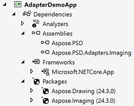

## نظرة عامة

هذا دليل شامل حول كيفية العمل مع Aspose.PSD adapters لتوسيع قدرات Aspose.PSD.
الأدوابترز هي حزم Nuget الخاصة التي تمكن التكامل السلس ل Aspose.PSD مع منتجات Aspose الأخرى، مما يمكنك من تصدير ملفاتك إلى صيغ غير مدعومة بسهولة، دون كتابة رمز تكامل إضافي.

## تطبيق التراخيص

يرجى التحقق من [المقال الكامل بشأن تطبيق التراخيص](/psd/ar/net/adapters/license) للأدوابترز.

{} 
يرجى ملاحظة، لاستخدام الأدوابترز تحتاج إلى تراخيص Aspose.PSD والمنتجات المتكاملة.
{} 

يمكن تطبيق الترخيص باستخدام هذا المثال:


من الأفضل تطبيق التراخيص مرة واحدة في وحدة التهيئة الخاصة بمشروعك

## الرجوع إلى Aspose.PSD أدوابترز

أولاً تحتاج إلى رجوع إلى Aspose.PSD.Adapters.Imaging من [Nuget](https://www.nuget.org/aspose.psd.adapters.imaging) أو تنزيلها من [صفحة الإصدارات الخاصة بـ Aspose](https://releases.aspose.com/psd/net/)(الأدوابترز مضمنة في توزيعة الإصدار الرئيسي في هذا الوقت كملف ثنائي منفصل) إلى مشروعك.

من الممكن أن تحتاج أيضاً إلى رجوع إلى حزم إضافية أخرى

## تمكين Loaders و Exporters من المنتجات المتكاملة

### تمكين الأدوابترز
عند الحاجة إلى استخدام الأدوابترز، استخدم الرمز التالي:

 
### تعطيل الأدوابترز
أثناء عملية التطوير، قد تواجه حالة حين يجب تعطيل الأدوابترز. هذه حالة شائعة إذا كنت بحاجة في جزء من الكود إلى استخدام Loaders من Aspose.PSD واستخدام Loaders من Adaptees في جزء آخر. في هذه الحالة، استخدم الرمز التالي:


## تحميل الصور باستخدام الأدوابترز

باستخدام الأدوابترز يمكنك [تحميل صيغ غير مدعومة شائعة من قبل Aspose.PSD]((/ar/net/adapters/load-unsupported-formats)) مثل SVG أو WebP.

### الاستخدام البسيط
استخدم الرمز التالي للتحميل:


### الاستخدام الوسيط لمعالجة الصورة المعقدة
إذا كنت بحاجة لتحديد خيارات إضافية تُوفرها Adaptee، يرجى التحقق من المثال التالي:


يمكنك العمل بصورة SVG باستخدام جميع ميزات Imaging، ثم تصديرها بمكالمة واحدة.

## تصدير الصور باستخدام الأدوابترز

هناك العديد من الحالات عندما لا تحتاج إلى [فتح صيغة غير مدعومة](/ar/net/adapters/load-unsupported-formats)، بل [تصديرها إليها](/ar/net/adapters/export-to-unsupported-formats). في هذه الحالات يجب تمكين مصدرين واستخدام الرمز التالي:


## الاستنتاج

استخدام Aspose.PSD أدوابترز لتحميل وتصدير الملفات هو عامل تغيير لعمل المطورين. تسمح هذه الحزم Nuget القوية بالتكامل السلس ل Aspose.PSD مع منتجات Aspose الأخرى، مما يجعل من الأسهل من أي وقت مضى فتح الملفات والعمل بها بصيغة غير مدعومة دون كتابة رمز تكامل إضافي. باستخدام Aspose.PSD أدوابترز، يمكنك توفير الوقت والجهد من خلال القضاء على الحاجة إلى رمز إضافي وعمليات التحويل اليدوية. سواء كنت تقوم بتحميل أو تصدير الملفات، تقدم Aspose.PSD أدوابترز حلاً مريحًا وفعالًا يفتح آفاقًا جديدة لمشاريعك. اكتشف قوة Aspose.PSD أدوابترز وقم برفع عملية التطوير إلى المستوى التالي.