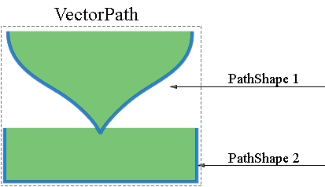

## **نظرة عامة على قناع الطبقة الناقل**
قناع الناقل هو مسار غير مرتبط بالدقة يقوم بقص محتويات الطبقة. تكون قناع الناقل عادة أكثر دقة من تلك التي تم إنشاؤها باستخدام أدوات قائمة على البيكسل. يمكنك إنشاء قناعات ناقلة باستخدام أدوات القلم أو الأشكال.

تدعم Aspose.PSD عملًا وتطبيقًا لقناعات الناقل. يمكنك تحرير قناعات الناقل من خلال تحرير مسارات الناقل.

## **مسار الناقل في Aspose.PSD**
يتم توفير الوصول إلى مسارات الناقل في Aspose.PSD من خلال مصادر [VsmsResouce](https://reference.aspose.com/psd/net/aspose.psd.fileformats.psd.layers.layerresources/vsmsresource) و [VmskResouce](https://reference.aspose.com/psd/net/aspose.psd.fileformats.psd.layers.layerresources/vmskresource) الذين هما فئتين فرعيتين من [VectorPathDataResource](https://reference.aspose.com/psd/net/aspose.psd.fileformats.psd.layers.layerresources/vectorpathdataresource).

## **كيفية تحرير مسار الناقل؟**
### **هيكل مسار الناقل**
الهيكل الأساسي للتلاعب بالمسارات هو [VectorPathRecord.](https://reference.aspose.com/psd/net/aspose.psd.fileformats.core.vectorpaths/vectorpathrecord) ولكن من أجل راحتك، يُقترح الحل التالي.

لتحرير مسارات الناقل بسهولة، يجب عليك استخدام الفئة [VectorPath](https://gist.github.com/aspose-com-gists/8a4c9d34ce856d1642fc7c0ce974175c#file-examples-csharp-aspose-workingwithvectorpaths-classestomanipulatevectorpathobjects-classestomanipulatevectorpathobjects-cs)، والتي تحتوي على طرق لتحرير بيانات المسار براحة في الموارد المشتقة من VectorPathDataResource.

ابدأ بإنشاء كائن من نوع VectorPath.

بالنسبة لراحتك، يمكنك استخدام الأسلوب الثابت [VectorDataProvider.CreateVectorPathForLayer](https://gist.github.com/aspose-com-gists/8a4c9d34ce856d1642fc7c0ce974175c#file-examples-csharp-aspose-workingwithvectorpaths-classestomanipulatevectorpathobjects-classestomanipulatevectorpathobjects-cs)، حيث سيجد مصدرًا ناقلًا في الطبقة المدخلة وسينشئ كائن VectorPath استناداً إليه.

بعد جميع التحريرات، يمكنك تطبيق كائن VectorPath مع التغييرات مرة أخرى على الطبقة باستخدام الأسلوب الثابت [VectorDataProvider.UpdateLayerFromVectorPath](https://gist.github.com/aspose-com-gists/8a4c9d34ce856d1642fc7c0ce974175c#file-examples-csharp-aspose-workingwithvectorpaths-classestomanipulatevectorpathobjects-classestomanipulatevectorpathobjects-cs).



يحتوي نوع VectorPath على قائمة من عناصر [PathShape](https://gist.github.com/aspose-com-gists/8a4c9d34ce856d1642fc7c0ce974175c#file-examples-csharp-aspose-workingwithvectorpaths-classestomanipulatevectorpathobjects-classestomanipulatevectorpathobjects-cs) ويصف صورة ناقلة كاملة يمكن أن تتألف من شكل واحد أو أكثر.

كل PathShape هو رقم مرجعي للصورة التي تتكون من مجموعة من النقاط بيزير.

النقاط هي كائنات من النوع [BezierKnot](https://gist.github.com/aspose-com-gists/8a4c9d34ce856d1642fc7c0ce974175c#file-examples-csharp-aspose-workingwithvectorpaths-classestomanipulatevectorpathobjects-classestomanipulatevectorpathobjects-cs) التي هي في الأساس النقاط التي يتم بناء الصورة منها.

يظهر المثال التالي كيفية الوصول إلى شكل ونقاط.


### **كيفية إنشاء شكل؟**
لتحرير شكل، تحتاج إلى الحصول على شكل موجود من قائمة [VectorPath.Shapes](https://gist.github.com/aspose-com-gists/8a4c9d34ce856d1642fc7c0ce974175c#file-examples-csharp-aspose-workingwithvectorpaths-classestomanipulatevectorpathobjects-classestomanipulatevectorpathobjects-cs)، أو إضافة شكل جديد عن طريق إنشاء مثيل [PathShape](https://gist.github.com/aspose-com-gists/8a4c9d34ce856d1642fc7c0ce974175c#file-examples-csharp-aspose-workingwithvectorpaths-classestomanipulatevectorpathobjects-classestomanipulatevectorpathobjects-cs) وإضافته إلى القائمة [Shapes](https://gist.github.com/aspose-com-gists/8a4c9d34ce856d1642fc7c0ce974175c#file-examples-csharp-aspose-workingwithvectorpaths-classestomanipulatevectorpathobjects-classestomanipulatevectorpathobjects-cs).


### **كيفية إضافة العقد (النقاط)؟**
يمكنك التلاعب في نقاط الشكل كعناصر من قائمة عادية باستخدام خاصية PathShape.Points، على سبيل المثال، يمكنك إضافة نقاط الشكل:



تحتوي BezierKnot على نقطة الربط ونقطتي تحكم.

إذا كانت نقاط الربط والتحكم لها نفس القيم، فسيكون لهذا العقد زاوية حادة.

لتغيير موضع نقطة الربط جنبًا إلى جنب مع نقاط التحكم (على غرار ما يحدث في Photoshop)، فإن BezierKnot يحتوي على طريقة انتقال.

يوضح المثال التالي كيفية تحريك العقد البيزيه بأكمله عموديًا بوحدة إلى الأعلى بالمعلمة Y:

يمكنك التلاعب في نقاط الشكل كعناصر من قائمة عادية باستخدام خاصية PathShape.Points، على سبيل المثال، يمكنك إضافة نقاط الشكل:



## **خصائص PathShape**
تحرير PathShape ليس مقتصرًا على تعديل العقد، بل لهذا النوع أيضًا خصائص أخرى.
### **عمليات المسار (عمليات بوغية)**
تعتبر خاصية [PathOperations](https://reference.aspose.com/psd/net/aspose.psd.fileformats.core.vectorpaths/pathoperations) عملية بوجية، حيث يقوم تغيير قيمتها بتحديد كيفية دمج الأشكال المتعددة.

هناك القيم الممكنة التالية:

- 0 = ExcludeOverlappingShapes (عملية XOR).
- 1 = CombineShapes (عملية OR).
- 2 = SubtractFrontShape (عملية NOT).
- 3 = IntersectShapeAreas (عملية AND).

### **خاصية IsClosed**
باستخدام خاصية PathShape.IsClosed، يمكننا أيضًا تحديد ما إذا كانت العقدة الأولى والأخيرة لشكل متصلة.

|**شكل مغلق**|**شكل مفتوح**|
| :- | :- |
|||
### **خاصية FillColor**
لا يمكن لأي شكل أن يكون لونًا خاصًا به، لذا يمكنك تغيير لون المسار الناقل بخاصية VectorPath.FillColor.

يمكنك التلاعب في نقاط الشكل كعناصر من قائمة عادية باستخدام خاصية PathShape.Points، على سبيل المثال، يمكنك إضافة نقاط الشكل:



## **هنا ستجد رمز المصدر لـ VectorDataProvider والفئات ذات الصلة:**
