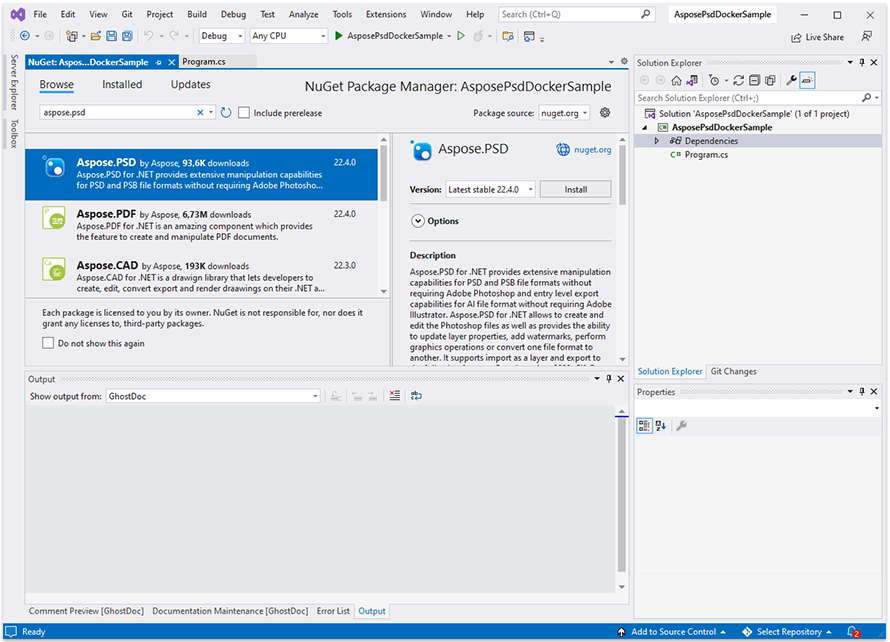

## المتطلبات الأولية

- يجب تثبيت Docker على نظامك. للمزيد من المعلومات حول كيفية تثبيت Docker على Windows أو Mac، راجع الروابط في قسم "انظر أيضًا".
- Visual Studio 2022.
- يُستخدم NET 6 SDK في المثال.
- يمكنك تنزيل مشروع عينة عملي تمامًا من خلال https://github.com/aspose-psd/Aspose.PSD-Docker-Sample

## تطبيق Hello World

في هذا المثال، ستقوم بإنشاء تطبيق وحدة تحكم بسيط يعرض ملف psd، يحدث طبقة النص ويقوم بالرسم باستخدام واجهة برمجة التطبيقات الرسومية. يمكن بناء التطبيق المُبين في Docker.

### إنشاء تطبيق الوحدة النصية

لإنشاء برنامج Hello World، اتبع الخطوات أدناه:
1. بمجرد تثبيت Docker، تأكد من أنه يستخدم حاويات Linux (افتراضيًا). إذا لزم الأمر، حدد خيار تبديل إلى حاويات Linux من قائمة Docker Desktops.
1. في Visual Studio، قم بإنشاء تطبيق وحدة تحكم NET 6. 
 
1. قم بتثبيت أحدث إصدار Aspose.PSD من NuGet. 
 
1. نظرًا لأن التطبيق سيتم تشغيله على Linux، قد تحتاج إلى تثبيت خطوط إضافية. يمكنك تفضيل ttf-mscorefonts-installer.
1. يُرجى ملاحظة أنه لاستخدام ميزات تقديم النص على Linux، يجب عليك إضافة الحزم التالية: apt-transport-https، libgdiplus، libc6-dev. يمكن العثور على الأوامر الخاصة بإضافتهم في ملف dcokerfile.
1. بمجرد إضافة جميع التبعيات المطلوبة، قم بكتابة برنامج بسيط يفتح ملف PSD، يحدث طبقة النص، ثم يقوم برسم شيء باستخدام الرسومات: 



يرجى ملاحظة أنه من أجل تعديل طبقات النص، تحتاج إلى الحصول على الترخيص. يمكنك الحصول على ترخيص مؤقت، باستخدام المقال التالي: https://purchase.aspose.com/temporary-license

### تكوين ملف Dockerfile

الخطوة التالية هي إنشاء وتكوين ملف Dockerfile.

1. قم بإنشاء ملف Dockerfile وضعه بجانب ملف الحل الخاص بتطبيقك. حافظ على اسم هذا الملف بدون امتداد (الافتراضي).
1. في ملف Dockerfile، حدد:


#راجب https://aka.ms/containerfastmode لفهم كيفية استخدام Visual Studio هذا Dockerfile لبناء الصور الخاصة بك لتصحيح الأخطاء بشكل أسرع.

FROM mcr.microsoft.com/dotnet/runtime:6.0 AS base
WORKDIR /app

# لاستخدام القدرة على تحديث طبقات النص، يجب عليك إضافة الحزم التالية إلى حاويتك
RUN apt-get update
RUN yes | apt-get install -y apt-transport-https
RUN yes | apt-get install -y libgdiplus
RUN yes | apt-get install -y libc6-dev

FROM mcr.microsoft.com/dotnet/sdk:6.0 AS build

WORKDIR /src
COPY ["AsposePsdDockerSample/AsposePsdDockerSample.csproj", "AsposePsdDockerSample/"]
RUN dotnet restore "AsposePsdDockerSample/AsposePsdDockerSample.csproj"
COPY . .
WORKDIR "/src/AsposePsdDockerSample"
RUN dotnet build "AsposePsdDockerSample.csproj" -c Release -o /app/build

FROM build AS publish
RUN dotnet publish "AsposePsdDockerSample.csproj" -c Release -o /app/publish

FROM base AS final
WORKDIR /app
COPY --from=publish /app/publish .
ENTRYPOINT ["dotnet", "AsposePsdDockerSample.dll"]


الملف السابق هو ملف Dockerfile بسيط، يحتوي على التعليمات التالية:

- صورة SDK التي سيتم استخدامها. هنا هي صورة Microsoft .Net 6. Docker ستقوم بتنزيلها عند تشغيل البناء. يتم تحديد إصدار SDK كعلامة.
- ثم تضيف التبعيات لعرض النص.
- بعد ذلك، يمكنك أن تحتاج لتثبيت الخطوط لأن صورة SDK تحتوي على عدد قليل جدًا من الخطوط. كما يمكنك استخدام الخطوط المحلية المنسوخة إلى صورة Docker.
- الدليل العامل، الذي يتم تحديده في السطر التالي.
- الأمر لنسخ كل شيء إلى الحاوية، نُشر التطبيق، وتحديد نقطة البداية.

### بناء وتشغيل التطبيق في Docker

#### باستخدام Visual Studio
أسهل طريقة لتجربة Aspose.PSD في Docker هي فتح Visual Studio وتشغيل التطبيق باستخدام دعم Docker

#### باستخدام موجه الأوامر
يمكن بناء التطبيق وتشغيله في Docker باستخدام موجه الأوامر. افتح موجه الأوامر المفضلة لديك، قم بتغيير الدليل إلى المجلد الخاص بالتطبيق (المجلد الذي يتم فيه وضع ملف الحل وملف Dockerfile) وقم بتشغيل الأمر التالي:


docker build -t asposepsddocker .


عند تشغيل هذا الأمر للمرة الأولى قد يستغرق وقتًا أطول، حيث يحتاج Docker إلى تنزيل الصور المطلوبة. بمجرد اكتمال الأمر السابق، قم بتشغيل الأمر التالي:


docker run --name asposepsdcontainer asposepsddocker; docker cp asposepsddocker:/app/Output.psd .; docker cp asposepsddocker:/app/Output.png .; docker rm asposepsdcontainer


{} 

توخ الانتباه إلى وسيط التسليم، لأنه، كما ذُكر سابقًا، يتم توصيل مجلد على جهاز الاستضافة في مجلد الحاوية، لرؤية نتائج تنفيذ التطبيق بسهولة. المسارات في Linux حساسة لحالة الأحرف.

{}

## Beispiele

لمزيد من الأمثلة حول كيفية استخدام Aspose.PSD في Docker، انظر إلى [الأمثلة](https://github.com/aspose-psd/Aspose.PSD-for-.NET).

## انظر أيضًا

- [تثبيت Docker Desktop على Windows](https://docs.docker.com/docker-for-windows/install/)
- [تثبيت Docker Desktop على Mac](https://docs.docker.com/docker-for-mac/install/)
- [Visual Studio 2022، NET 6 SDK](https://docs.microsoft.com/en-us/dotnet/core/install/windows?tabs=net60#dependencies)
- خيار [تبديل إلى حاويات Linux](https://docs.docker.com/docker-for-windows/#switch-between-windows-and-linux-containers)
- معلومات إضافية عن [SDK لـ .NET Core](https://hub.docker.com/_/microsoft-dotnet-sdk)