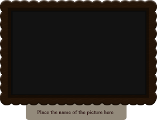

### **نظرة عامة**
توضح هذه المقالة الحالات المستخدمة بشكل متكرر عند الحاجة لتحديث بعض الطبقات في [ملف PSD](https://wiki.fileformat.com/image/psd/) بشكل برمجي، حيث يحتوي ملف PSD/PSB على هيكل يشبه القالب معروف. يمكن استخدام هذا من أجل إنشاء كمية كبيرة من بطاقات الأعمال لأشخاص مختلفين (حالة بطاقات الأعمال). أو إذا كنت بحاجة إلى ترجمة ملف PSD إلى لغات مختلفة مع استبدال بعض المواد البصرية فيه.

بعد قراءة هذه المقالة، ستعرف كيف يمكنك القيام بذلك:

## **حالة بسيطة**
على سبيل المثال، لديك بعض القوالب PSD بأسماء الطبقات المعروفة. لذلك تحتاج إلى تغيير أو تحديث أو استبدال طبقة PSD عبر الـC#. أولاً، تحتاج إلى فتح ملف القالب باستخدام Aspose.PSD.

كيف يمكن فتح ملف PSD عبر الـ C#؟



ثم نحتاج الآن إلى البحث عن طبقة نريد استبدالها بحسب اسمها. هنا تجدون تطبيق بسيط لذلك.

كيفية العثور على الطبقة في ملف PSD بواسطة اسمها



عند العثور على الطبقة، يمكننا تحديثها بالطريقة الشائعة، باستخدام [Graphics](https://reference.aspose.com/psd/net/aspose.psd/graphics):

كيفية الرسم على طبقة PSD بالـ Graphics



في هذه الحالة، نقوم برسم صورة PNG محملة حديثًا على الطبقة PSD الحالية، حيث سيتم فقدان البيانات القديمة في الملف الجديد.

لكن ماذا لو كنا بحاجة أيضًا لتحديث النص؟ سيكون العملية مماثلة. العثور على [طبقة النص](https://reference.aspose.com/psd/net/aspose.psd.fileformats.psd.layers/textlayer) بواسطة اسمها ثم نقوم بتحديثها برمجيًا [طبقة النص في ملف فوتوشوب](/psd/ar/net/render-text-with-different-colors-in-text-layer/) عن طريق C#.

كيفية تحديث طبقة النص في فوتوشوب باستخدام C#



في النهاية، نحتاج إلى حفظ تغييراتنا:

كيفية حفظ ملف PSD المعدل باستخدام [Aspose.PSD](https://products.aspose.com/psd/net)



الصورة الناتجة:

## **حالة معقدة مع ميزات إضافية**
أعلاه، عرضنا أبسط الطرق لاستبدال الصورة في طبقة ملف PSD.

ولكن Aspose.PSD يمكنه تقديم ميزات إضافية معقدة مثل إضافة طبقة جديدة، إزالة الطبقات القديمة، وتحديث طبقة النص باستخدام أنماط مختلفة في نص متعدد الأسطر.

يمكننا العثور على [الطبقة](https://reference.aspose.com/psd/net/aspose.psd.fileformats.psd.layers/layer) التي نريد استبدالها، ثم نجد مؤشرها في قائمة الطبقات، نقوم بإزالتها وإدراج طبقة جديدة بعد إنشائها من [ملف Jpeg](https://wiki.fileformat.com/image/jpeg/) في نفس المكان.

إنشاء طبقة جديدة من الملف وإدراجها في صورة PSD باستخدام [Aspose.PSD](https://products.aspose.com/psd/net)



في نهاية هذا مقطع الكود، نصحح موضع الطبقة ونحفظ مجموعة الطبقات الجديدة على صورة Psd.

كيفية نسخ خصائص الطبقة [PsdImage](https://reference.aspose.com/imaging/net/aspose.imaging.fileformats.psd/psdimage)



وبعد كل ذلك، نحتاج إلى تحديث طبقات النص في صورة PSD الحالية باستخدام C#. Aspose.PSD تدعم [تحديث طبقة النص عن طريق الأجزاء](/psd/ar/net/working-with-text-layers/). كل [جزء نص](https://reference.aspose.com/psd/net/aspose.psd.fileformats.psd.layers.text/itextportion) له مزيج فريد من الأنماط وخصائص الفقرة.

كيفية نسخ خصائص الطبقة [PsdImage](https://reference.aspose.com/imaging/net/aspose.imaging.fileformats.psd/psdimage)



نتيجةً، لقد قمنا بتغيير قالب PSD عبر الكود مع طبقة جديدة من ملف Jpeg، PNG، J2k، Bmp، Gif، أو Tiff ونص متعدد الأسطر بأنماط مختلفة في كل سطر.

