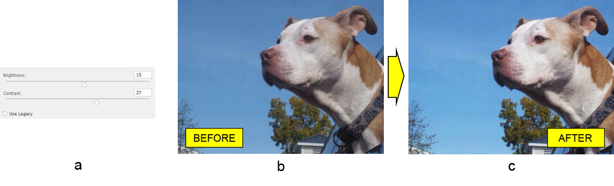

# Работа с Photoshop слой за корекция на яркост/контраст в Java

В тази статия ще приложим корекция на яркост/контраст към документ в Adobe® Photoshop® използвайки библиотеката Aspose.PSD за Java®. Също така, ще научим повече за функциите на библиотеката, свързани с този тип слой за корекция.

Но първо малко теория.

Слоят за корекция на яркост/контраст променя яркостта и контраста на изображението. Но почакайте малко, какво всъщност означава това? Увеличаването на яркостта изсветлява цветовата стойност до бяло, а намаляването на яркостта затъмнява цветовата стойност до черно. Увеличаването на контраста, от своя страна, ще увеличи разликата между светли и тъмни цветове, а намаляването на контраста ще намали тази разлика съответно; това означава, че светлите цветове стават по-светли, а тъмните цветове стават по-тъмни.

## Поддръжка на режим на цветност

Библиотеката позволява добавянето на слой за корекция на яркост и контраст към изображения в режим на цветност RGB, CMYK или Lab.

## Сегашното и миналото поведение

Текущата имплементация на библиотеката (v20.6 в момента на писане) използва стандартния алгоритъм на Photoshop, който запазва пълния тонален обхват от сенките до светлините, но все още не поддържа миналото поведение. Това означава, че библиотеката поддържа слой за корекция на яркост/контраст в документи, създадени в последните версии на Photoshop (CS4 и по-нови). Все пак, ако ви е необходима, можете [да поискате имплементация на миналото поведение на слоя за корекция на яркост/контраст](https://forum.aspose.com/c/psd) в нашия форум.

## Настройка на яркост и контраст

Сега нека опишем как работи API на високо ниво на слоя за корекция на яркост/контраст (напреднато, API-то е прости). Класът PsdImage съдържа фабричен метод (addBrightnessContrastAdjustmentLayer) за инстанциране на класа BrightnessContrastLayer, който е порталът за корекция на яркост и контраст. Класът BrightnessContrastLayer просто съдържа двойка методи за вземане и задаване на свойствата за яркост и контраст, както и промяна на техните стойности.

И така, нека вземем изображение на куче (b), например, за да настроим неговата яркост1 и контраст2 (a), като използваме само фабричния метод със съответните аргументи, за да получим накрая изображение (c), което изглежда по-живо:

BrightnessContrastLayer brightnessContrastLayer = psdImage.addBrightnessContrastAdjustmentLayer(15, 27);

Забележки:

1. Стойността на яркостта трябва да бъде в интервала от -150 до 150.
2. Стойността на контраста трябва да бъде в интервала от -50 до 100.

Препоръчваме да се обърнете към документацията на [BrightnessContrastLayer](https://reference.aspose.com/psd/java/com.aspose.psd.fileformats.psd.layers.adjustmentlayers/BrightnessContrastLayer) за повече подробности.

## Заключение

В тази статия получихме бърз преглед на слоя за корекция на яркост/контраст и научихме как да настроим яркостта и контраста на изображението, използвайки фабричния метод.

Препоръчваме да разгледате серията от [статии за API на слоя за корекция](/bg/java/layer-types/adjustment-layer/) на Aspose.PSD за Java, за да научите повече.
