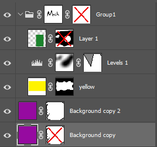

## **Преглед**
**За автоматизиране на редакцията на формат PSD и промяната на PSD файл без Adobe® Photoshop®, можете да използвате API на Aspose.PSD, предоставен по-долу. Има C# и .NET кодови откъски, които могат да ви помогнат да промените PSD файлове.**

С използване на PSD маски на слоеве и векторни маски сме в състояние да скриваме и показваме пиксели на слоя, без да ги изтриваме перманентно. Растерните маски се наричат също слойна маска или потребителска маска. Достъпът до и двете растерни и векторни маски в Aspose.PSD се осъществява чрез свойството на слоя [LayerMaskData](https://reference.aspose.com/psd/net/aspose.psd.fileformats.psd.layers/layer/properties/layermaskdata), което може да е инстанция на класовете '[LayerMaskDataShort](https://reference.aspose.com/psd/net/aspose.psd.fileformats.psd.layers/layermaskdatashort)' и '[LayerMaskDataFull](https://reference.aspose.com/psd/net/aspose.psd.fileformats.psd.layers/layermaskdatafull)', които са детски класове на абстрактния клас 'LayerMaskData'. Ако слоят има и растерни, и векторни маски, тогава се предоставя инстанция на [LayerMaskDataFull ](https://reference.aspose.com/psd/net/aspose.psd.fileformats.psd.layers/layermaskdatafull). Ако слоят има само растерна или векторна маска, тогава се предоставя инстанция [LayerMaskDataShort ](https://reference.aspose.com/psd/net/aspose.psd.fileformats.psd.layers/layermaskdatashort). Ако свойството LayerMaskData е нулево, то тогава слоят няма маски или има само деактивирана векторна маска.

||
Растерна маска и деактивирана векторна маска LayerMaskDataShort

Деактивирана растерна маска  LayerMaskDataShort

Растерна маска и векторна маска  LayerMaskDataFull

Растерна маска  LayerMaskDataShort

Векторна маска  LayerMaskDataShort

Деактивирана векторна маска null (Но векторният ресурс е налице)
|
| :- | :- |
## **Как да получите растерната маска на слоя в PSD файла?**
На първо място, трябва да разберем дали слоят има както векторни, така и растерни маски:

Предоставеният по-долу примерен код демонстрира как да получите растерна маска на слоя:



В противен случай, типът на свойството LayerMaskData е LayerMaskDataShort. В този случай, нека проверим дали слоят има само растерна маска, като проверим свойството Flags. То не трябва да съдържа флага [LayerMaskFlags](https://reference.aspose.com/psd/net/aspose.psd.fileformats.psd.layers/layermaskflags).**UserMaskFromRenderingOtherData**, в противен случай маската е векторен кеш**.**

Кодов откъс за извличане на маска:



Ако имате нужда от **извличане на растерна маска** като LayerMaskDataShort (за по-нататъшни манипулации) дори когато и двете маски са налице, трябва да се извлече LayerMaskDataFull и да се конвертира в LayerMaskDataShort. Следващият код може да се използва за двата случая:

Извличане на растерна маска от PSD


## **Как да проверите дали слой в PSD файла има растерна маска?**
Следният C# код може да ви помогне да проверите дали слоят има растерна маска:

Как да разберете дали е приложена растерна маска към [PSD слоя](/psd/bg/net/psd-layer/)


## **Как да премахнете / добавите / актуализирате растерна маска на слой в PSD файла?**
Просто премахването / добавянето / актуализирането на LayerMaskData не е достатъчно за правилно запазване, тъй като каналите не се актуализират; въпреки че може да осигури правилно изкарване. Това не променя каналите на маската:



Трябва да използваме метода AddLayerMask на слоя за премахване / добавяне / актуализиране.

Това добавя/актуализира както маската, така и каналите:



Това премахва както маската, така и каналите:


## **Премахване на растерна маска на слой в изображението PSD**
Първоначално проверяваме дали маската е в кратък формат и ако не е векторна, можем просто да извикаме метода AddLayerMask с нула, за да изтрием растерната маска. Но ако тя е в пълен формат, трябва да я преобразуваме в кратък формат, като оставим само векторната маска. За премахване на маска на слой може да се използва следният кодов откъс C# .NET:

Кодов откъс как да премахнете маска на слой от PSD файл.


## **Актуализиране на растерна маска на слой в изображението PSD**
Това е просто: ако маската е в кратък формат, трябва да променим ImageData и MaskRectangle при необходимост, в противен случай [UserMaskData ](https://reference.aspose.com/psd/net/aspose.psd.fileformats.psd.layers/layermaskdatafull/properties/usermaskdata)и [UserMaskRectangle ](https://reference.aspose.com/psd/net/aspose.psd.fileformats.psd.layers/layermaskdatafull/properties/usermaskrectangle)трябва да бъдат променени. Следният C# .NET кодов откъс може да се използва за актуализиране на маска на слоя:

Актуализиране на PSD маската на слоя с C#.



Ето един пример за възможни действия, които променят растерна маска. Този пример инвертира потребителската маска на слой:

Актуализиране на PSD маската на слоя с C#.


## **Актуализиране на векторна маска в PSD файла, когато маската на растерния слой е налице**
Предполага се, че потребителят вече е променил векторния път. Тогава може да актуализира векторната маска просто чрез извикване на метода [AddLayerMask ](https://reference.aspose.com/psd/net/aspose.psd.fileformats.psd.layers/layer/methods/addlayermask)на слоя:

Актуализиране на [PSD Layer Vector Mask ](/psd/bg/net/layer-vector-mask/)с C#.


## **Добавяне на растерна маска на слой в PSD файла**
Ако слоят няма маска, можем да добавим подадената растерна маска, като извикаме метода AddLayerMask на слоя.

Ако маската няма [UserMaskFromRenderingOtherData** ](https://reference.aspose.com/psd/java/com.aspose.psd.fileformats.psd.layers/LayerMaskFlags)флаг, тогава вече има растерна маска и трябва да я актуализираме, както е описано по-горе. В противен случай, ако тази маска е в кратък формат, я преобразуваме в пълен формат. Ако не, я използваме каквато е. Следният C# .NET кодов откъс може да се използва за добавяне (актуализиране) на маска на слой:

Добавяне на нова маска на слой в PSD



## **Как да проверите дали маската на слоя е активирана?**
За да разберете дали маската на слоя е активирана, можем да проверим състоянието на флага LayerMaskFlags.Disabled в свойството Flags за LayerMaskDataShort или в RealFlags за LayerMaskDataFull. Следният C# .NET код може да се използва за получаване на състоянието на активирана маска на слоя:

Проверка дали маската е активирана:


## **Как да активирате или деактивирате растерна маска на слоя?**
За да активирате или деактивирате растерна маска на слоя, можем да променим състоянието на флага LayerMaskFlags.Disabled в свойството Flags за LayerMaskDataShort или в RealFlags за LayerMaskDataFull. Следният C# .NET кодов откъс може да се използва за промяна на състоянието на активирана маска на слоя:

Активиране или деактивиране на Растерна маска на слоя:

