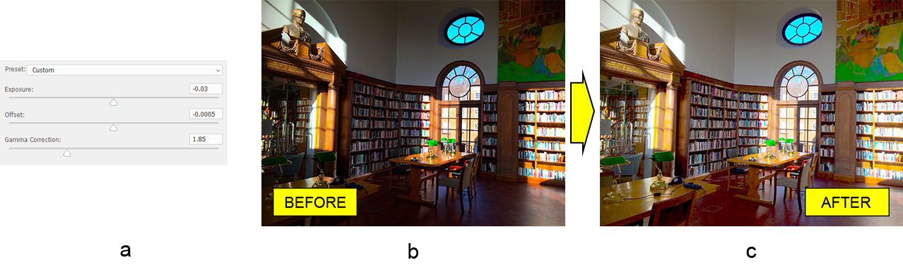

# Práce s vrstvou úprav expozice v Photoshopu v Javě

V tomto článku se naučíme přidávat vrstvu úprav expozice do dokumentu Adobe® Photoshop® pomocí Aspose.PSD pro Javu - knihovny pro manipulaci s formátem souboru PSD. Knihovna funguje bez nainstalovaného editoru Photoshopu, protože používá vlastní algoritmy zpracování obrázků. Také jsme se naučili některé detaily týkající se API úprav expozice knihovny.

## Přehled API

Vrstva úprav expozice se konfiguruje pomocí třídy [ExposureLayer](https://reference.aspose.com/psd/java/com.aspose.psd.fileformats.psd.layers.adjustmentlayers/exposurelayer), která obsahuje následující vlastnosti pro práci s úpravou expozice:

- Definuje, jak moc světla fotografie obsahuje tím, že stlačuje nebo protahuje celý histogram vzhledem k černým barvám. Takže ovlivňuje hlavně světlé oblasti.
- Na rozdíl od expozice, posun ovlivňuje především stíny.
- Gama korekce. Koreguje svítivost obrázku.

## Správná expozice

Korekce expozice a související vlastnosti jsou tak jednoduché jako změna několika vlastností třídy. Nechceme aplikovat některé úpravy expozice (a) na podexpozovanou fotografii knihovny (b), abychom ji učinili vnímatelnou pro lidské oko (c).

Celá úprava je provedena hlavně pomocí gama korekce. Nicméně, expozice a posun jsou také trochu upraveny. Vše, co musíte udělat, je nastavit vhodné hodnoty již zmíněným vlastnostem:

    ExposureLayer exposureLayer = psdImage.addExposureAdjustmentLayer();
    exposureLayer.setExposure(-0.03f);
    exposureLayer.setOffset(-0.0005f);
    exposureLayer.setGammaCorrection(1.85f);

Mějte na paměti, že hodnota expozice musí být v rozmezí od -20.0 do 20.0, hodnota posunu musí být v rozmezí od -0.5 do 0.5 a rozsah hodnoty gama korekce musí být mezi 9.99 a 0.01.

Podívejte se na [API referenci vrstvy úprav expozice](https://reference.aspose.com/psd/java/com.aspose.psd.fileformats.psd.layers.adjustmentlayers/ExposureLayer) pro více informací.

## Závěr

V tomto článku jsme se naučili, jak přidat vrstvu úprav expozice do souboru PSD, abychom zesvětlili obrázek, a zároveň jsme zohlednili některé detaily API.
