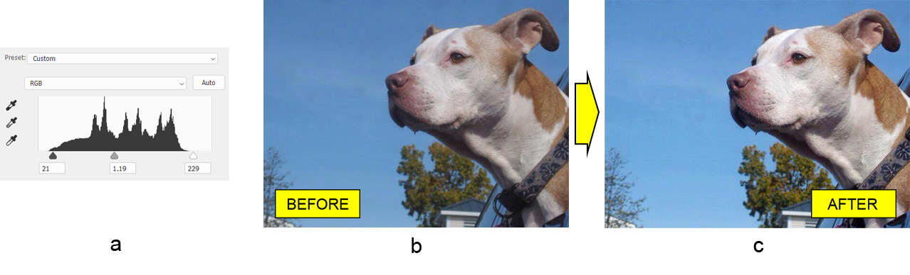

## Práce s vrstvou úrovní Photoshopu v Javě

V tomto článku se naučíme, jak programově upravit tónový rozsah a barevnou vyváženost fotografie ve formátu souboru PSD v Javě. Nepoužíváme samotný editor fotografií Adobe® Photoshop®. Místo toho používáme knihovnu Aspose.PSD pro Javu, která funguje samostatně k manipulaci s dokumentem Photoshopu.

I když Aspose.PSD pro Javu podporuje více než dostatek nástrojů k úpravě fotografií podle našich požadavků, pojďme **pracovat s API vrstvy úrovní**, což je jeden z nejjednodušších a nejrychlejších způsobů provedení práce.

## Přehled API

Aktuální implementace (20.6 v době psaní) API vrstvy úrovní **podporuje všechny základní funkce úrovní Photoshopu**, konkrétně úpravu vstupních a výstupních úrovní pro kompozitní kanál (RGB) a pro každý primární barevný kanál (červená, zelená a modrá).

API vrstvy úrovní je přímé. Třída [LevelsLayer](https://reference.aspose.com/psd/java/com.aspose.psd.fileformats.psd.layers.adjustmentlayers/LevelsLayer) je vstupním bodem pro úpravu úrovní. Obsahuje pár metod pro přístup k barevným kanálům: getMasterChannel a getChannel(int). Obě metody vracejí [LevelChannel](https://reference.aspose.com/psd/java/com.aspose.psd.fileformats.psd.layers.layerresources/LevelChannel), který má odpovídající vlastnosti pro manipulaci s vstupními a výstupními úrovněmi. Rozdíl spočívá v tom, že getMasterChannel slouží k úpravě kompozitního barevného kanálu (RGB), zatímco getChannel umožňuje přístup k určitému barevnému kanálu (červená, zelená nebo modrá) pomocí indexu.

## Kompatibilita s barevnými režimy

Je důležité dodat, že vrstva úrovní **je kompatibilní s většinou barevných režimů** podle úrovní Photoshopu. Proto je možné upravovat úrovně pro obrázky v odstínech šedi (šedý kanál), RGB (RGB, červený, zelený a modrý kanál), CMYK (CMYK, azurový, purpurový, žlutý a černý kanál), Duotón (jednobarevný kanál) a LAB (jas, a a b kanál) barevných režimech.

## Úprava tónového rozsahu

Jednoduše řečeno, tónová korekce se aplikuje na obrázek k přemapování stínů a světel pro lepší distribuci středních tónů. Obvykle **zvýrazní kontrast obrázku**, pokud je provedena správně. Například vezměme fotografii psa (b) a upravme jeho tónový rozsah (a - snímek je pořízen z okna úrovní Photoshopu pro lepší viditelnost) tak, aby fotografie vypadala kontrastněji (c).

||

Pro **úpravu celkového tónového rozsahu** obrázku by měly být nastaveny vstupní úrovně hlavního kanálu:

    LevelsLayer levelsLayer = psdImage.addLevelsAdjustmentLayer();

    LevelChannel masterChannel = levelsLayer.getMasterChannel();
    masterChannel.setInputShadowLevel(( **krátká** )21);
    masterChannel.setInputMidtoneLevel(( **plovoucí** )1.19);
    masterChannel.setInputHighlightLevel(( **krátká** )229);

Je důležité si uvědomit, že vstupní úrovně by měly být v rozmezí 0 až 253 pro stíny, 9.99 až 0.01 pro střední tóny a 2 až 255 pro světla. Rozsah výstupních úrovní musí být mezi 0 a 255.

Potřebujete ještě více příkladů? Můžete je najít na [Githubu](https://github.com/aspose-psd/Aspose.PSD-for-Java) a v [databázi znalostí](https://docs.aspose.com/display/psdjava/Manipulating+Photoshop+Formats#ManipulatingPhotoshopFormats-AddLevelAdjustmentLayers).

## Závěr

Shrnutí: Aspose.PSD pro Javu má užitečné a jednoduché API pro změnu tónového rozsahu a barevné vyváženosti obrázku, které je kompatibilní s téměř všemi barevnými režimy. API vrstvy úrovní knihovny vypadá podobně jako úrovně Photoshopu, je tedy snadné začít, i když jste s knihovnou dříve nepracovali.
