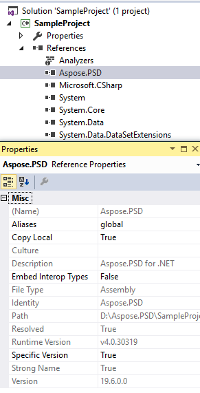

## **Instalace Aspose.PSD pro .NET pomocí NuGetu**
NuGet je nejjednodušší způsob, jak stáhnout a nainstalovat Aspose API pro .NET. Otevřete Microsoft Visual Studio a správce balíčků NuGet. Vy‐hledejte "aspose", abyste našli požadované API od Aspose. Klepněte na „Instalovat“, vybrané API se stáhne a bude použito ve vašem projektu.

## **Instalace nebo aktualizace Aspose.PSD přes konzoli správce balíčků**
Můžete postupovat podle následujících kroků k použití [API Aspose.PSD](https://www.nuget.org/packages/Aspose.psd/) pomocí konzole správce balíčků:

1. Otevřete své řešení/projekt v Visual Studiu.
1. Z nabídky vyberte Nástroje -> Správce knihoven balíčků -> Konzole správce balíčků.

Zadejte příkaz “**Install-Package Aspose.Psd**” a stiskněte Enter pro instalaci nejnovější plné verze do vaší aplikace. Alternativně můžete k příkazu přidat příponu "**-prerelease**" pro specifikaci instalace nejnovější verze včetně oprav chyb.

Uvidíte zprávu **"Instalace Aspose.PSD"** dole v okně, což označuje průběh stahování.

Jakmile je stáhnutí dokončeno, uvidíte následující potvrzovací zprávy. Pokud neznáte [licenční smlouvu Aspose](https://company.aspose.com/legal/eula), je dobrý nápad přečíst si licenci odkazovanou v URL.

Nyní byste měli zjistit, že Aspose.PSD byl úspěšně přidán a referencován ve vaší aplikaci.

V konzole správce balíčků můžete také použít příkaz “**Update-Package Aspose.Psd**” a stisknout Enter k ověření jakýchkoli aktualizací balíčku Aspose.Psd a jejich instalaci v případě jejich přítomnosti. Můžete také přidat příponu "-prerelease" pro aktualizaci nejnovější verze.
## **Zvažte při použití v prostředí sdíleného serveru**
Všechny komponenty Aspose .NET jsou doporučeny k provozování s podmínkami plné důvěry. To je z důvodu, že komponenty Aspose .NET někdy potřebují přístup k nastavením registru a souborům umístěným na jiných místech než v virtuálním adresáři např. pro čtení písem atd. Dále jsou komponenty Aspose.NET založeny na jádrových třídách systému .NET, některé z nich také vyžadují oprávnění plné důvěry pro provoz v některých případech.

Poskytovatelé internetových služeb hostující mnoho aplikací od různých společností obvykle uplatňují úroveň zabezpečení Střední důvěra. V případě .NET 2.0 tato úroveň zabezpečení může stanovit následující omezení, která by mohla ovlivnit schopnost Aspose.Words plně fungovat.

- **RegistryPermission** není k dispozici. To znamená, že nemůžete přistupovat k registru, což je vyžadováno k výčtu instalovaných písem při vykreslování dokumentů.
- **FileIOPermission** je omezeno. To znamená, že můžete přistupovat pouze k souborům ve hierarchii virtuálního adresáře vaší aplikace. To potenciálně znamená, že písma nelze přečíst při exportu.

Z výše uvedených důvodů se doporučuje, aby Aspose.PSD běžel s oprávněními plné důvěry. Může se stát, že některé funkce knihovny budou fungovat při provádění různých úkolů na Střední důvěru, zatímco jiné ne (například vykreslování), což může být způsobeno voláním zpracování obrázku GDI+.

## **Práce s .NET Core DLL nainstalovanými pomocí MSI balíčku**

**Poznámka:** Pokud používáte .Net Standard dll nainstalované pomocí MSI balíčku, měli byste přidat nezbytné závislosti pro práci s verzí .Net Standard.

|**Snímek závislostí Visual Studia:**|**Fragment souboru CsProj:**|
| :- | :- |
||<ItemGroup>

`    `<PackageReference Include="System.Drawing.Common" Version="4.5.1" />

`    `<PackageReference Include="System.Text.Encoding.CodePages" Version="4.5.0" />

</ItemGroup>|
## **Systémové požadavky**
### **Podporované operační systémy:**
- Microsoft Windows 2000 Professional a Server (doporučeno SP2)
- Microsoft Windows XP Professional a Home Edition
- Microsoft Windows 2003 Server
- Microsoft Windows Vista
- Microsoft Windows 2008 Server
- Microsoft Windows 2008 Server R2
- Microsoft Windows 7
- Microsoft Windows 8
- Microsoft Windows 10
- Microsoft Windows 11
### **Podporované platformy:**
- Okenní formuláře
- Webové formuláře
- Visual Studio 2005
- Visual Studio 2008
- Visual Studio 2010
- Visual Studio 2012
- Visual Studio 2013
- Visual Studio 2015
- Visual Studio 2017
- Visual Studio 2019
- Visual Studio 2022

Aspose.PSD funguje pro obě verze x86 a x64 uvedených operačních systémů.
### **Podporované rámce:**
Aspose.PSD pro .NET podporuje .NET framework následovně:

- .NET Framework verze 2.0 nebo vyšší
- .NET Standard 2.0
