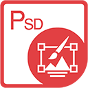

{} 

****

**Willkommen bei Aspose.PSD für .NET**

Aspose.PSD für .NET ist ein Produkt, das eine umfassende Manipulation von PSD-Dateiformaten ermöglicht. Das Produkt erfordert nicht die Installation von Adobe Photoshop. Aspose.PSD für .NET ermöglicht das Bearbeiten von PSD-Dateien, das Aktualisieren von Ebeneneigenschaften, das Hinzufügen von Wasserzeichen, das Ausführen von Grafikoperationen oder das Konvertieren eines Dateiformats in ein anderes. Dieses Produkt ermöglicht verschiedene Automatisierungsszenarien, die Entwicklern auf ihrem Weg helfen.

Aktuell unterstützt Aspose.PSD für .NET PSD- und PSB-Dateiformate zum Laden und Manipulieren. Zukünftige Versionen werden das Laden weiterer PSD-Dateiformate ermöglichen. Aspose.PSD für .NET ermöglicht den Export in verschiedene Rasterdateiformate wie TIFF, JPEG, JPEG2000, PNG, GIF, BMP und es werden weitere unterstützte Dateiformate für den Export hinzugefügt. Das Produkt verwendet Algorithmen, die eine effiziente Bearbeitung von PSD-Dateien ermöglichen und eine gute Leistung beibehalten. Das Produkt wird aktiv weiterentwickelt und es werden viele nützliche Funktionen hinzugefügt, um den Marktanforderungen gerecht zu werden. Unterstützung für .NET Core wird beispielsweise aktiv entwickelt.

{} 

## **Ressourcen für Aspose.PSD für .NET**

Im Folgenden finden Sie Links zu einigen nützlichen Ressourcen, die Sie benötigen könnten, um Ihre Aufgaben zu erledigen.

- [Online-Dokumentation für Aspose.PSD für .NET](/psd/de/net/)
- [Funktionen von Aspose.PSD für .NET](/psd/de/net/features/)
- [Versionshinweise zu Aspose.PSD für .NET](/psd/de/net/release-notes/)
- [Produktseite von Aspose.PSD für .NET](https://products.aspose.com/psd/net)
- [Aspose.PSD für .NET NuGet-Paket installieren](https://www.nuget.org/packages/Aspose.PSD/)
- [Aspose.PSD für .NET API-Referenzhandbuch](https://reference.aspose.com/net/psd)
- [Beispiele herunterladen im GitHub-Repository](https://github.com/aspose-psd/Aspose.PSD-for-.NET)
- [Kostenloses Supportforum für Aspose.PSD für .NET](https://forum.aspose.com/c/psd)
- [Hilfeschalter für kostenpflichtigen Support von Aspose.PSD für .NET](https://helpdesk.aspose.com/)

{} 

****

**Willkommen bei Aspose.PSD für Java**

Aspose.PSD für Java ermöglicht eine umfassende Manipulation von PSD-Dateiformaten. Das Produkt erfordert nicht die Installation von Adobe Photoshop. Aspose.PSD für Java ermöglicht das Bearbeiten von PSD-Dateien, das Aktualisieren von Ebeneneigenschaften, das Hinzufügen von Wasserzeichen, das Ausführen von Grafikoperationen und das Konvertieren eines Dateiformats in ein anderes. Das Produkt unterstützt auch verschiedene Automatisierungsszenarien, die Entwickler auf ihrem Weg unterstützen.

Aktuell unterstützt Aspose.PSD für Java PSD- und PSB-Dateiformate zum Laden und Manipulieren. Zukünftige Versionen werden das Laden weiterer PSD-Dateiformate ermöglichen. Aspose.PSD für Java ermöglicht den Export in verschiedene Rasterdateiformate wie TIFF, JPEG, JPEG2000, PNG, GIF, BMP. Das Produkt verwendet Algorithmen, die eine effiziente Bearbeitung von PSD-Dateien ermöglichen und eine gute Leistung beibehalten. Das Produkt wird aktiv weiterentwickelt und es werden viele nützliche Funktionen hinzugefügt, um den Marktanforderungen gerecht zu werden.

{} 

## **Ressourcen für Aspose.PSD für Java**

Im Folgenden finden Sie Links zu einigen nützlichen Ressourcen, die Sie benötigen könnten, um Ihre Aufgaben zu erledigen.

- [Online-Dokumentation für Aspose.PSD für Java](/psd/de/java/)
- [Funktionen von Aspose.PSD für Java](/psd/de/java/features/)
- [Versionshinweise zu Aspose.PSD für Java](/psd/de/java/release-notes/)
- [Produktseite von Aspose.PSD für Java](https://products.aspose.com/psd/java)
- [Aspose.PSD für Java herunterladen](https://repository.aspose.com/webapp/#/artifacts/browse/tree/General/repo/com/aspose/aspose-psd)
- [Aspose.PSD für Java aus Maven-Repository installieren](/psd/de/java/installation/)
- [Aspose.PSD für Java API-Referenzhandbuch](https://reference.aspose.com/java/psd)
- [Beispiele herunterladen im GitHub-Repository](https://github.com/aspose-psd/Aspose.PSD-for-Java)
- [Kostenloses Supportforum für Aspose.PSD für Java](https://forum.aspose.com/c/psd)
- [Hilfeschalter für kostenpflichtigen Support von Aspose.PSD für Java](https://helpdesk.aspose.com/)

{} 

**Willkommen bei Aspose.PSD für Python via .NET**

Aspose.PSD für Python via .NET bietet eine umfassende Palette von Funktionen zur Manipulation von PSD-Dateiformaten. Es bietet eine nahtlose Erfahrung, ohne dass Adobe Photoshop installiert sein muss. Mit Aspose.PSD für Python via .NET können Sie PSD-, PSB- und AI-Dateien mühelos bearbeiten, Ebeneneigenschaften aktualisieren, Wasserzeichen anwenden, verschiedene Grafikoperationen durchführen und Dateien von einem Format in ein anderes konvertieren. Das Produkt bietet auch Unterstützung für verschiedene Automatisierungsszenarien, die Entwicklern helfen, ihren Arbeitsablauf zu optimieren.

Aktuell unterstützt Aspose.PSD für Python via .NET das Laden und Manipulieren von PSD-, PSB- und AI-Dateiformaten. Zukünftige Versionen des Produkts werden die Möglichkeiten erweitern, um zusätzliche PSD-Dateifunktionen zu unterstützen. Die Qualität der AI-Formatunterstützung nimmt ständig zu. Aspose.PSD begann, moderne AI-Formate zu unterstützen. Darüber hinaus ermöglicht Aspose.PSD für Python via .NET den Export in verschiedene Rasterdateiformate, einschließlich TIFF, JPEG, JPEG2000, PNG, GIF und BMP. Das Produkt verwendet effiziente Algorithmen, die eine optimale Leistung beim Bearbeiten von PSD-Dateien gewährleisten. Aspose.PSD für Python via .NET entwickelt sich kontinuierlich weiter, wobei neue Funktionen hinzugefügt werden, um den Marktanforderungen gerecht zu werden.

{} 

## **Ressourcen für Aspose.PSD für Python via .NET**

Im Folgenden finden Sie Links zu einigen nützlichen Ressourcen, die Sie benötigen könnten, um Ihre Aufgaben zu erledigen.

- [Online-Dokumentation für Aspose.PSD für Python](/psd/de/python-net/)
- [Funktionen von Aspose.PSD für Python](/psd/de/python-net/features/)
- [Versionshinweise zu Aspose.PSD für Python](/psd/de/python-net/release-notes/)
- [Produktseite von Aspose.PSD für Python](https://products.aspose.com/psd/python-net)
- [Aspose.PSD für Python herunterladen](https://repository.aspose.com/webapp/#/artifacts/browse/tree/General/repo/com/aspose/aspose-psd)
- [Aspose.PSD für Python aus dem Maven-Repository installieren](/psd/de/python-net/installation/)
- [Aspose.PSD für Python API-Referenzhandbuch](https://reference.aspose.com/python-net/psd)
- [Beispiele herunterladen im GitHub-Repository](https://github.com/aspose-psd/Aspose.PSD-for-Python-Net)
- [Kostenloses Supportforum für Aspose.PSD für Python](https://forum.aspose.com/c/psd)
- [Hilfeschalter für kostenpflichtigen Support von Aspose.PSD für Python](https://helpdesk.aspose.com/)
