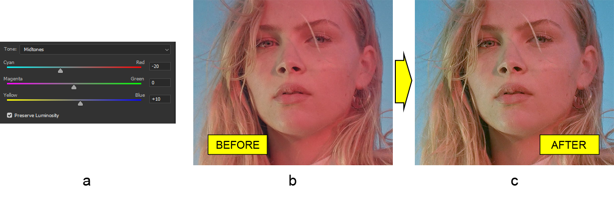

# Arbeiten mit der Farbausgleich-Anpassungsebene in Photoshop in Java

In diesem Artikel werden wir den **Farbausgleich des Bildes** im PSD-Dateiformat in Java anpassen. Dazu verwenden wir eine spezielle Bibliothek namens Aspose.PSD für Java, die ein Werkzeugkasten zur Manipulation von Photoshop-Dokumenten darstellt.

Da die Bibliothek mit dem PSD-Dateiformat arbeitet, enthält sie nahezu [alle Funktionen](https://docs.aspose.com/psd/java/features/), die im Photoshop-Editor verfügbar sind, und die **Farbausgleich-Anpassungsebene** ist keine Ausnahme.

Die Farbausgleich-Anpassungsebene ermöglicht es, das Gleichgewicht zwischen den primären (RGB) und subtraktiven (CMY)-Farben für Schatten, Mitten und Lichter auf einfache und schnelle Weise zu ändern.

## Farbausgleich anpassen

Wie bereits erwähnt, ist die Farbausgleich-Anpassungsebene in Aspose.PSD für Java genau das, was sie ist, **ein Ausgleich zwischen primären und subtraktiven Farben**. Das bedeutet, dass es drei Skalen für jedes Farbpaar gibt (cyan/rot, magenta/grün, gelb/blau). Die Intensität einer bestimmten Farbe im Paar wird erhöht, wenn sich der Wert in ihre Richtung bewegt, und umgekehrt. Darüber hinaus sind diese drei Paare jedem Bereich des Tonwertbereichs (Schatten, Mitten und Lichter) zugeordnet, was die Flexibilität dieser Art von Anpassung erhöht.

Lassen Sie uns dieses Wissen nun in die Praxis umsetzen. Als Beispiel wählen wir ein rötliches Foto von einem Frauengesicht (b). Das Gesicht ist zu rötlich, und wir werden das beheben, indem wir eine **Farbausgleich-Anpassungsebene hinzufügen**, um das Rot zu verringern und im Wesentlichen das Cyan zu erhöhen (a), um das Gesicht natürlicher aussehen zu lassen (c). Es gibt noch viel Arbeit mit diesem Bild, aber in diesem Artikel ist das alles, was wir tun werden.

 Die API der Farbausgleich-Anpassungsebene hat ein einfaches Design. Daher ist die [ColorBalanceAdjustmentLayer](https://reference.aspose.com/psd/java/com.aspose.psd.fileformats.psd.layers.adjustmentlayers/colorbalanceadjustmentlayer)-Klasse alles, was Sie brauchen. Zunächst sollte die Helligkeit erhalten werden, da sie standardmäßig deaktiviert ist. Fügen Sie dann etwas Grün und mehr Gelb für die Schatten hinzu, indem Sie die entsprechenden Methoden verwenden (deren Namen aus dem Namen des jeweiligen Bereichs im Tonwertbereich und den Farbnamen im Farbpaar bestehen), fügen Sie dann mehr Cyan und ein wenig Blau für die Mitten hinzu, und fügen Sie schließlich mehr Cyan hinzu, sowie ein wenig Magenta und Blau:

    ColorBalanceAdjustmentLayer colorBalanceAdjustmentLayer = psdImage.addColorBalanceAdjustmentLayer();
    colorBalanceAdjustmentLayer.setPreserveLuminosity(true);
    colorBalanceAdjustmentLayer.setShadowsMagentaGreenBalance((short)5);
    colorBalanceAdjustmentLayer.setShadowsYellowBlueBalance((short)-20);
    colorBalanceAdjustmentLayer.setMidtonesCyanRedBalance((short)-20);
    colorBalanceAdjustmentLayer.setMidtonesYellowBlueBalance((short)10);
    colorBalanceAdjustmentLayer.setHighlightsCyanRedBalance((short)-20);
    colorBalanceAdjustmentLayer.setHighlightsMagentaGreenBalance((short)-5);
    colorBalanceAdjustmentLayer.setHighlightsYellowBlueBalance((short)5);

Nun haben wir das gewünschte Bild! Es ist so einfach, oder?

Beachten Sie, dass _der Wert jedes Farbpaars im Bereich von -100 bis 100 liegen muss_, das heißt negative Werte für subtraktive Farben und positive für primäre Farben, wie auch im Photoshop-Editor.

Konsultieren Sie unser API-Referenzmaterial, um weitere technische Details über die [Farbausgleich-Anpassungsebene](https://reference.aspose.com/psd/java/com.aspose.psd.fileformats.psd.layers.adjustmentlayers/colorbalanceadjustmentlayer) zu erfahren.

## Fazit

In diesem Artikel haben wir betrachtet, wie der Farbausgleich des Bildes programmgesteuert in Java mithilfe der Bibliothek Aspose.PSD für Java angepasst werden kann. Die Bibliothek enthält eine voll ausgestattete API zur Arbeit mit Farbausgleich-Anpassungsebenen in Photoshop-Dokumenten.
