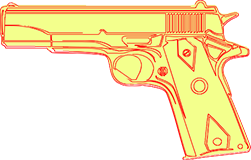

Mit Aspose.PSD können Sie unterstützte Versionen von AI-Dateien in das Png-Format konvertieren. Png ist ein Dateiformat für Rastergrafiken, das eine verlustfreie Datenkompression unterstützt. Außerdem unterstützt Png Transparenz. Die [Rastertisierung der Ai-Dateien](/psd/de/umwandeln-von-ai-bild-in-rasterformat/) auf dem Server kann automatisiert werden. Zur Ai-Exportierung müssen Sie den folgenden Code-Schnipsel verwenden:

Im unten bereitgestellten Beispielcode wird veranschaulicht, wie die AI-Datei programmgesteuert in das Png-Format exportiert wird.



Mit Aspose.PSD können Sie den Png-Kompressionsgrad angeben. Sie können die Png Progressive-Komprimierung verwenden und den [Farbtyp](https://reference.aspose.com/psd/de/aspose.psd.imageoptions/pngoptions/properties/colortype) der Png-Datei ändern. [Png-Optionen](https://reference.aspose.com/psd/de/aspose.psd.imageoptions/pngoptions) haben unterschiedliche Eigenschaften für alle Fälle der AI-Exportierung.

Das Ai-Format unterstützt die Änderung der Deckkraft für Vektordaten, und Png unterstützt Halbtransparenz. Daher kann eine Kombination dieser beiden Formate Ihnen helfen, die Dateiformatautomatisierung durchzuführen.
## **Beispiele für aktuelle Exportfähigkeiten von AI-Dateien in Png**
-----

|**Beispiel**|**Beschreibung**|
| :- | :- |
||
Der Export von AI-Dateien beinhaltet die Möglichkeit,

Postscript-Primitive mit unterschiedlichen Füllungen und Strichen

mit beliebiger benutzerdefinierter Breite zu rendern.
|
||
Das Rendern von komplexen Pfaden aus AI-Dateien

mit der C#-API ohne Adobe Illustrator
|
