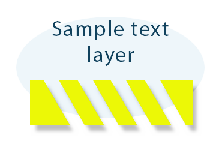

Aspose.PSD ist ein PSD-Format SDK und eine C# .NET Photoshop Manipulation API, die von PSD-Format in PNG-Format konvertieren kann.

Für diese PSD-Konvertierung sollte der folgende C#-Code verwendet werden:

Der folgende Beispielcode zeigt, wie PSD in Png konvertiert wird:



Sie können den Png-Formatkomprimierungsgrad von 0 bis 9 angeben, wobei 9 die höchste Kompression ist. Sie können eine Png-progressive Kompression verwenden und den Farbtyp der Png-Datei ändern. [Png-Optionen](https://reference.aspose.com/psd/net/aspose.psd.imageoptions/pngoptions) haben unterschiedliche Eigenschaften für alle Fälle des PSD-Exports.

Die Verwendung von semitransparentem Png mit Alphakanal für Ihre Website oder Arbeit ist eine gute Lösung. Adobe Photoshop-Dateien können pixelgenau mit [Schreibgeschütztem Modus](https://reference.aspose.com/psd/net/aspose.psd.imageloadoptions/psdloadoptions/properties/readonlymode) exportiert werden.

Hier ist das Beispiel einer exportierten PSD-Datei mit [angewandter Maske](https://docs.aspose.com/display/psdjava/Apply+Masking), [Ebene mit Text](https://reference.aspose.com/psd/net/aspose.psd.fileformats.psd.layers/textlayer) und transparenter [Füllfarbenebene](https://reference.aspose.com/psd/net/aspose.psd.fileformats.psd.layers.filllayers/filllayer) (Aspose.PSD unterstützt alle Arten von [Adobe Photoshop-Füllebenen](https://docs.aspose.com/display/psdjava/Support+of+Fill+Layers)). Außerdem können Sie den [Schatteneffekt](/psd/de/net/shadow-effects-in-psd-file/) auf der PSD-Formebene sehen.

