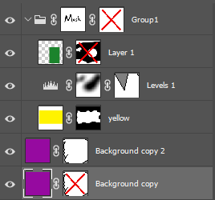

## **Überblick**
**Um die Bearbeitung im PSD-Format zu automatisieren und eine PSD-Datei ohne Adobe® Photoshop® zu ändern, können Sie die unten bereitgestellte Aspose.PSD-API verwenden. Es gibt C# und .NET-Code-Schnipsel, die Ihnen helfen können, PSD-Dateien zu bearbeiten.**

Mithilfe von PSD-Layer- und Vektormasken können wir Layer-Pixel verbergen und anzeigen, ohne sie dauerhaft zu löschen. Rastermasken werden auch als Ebenenmaske oder Nutzermaske bezeichnet. Der Zugriff auf Raster- und Vektormasken in Aspose.PSD erfolgt über die [LayerMaskData](https://reference.aspose.com/psd/net/aspose.psd.fileformats.psd.layers/layer/properties/layermaskdata)-Ebeneneigenschaft, die eine Instanz der Klassen '[LayerMaskDataShort](https://reference.aspose.com/psd/net/aspose.psd.fileformats.psd.layers/layermaskdatashort)' und '[LayerMaskDataFull](https://reference.aspose.com/psd/net/aspose.psd.fileformats.psd.layers/layermaskdatafull)' sein kann, die Unterklassen der abstrakten Klasse 'LayerMaskData' sind. Wenn eine Ebene sowohl Raster- als auch Vektormasken hat, wird eine Instanz von [LayerMaskDataFull](https://reference.aspose.com/psd/net/aspose.psd.fileformats.psd.layers/layermaskdatafull) bereitgestellt. Wenn eine Ebene nur eine Raster- oder eine Vektormaske hat, wird eine [LayerMaskDataShort](https://reference.aspose.com/psd/net/aspose.psd.fileformats.psd.layers/layermaskdatashort)-Instanz bereitgestellt. Wenn die LayerMaskData-Eigenschaft null ist, hat die Ebene keine Masken oder nur eine deaktivierte Vektormaske.

||
Ein Rastermaske und eine deaktivierte Vektormaske LayerMaskDataShort

Eine deaktivierte Rastermaske LayerMaskDataShort

Ein Rastermaske und eine Vektormaske LayerMaskDataFull

Ein Rastermaske LayerMaskDataShort

Eine Vektormaske LayerMaskDataShort

Eine deaktivierte Vektormaske null (Aber Vektorressource ist vorhanden)
|
| :- | :- |

## **Wie man eine Rastermaske einer Ebene in der PSD-Datei abruft?**
Zunächst sollten wir herausfinden, ob eine Ebene sowohl Vektor- als auch Ebenenmasken hat:

Der unten bereitgestellte Beispielcode zeigt, wie man eine Rastermaske einer Ebene abruft



Andernfalls ist der Typ der LayerMaskData-Ebeneneigenschaft LayerMaskDataShort. In diesem Fall prüfen wir, ob die Ebene nur eine Rastermaske hat, indem wir die Flags-Eigenschaft überprüfen. Sie sollte nicht die [LayerMaskFlags](https://reference.aspose.com/psd/net/aspose.psd.fileformats.psd.layers/layermaskflags).**UserMaskFromRenderingOtherData**-Flag enthalten, andernfalls handelt es sich um einen Vektormaskenspeicher.

Ausschnitt des Maskencodes abrufen:



Wenn Sie eine **Rastermaske extrahieren** müssen als LayerMaskDataShort (für weitere Manipulationen), auch wenn beide Masken vorhanden sind, sollte LayerMaskDataFull extrahiert und in LayerMaskDataShort konvertiert werden. Der folgende Code kann für beide Fälle verwendet werden:

Extrahieren einer Rastermaske aus PSD



## **Wie man überprüft, ob eine Ebene in der PSD-Datei eine Rastermaske hat?**
Der folgende C#-Code kann Ihnen dabei helfen zu überprüfen, ob eine Ebene eine Rastermaske hat:

Wie man prüft, ob eine Rastermaske auf die [PSD Ebene](/psd/de/net/psd-layer/) angewendet wird



## **Wie man eine Rastermaske einer Ebene in der PSD-Datei entfernt/hinzufügt/aktualisiert?**
Das Entfernen/Hinzufügen/Aktualisieren des LayerMaskData reicht für das korrekte Speichern nicht aus, da die Kanäle nicht aktualisiert werden; obwohl es eine korrekte Wiedergabe ermöglichen kann. Dies ändert nicht die Maskenkanäle:



Wir sollten die Methode AddLayerMask der Ebene für das Entfernen/Hinzufügen/Aktualisieren verwenden.

Dies fügt/aktualisiert sowohl die Maske als auch die Kanäle:



Dies entfernt sowohl die Maske als auch die Kanäle:



## **Entfernen einer Rastermaske einer Ebene im PSD-Bild**
Zunächst überprüfen wir, ob die Maske im Kurzformat vorliegt und wenn es keine Vektormaske ist, können wir einfach die AddLayerMask-Methode mit null aufrufen, um die Rastermaske zu löschen. Ist sie jedoch im Vollformat, müssen wir sie in ein Kurzformat konvertieren und so nur die Vektormaske übrig lassen. Für das Entfernen einer Maskierung kann der folgende C# .NET-Code-Schnipsel verwendet werden:

Codeschnipsel zum Entfernen einer Maskierung von einer PSD-Datei



## **Aktualisieren einer Rastermaske einer Ebene im PSD-Bild**
Dies ist unkompliziert: wenn die Maske im Kurzformat vorliegt, müssen wir ImageData und MaskRectangle gegebenenfalls ändern, andernfalls sollten [UserMaskData](https://reference.aspose.com/psd/net/aspose.psd.fileformats.psd.layers/layermaskdatafull/properties/usermaskdata) und [UserMaskRectangle](https://reference.aspose.com/psd/net/aspose.psd.fileformats.psd.layers/layermaskdatafull/properties/usermaskrectangle) geändert werden. Der folgende C# .NET-Code-Schnipsel kann zum Aktualisieren einer Maskierung verwendet werden:

PSD-Layer-Maske mit C# aktualisieren



Hier ist ein Beispiel für mögliche Aktionen, die eine Rastermaske ändern. Diese invertiert z.B. eine Benutzermaske der Ebene:

PSD-Layer-Maske mit C# aktualisieren



## **Aktualisieren einer Vektormaske in der PSD-Datei, wenn eine Rastermaske einer Ebene vorhanden ist**
Es wird angenommen, dass ein Benutzer bereits eine Vektorpfadressource geändert hat. Dann kann er die Vektormaske einfach aktualisieren, indem er die [AddLayerMask](https://reference.aspose.com/psd/net/aspose.psd.fileformats.psd.layers/layer/methods/addlayermask)-Layermethode aufruft:

Aktualisieren von [PSD Layer Vector Mask](/psd/de/net/layer-vector-mask/) mit C#



## **Hinzufügen einer Rastermaske zu einer Ebene in der PSD-Datei**
Wenn eine Ebene keine Maske hat, können wir die angegebene Rastermaske einfach hinzufügen, indem wir die AddLayerMask-Layermethode aufrufen.

Wenn die Maske keine [UserMaskFromRenderingOtherData]-Flag enthält, hat sie bereits eine Rastermaske und wir müssen sie wie oben beschrieben aktualisieren. Andernfalls, wenn diese Maske im Kurzformat vorliegt, konvertieren wir sie in das Vollformat. Andernfalls verwenden wir sie wie sie ist. Dann aktualisieren Sie UserMaskData, UserMaskRectangle und andere Eigenschaften mit den angegebenen Masken-Eigenschaften. Der folgende C# .NET-Code-Schnipsel kann zum Hinzufügen (Aktualisieren) einer Maskierung verwendet werden:

Neue Rastermaske zu PSD hinzufügen



## **Wie man überprüft, ob eine Ebenenmaske aktiviert ist?**
Um den Zustand der aktivierten Ebenenrastermaske herauszufinden, können wir den LayerMaskFlags.Disabled-Flag-Zustand in der Flags-Eigenschaft für LayerMaskDataShort oder in den RealFlags für LayerMaskDataFull überprüfen. Der folgende C# .NET-Code-Schnipsel kann zum Abrufen des aktivierten Zustands einer Ebenenmaske verwendet werden:

Überprüfen, ob eine Maske aktiviert ist:



## **Aktivieren oder Deaktivieren einer Rasterlayemaske?**
Um eine Ebenenrastermaske zu aktivieren oder zu deaktivieren, können wir den Zustand des LayerMaskFlags.Disabled-Flags in der Flags-Eigenschaft für LayerMaskDataShort oder in den RealFlags für LayerMaskDataFull ändern. Der folgende C# .NET-Code-Schnipsel kann zum Ändern des aktivierten Zustands einer Ebenenmaske verwendet werden:

Raster-Layemaske aktivieren oder deaktivieren:


