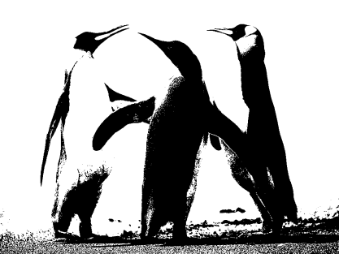

## **Rohdatenverarbeitung**
Zur Verbesserung der Leistung des Aspose.PSD API haben wir eine Methode zur Rohdatenverarbeitung mit der Version 2.4.0 eingeführt. Die Rohdatenverarbeitung wird nun intern verwendet und verfügt über eine externe API, die von außerhalb der Bibliothek genutzt werden kann, um die Gesamtleistung zu verbessern. Manchmal kann die Verarbeitung etwas knifflig sein und eine Erklärung erfordern. Die Rohdatenverarbeitung ist derzeit nur für das BMP-Format verfügbar.

Um den Entwicklern zu helfen, die beste Leistung zu erzielen, bietet das Aspose.PSD API ein Rohdatenverarbeitungssystem, das über eine externe API für die Anpassung verfügt. Entwickler rufen die Methoden [LoadRawData](https://reference.aspose.com/psd/net/aspose.psd/rasterimage/methods/loadrawdata/index) und [SaveRawData](https://reference.aspose.com/psd/net/aspose.psd/rasterimage/methods/saverawdata) auf, um die Rohdatenverarbeitung zu nutzen. Diese Methoden erfordern auch die Festlegung des gewünschten Rohdatenformats mithilfe der Klasse [RawDataSettings](https://reference.aspose.com/psd/net/aspose.psd/rawdatasettings). Die Klasse RawDataSettings ermöglicht es den Entwicklern, jedes Rohdatenformat festzulegen. Um jedoch die beste Leistung zu erzielen, müssen Sie das Rohdatenformat verwenden, in dem die Daten gespeichert sind. Die in der Klasse RawDataSettings definierten Einstellungen [PixelDataFormat](https://reference.aspose.com/psd/net/aspose.psd/rawdatasettings/properties/pixeldataformat) im Bild [RasterImage](https://reference.aspose.com/psd/net/aspose.psd/rasterimage) helfen dabei, das Rohdatenformat des Bildes zu bestimmen. Wenn Sie eine Instanz von RawDataSettings in die LoadRawData-Methode übergeben, werden die Daten unverändert zurückgegeben, ohne dass eine Konvertierung angewendet wird, was die Leistung verbessern kann. Andererseits müssen Sie sich um alle möglichen Layouts von Rohdatenformaten kümmern, was manchmal ein wenig kompliziert sein kann.

Um den Prozess zu vereinfachen, können Sie das gewünschte RawDataSettings spezifizieren, indem Sie die Klasse instanziieren und initialisieren mit den gewünschten Rohdateneinstellungen. Es gibt Fälle, in denen es nicht möglich ist, die Rohdaten im angegebenen Format zurückzugeben (beispielsweise ist die Konvertierung von CMYK-Farbraum in RGB in der Version 2.4.0 nicht verfügbar). Darüber hinaus kann es Szenarien geben, in denen die Rohdatenverarbeitung für ein Bildformat überhaupt nicht verfügbar ist. Um festzustellen, ob Sie die Methoden LoadRawData und SaveRawData-Familie verwenden können, müssen Sie die Eigenschaft [IsRawDataAvailable](https://reference.aspose.com/psd/net/aspose.psd/rasterimage/properties/israwdataavailable) abfragen.

### **Einblick**
Für RGB-Pixeldatenformate stehen indizierte (palettebasierte) und RGB-basierte Rohdatenformate zur Verfügung. Indizierte Rohdatenformate enthalten Paletteeintrag-Indizes im Bereich von 0 bis (2^Bitanzahl - 1). Die indizierten Rohdatenformate sind 1, 2, 4 und 8 Bits pro Pixel. Die restlichen Formate sind RGB-basiert. Beim Laden von Rohdaten ist darauf zu achten, dass genügend Bytes verfügbar sind, um die Daten zu laden, andernfalls wird eine entsprechende Ausnahme ausgelöst. Sie können die Größe des Byte-Arrays einfach schätzen, indem Sie die Zeilengröße mit den erforderlichen Zeilen multiplizieren. Die Zeilengröße kann variieren und hängt vom Format der Rohdatenspeicherung ab.

Um die beste Leistung zu erzielen, verwenden Sie immer eine Rohdatenzeilengröße, die dem Wert der [RasterImage.RawLineSize](https://reference.aspose.com/psd/net/aspose.psd/rasterimage/properties/rawlinesize) Eigenschaft entspricht. Manchmal ist es jedoch erforderlich, zusätzlichen Platz zu den Rohdatenzeilen hinzuzufügen oder zu reduzieren, und in diesem Fall kann eine andere Zeilengröße verwendet werden. Wenn ein Ausschnitt aus einem Bild-Begrenzungsrechteck erforderlich ist, berücksichtigen Sie die Bitverschiebungen, die für indizierte RGB-Pixelformate auftreten können. Betrachten wir zum Beispiel ein Bild mit den Abmessungen 100x100 Pixel und einem Rohdatenformat von 1 Bit pro Pixel. Sie möchten ein Rechteck mit Rohdaten laden, das bei den Koordinaten (7,0) beginnt und die Dimensionen (2,1) hat, oder anders gesagt, Sie benötigen 2 Pixel, die bei x=7 und y=0 beginnen. In diesem Fall sollten Sie folgendes Datenlayout erhalten:


Dies bedeutet, dass Sie 2 Bytes erhalten, wobei das erste Byte 7 unerwünschte Pixel enthält, dann einen gewünschten Pixel, und das zweite Byte einen gewünschten Pixel und dann 7 unerwünschte Pixel enthält. Sie könnten sich fragen, warum wir keine Datenschiebung durchgeführt und diese 2 Pixel in ein einzelnes Byte geschoben haben. Die Antwort ist einfach: um die Leistung hoch zu halten. Alle internen Verarbeitungen werden typischerweise mit allen Daten vom ersten Pixel bis zum letzten verfügbaren Pixel durchgeführt. Es gibt selten Situationen, in denen ein Pixelausschnitt erforderlich ist. Außerdem wissen wir nicht, wie diese Pixel anschließend verarbeitet werden, daher würde eine Verschiebung die Leistung verringern und den Code unnötig komplex machen. Schätzen Sie immer das richtige Bit (es ist nicht erforderlich, das richtige Byte zu bestimmen, da die Daten immer mit dem ersten gefüllten Byte kommen), an dem die geforderten Pixel beginnen. Um das richtige Bit zu berechnen, kann eine einfache Formel verwendet werden: (rect.Left * Bitszahl) % 8.
### **Indizierte RGB-Farbkonvertierung**
Um die bestmögliche Leistung zu erzielen, verwenden Sie immer die gleichen Quell- und Ziel-Rohdateneinstellungen, Pixelformate und Zeilengrößen. Manchmal müssen Sie jedoch eine Datenkonvertierung durchführen. Beispielsweise können Sie ein RGB-Bild mit 1 Bit pro Pixel laden und mit 2 Bits pro Pixel speichern oder ein 4-Bit-RGB-Bild laden und seinen Farbbereich auf 2 Bits pro Pixel reduzieren. In jedem Fall sollte eine Farbkonvertierung angewendet werden. Die Konvertierung von indizierten RGB-Bildern kann manchmal knifflig sein und ohne einige angewendete Einstellungen nicht durchgeführt werden. Wir müssen feststellen, wie der Farbbereich der Quelle auf den Ziel-Farbraum abgebildet wird. Um diese Aufgabe zu erledigen, haben wir verschiedene [Modi](https://reference.aspose.com/psd/net/aspose.psd/ditheringmethods):

- Palettenzuordnung (DitheringMethods.PaletteConversion)
- Rohdatenzuordnung (DitheringMethods.PaletteIgnore)
- Benutzerdefinierte Konvertierung (DitheringMethods.CustomConverter)

Bei der Palettenkonvertierung versucht der Quellfarbraum, dem Ziel-Farbraum so nahe wie möglich zu kommen. Nehmen wir an, wir haben ein 4-Bit-Bild mit den folgenden Farben:
[0] RGB=0, 0, 0
[1] RGB=17, 17, 17
[2] RGB=34, 34, 34
[3] RGB=51, 51, 51
[4] RGB=68, 68, 68
[5] RGB=85, 85, 85
[6] RGB=102, 102, 102
[7] RGB=119, 119, 119
[8] RGB=136, 136, 136
[9] RGB=153, 153, 153
[10] RGB=170, 170, 170
[11] RGB=187, 187, 187
[12] RGB=204, 204, 204
[13] RGB=221, 221, 221
[14] RGB=238, 238, 238
[15] RGB=255, 255, 255

Das Quellbild sieht wie folgt aus:


Und wir konvertieren das 4-Bit-Bild in das 1-Bit-Bild mit den folgenden definierten Palettenfarben:

[0] RGB = 0, 0, 0
[1] RGB = 255, 255, 255

Im Palettenkonvertierungsmodus liest der Konverter die Quellfarbe und bestimmt den Zielindex unter Verwendung der Methode GetNearestColorIndex der Ziel-Palette. Der Wert der [RasterImage.RawFallbackIndex](https://reference.aspose.com/psd/net/aspose.psd/rasterimage/properties/rawfallbackindex) Eigenschaft wird verwendet, falls die Methode GetNearestColorIndex der Palette einen Index außerhalb des Bereichs ergibt. Dies konvertiert die Quellfarben in die nächstgelegenen Zielfarben in Bezug auf Intensitätswerte. Das Zielbild stimmt so genau wie möglich mit dem Quellbild überein. Sie können das folgende Ergebnis sehen:



Im Rohdatenzuordnungsmodus wird ein anderer Ansatz verwendet. Die Quell- und Ziel-Farbpalletten werden einfach ignoriert und die Quellindizes werden auf Zielindizes abgebildet. Wenn ein Wert gefunden wird, der nicht in den Zielbereich abgebildet werden kann (wenn die Bitanzahl verringert wird), wird der Wert der RasterImage.RawFallbackIndex-Eigenschaft verwendet. Der Standardwert beträgt 0 und wird der ersten Farbe in der Ziel-Palette zugeordnet. Liegt dieser Eigenschaftswert außerhalb des Zielbereichs, wird eine entsprechende Ausnahme ausgelöst. Dies führt zu weniger vorhersehbaren Ergebnissen, die auf dem folgenden Bild gezeigt werden können:


Der Palettenkonvertierungsmodus ist eine genauere Lösung für das Farbzuordnungsproblem, aber er dauert auch etwas länger, da Berechnungen durchgeführt werden müssen, um die korrekten Palettenzuordnungen zu schätzen. (Typischerweise gibt es nur einen sehr kleinen Leistungsunterschied zwischen den beiden Methoden.) Andererseits ist der Rohzuordnungsmodus etwas schneller und kann für grobere Farbkonvertierungen verwendet werden, wenn die genaue Farbzuordnung nicht so wichtig ist. Beispielsweise gibt es Fälle, in denen die Quellfarbpalette beschnitten ist und sicher in Farbtiefen konvertiert werden kann, da die zusätzlichen Bits sowieso nicht verwendet wurden.

Um einen dieser Ansätze zu verwenden, verwenden Sie die RawDitheringMethod-Eigenschaft der RasterImage-Klasse. Standardmäßig ist sie auf die Palettenkonvertierungsmethode eingestellt, um die besten Ergebnisse zu erzielen. Sie können diese Einstellung ändern, bevor eine Konvertierung erfolgt (beispielsweise beim Speichern des Bildes in einen Stream). Bitte beachten Sie, dass die Methoden zur Palettenignorierung und Palettenkonvertierung nicht ausgeführt werden, wenn ein Bild geladen und einige der Originalpixeldaten überschrieben wurden, da die neuen Daten in den Cache gelangen und der Cache die Daten im maximal verfügbaren Format 32ARGB speichert (Stand: 2.4.0, Änderungen vorbehalten). Dieses Format wird verwendet, um Probleme mit möglichen unterschiedlichen Farbbereichen für geladene und gespeicherte Bilder zu überwinden. Darüber hinaus werden die Methoden zur Palettenignorierung und Palettenkonvertierung nicht ausgeführt, wenn ein Bild im RGB-Modus geladen und in den indizierten Modus oder umgekehrt konvertiert wird. 
### **Benutzerdefinierte Farbkonverter**
Manchmal reicht es nicht aus, den Standardansatz für die Farbkonvertierung zu verwenden. Möglicherweise möchten Sie einen benutzerdefinierten Algorithmus verwenden, um eine vollständige Freiheit bei der Verwendung von Farbkonvertierungsroutinen zu erhalten. Wenn die Pixelformate der Quell- und Zielbilder indizierte RGB-Formate sind, kann eine einfachere Schnittstelle, [IIndexedColorConverter](https://reference.aspose.com/psd/net/aspose.psd/iindexedcolorconverter), verwendet werden. Sie müssen die [RasterImage.RawIndexedColorConverter](https://reference.aspose.com/psd/net/aspose.psd/rasterimage/properties/rawindexedcolorconverter) Eigenschaft auf eine Instanz des IIndexedColorConverter-Interfaces setzen und den Wert [DitheringMethods](https://reference.aspose.com/psd/net/aspose.psd/ditheringmethods).CustomConverter für die RawDitheringMethod-Eigenschaft verwenden. Wenn diese Kombination vorhanden ist, wird jede indizierte Farbkonvertierung durch die angegebene IIndexedColorConverter-Instanz durchgeführt. Der benutzerdefinierte indizierte Farbkonverter hat die folgende Methode definiert:

```java
void FillIndexedtoIndexedMap(byte[] map, PixelDataFormat sourceFormat, PixelDataFormat destFormat);
```

Die Methode FillIndexedtoIndexedMap wird aufgerufen, wenn eine Konvertierung von einem indizierten RGB-Bild in ein anderes indiziertes RGB-Bildformat erforderlich ist (wenn zwei Formate mit 1, 2, 4 oder 8 Bit zueinander umgewandelt werden). Das Kartenarray hat die Länge aller möglichen Quellformats Einträge. Sie müssen dieses Array füllen, um die Zuordnung von der Quellfarbpalette zum Ziel-Farbpalette Eintrag vorzunehmen. Achten Sie darauf, dass der Indexwert des Ziels im Bereich von 0 bis (Bitszahl - 1) liegt, andernfalls wird eine angemessene Ausnahme ausgelöst.

Wenn die Anforderung besteht, eine anspruchsvollere Farbkonvertierungsszenario durchzuführen, sollte die [RasterImage.RawCustomColorConverter](https://reference.aspose.com/psd/net/aspose.psd/rasterimage/properties/rawcustomcolorconverter) Eigenschaft auf eine Instanz des [IColorConverter](https://reference.aspose.com/psd/net/aspose.psd/icolorconverter) Interfaces gesetzt werden. Die RawCustomColorConverter-Eigenschaft überschreibt immer die RawIndexedColorConverter-Eigenschaft, wenn beide gesetzt sind, und ein indizierter Farbkonverter wird in einem solchen Fall nicht verwendet. Das IColorConverter Interface hat eine einzige Methode:

```java
int Convert(PixelDataFormat sourceFormat, byte[] data, int offset, int bitStart, int samplesCount, int linesCount, PixelDataFormat destFormat, byte[] outputData, int outputOffset);
```

Die Convert-Methode wird jedes Mal aufgerufen, wenn eine Farbkonvertierung erforderlich ist. Die Methode erhält die Quellrohdaten im Quellformat und verfügt über einen Ausgabe-Buffer zum Empfangen der Farbformatkonvertierung ins Ziel. Der Ziel-Buffer sollte ausreichen, um die konvertierten Daten zu empfangen (wenn der Schnittstellenaufruf intern von der Aspose.PSD-Bibliothek durchgeführt wird) und sollte die konvertierten Rohdaten beim Rückgabewert der Methode enthalten. Die Convert-Methode kann mehrmals aufgerufen werden, bis alle Daten abgedeckt sind.