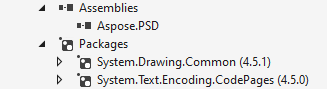

## **Aspose.PSD für .NET über NuGet installieren**
NuGet ist der einfachste Weg, um Aspose APIs für .NET herunterzuladen und zu installieren. Öffnen Sie Microsoft Visual Studio und den NuGet-Paket-Manager. Suchen Sie nach "aspose", um die gewünschte Aspose API zu finden. Klicken Sie auf "Installieren". Die ausgewählte API wird heruntergeladen und in Ihrem Projekt referenziert.

## **Aspose.PSD mit der Paket-Manager-Konsole installieren oder aktualisieren**
Sie können die folgenden Schritte befolgen, um die [Aspose.PSD API](https://www.nuget.org/packages/Aspose.psd/) mithilfe der Paket-Manager-Konsole zu referenzieren:

1. Öffnen Sie Ihre Lösung/Ihr Projekt in Visual Studio.
1. Wählen Sie Tools -> Bibliothekspaket-Manager -> Paket-Manager-Konsole im Menü aus, um die Paket-Manager-Konsole zu öffnen.

Geben Sie den Befehl "**Install-Package Aspose.Psd**" ein und drücken Sie die Eingabetaste, um die neueste Vollversion in Ihre Anwendung zu installieren. Alternativ können Sie dem Befehl "-prerelease" anhängen, um anzugeben, dass die neueste Version inklusive Hotfixes installiert werden soll.

Sie sehen, dass der Hinweis **"Installiere Aspose.PSD"** unten im Fenster angezeigt wird, was bedeutet, dass der Download läuft.

Nach Abschluss des Downloads erhalten Sie die folgenden Bestätigungsmeldungen. Falls Sie nicht mit der [Aspose EULA](https://company.aspose.com/legal/eula) vertraut sind, empfiehlt es sich, die Lizenz unter der angegebenen URL zu lesen.

Aspose.PSD sollte nun erfolgreich zu Ihrem Projekt hinzugefügt und referenziert worden sein.

In der Paket-Manager-Konsole können Sie auch den Befehl "**Update-Package Aspose.Psd**" eingeben und die Eingabetaste drücken, um nach Updates für das Aspose.Psd-Paket zu suchen und sie zu installieren, wenn verfügbar. Sie können auch dem Befehl den Suffix "-prerelease" hinzufügen, um das neueste Release zu aktualisieren.

## **Überlegungen beim Ausführen in einer Shared Server-Umgebung**
Es wird empfohlen, alle Aspose .NET-Komponenten mit dem Berechtigungssatz für die volle Vertrauenswürdigkeit auszuführen. Dies ist erforderlich, da Aspose .NET-Komponenten manchmal auf Registrierungseinstellungen und Dateien außerhalb des virtuellen Verzeichnisses zugreifen müssen, z. B. zum Lesen von Schriften usw. Darüber hinaus basieren Aspose .NET-Komponenten auf Kern-.NET-Systemklassen, von denen einige in einigen Fällen ebenfalls eine Vollvertrauenswürdigkeit zum Ausführen benötigen.

Internetdienstanbieter, die mehrere Anwendungen verschiedener Unternehmen hosten, setzen normalerweise auf die Sicherheitsstufe "Medium Trust". Im Fall von .NET 2.0 können solche Sicherheitsstufen die folgenden Einschränkungen festlegen, die sich auf die Funktionsfähigkeit von Aspose.Words auswirken können.

- **RegistryPermission** ist nicht verfügbar. Dies bedeutet, dass Sie nicht auf die Registrierung zugreifen können, was beim Rendern von Dokumenten zur Schriftenauswahl erforderlich ist.
- **FileIOPermission** ist eingeschränkt. Dies bedeutet, dass Sie nur auf Dateien in der virtuellen Verzeichnishierarchie Ihrer Anwendung zugreifen können. Dies bedeutet potenziell, dass Schriften beim Export nicht gelesen werden können.

Aus den oben genannten Gründen wird empfohlen, Aspose.PSD mit Vollvertrauensberechtigungen auszuführen. Es kann sein, dass einige Funktionen der Bibliothek unter Medium Trust funktionieren, während andere (wie z.B. das Rendern) nicht funktionieren, was auf Aufrufe zur GDI+ Bildverarbeitung zurückzuführen sein kann.

## **Arbeiten mit .NET Core DLLs, die über das MSI-Paket installiert wurden**

**Bitte beachten Sie:** Wenn Sie .Net Standard DLLs verwenden, die über das MSI-Paket installiert wurden, sollten Sie die erforderlichen Abhängigkeiten hinzufügen, um mit der .Net Standard-Version zu arbeiten.

|**Screenshot der Visual Studio-Abhängigkeiten**|**Fragment der CsProj-Datei:**|
| :- | :- |
||<ItemGroup>

`    `<PackageReference Include="System.Drawing.Common" Version="4.5.1" />

`    `<PackageReference Include="System.Text.Encoding.CodePages" Version="4.5.0" />

</ItemGroup>|

## **Systemanforderungen**
### **Unterstützte Betriebssysteme:**
- Microsoft Windows 2000 Professional und Server (SP2 empfohlen)
- Microsoft Windows XP Professional und Home Edition
- Microsoft Windows 2003 Server
- Microsoft Windows Vista
- Microsoft Windows 2008 Server
- Microsoft Windows 2008 Server R2
- Microsoft Windows 7
- Microsoft Windows 8
- Microsoft Windows 10
- Microsoft Windows 11
### **Unterstützte Plattformen:**
- Windows Forms
- Web Forms
- Visual Studio 2005
- Visual Studio 2008
- Visual Studio 2010
- Visual Studio 2012
- Visual Studio 2013
- Visual Studio 2015
- Visual Studio 2017
- Visual Studio 2019
- Visual Studio 2022

Aspose.PSD funktioniert für sowohl die x86- als auch die x64-Versionen der oben aufgeführten Betriebssysteme.
### **Unterstützte Frameworks:**
Aspose.PSD für .NET unterstützt das .NET Framework wie folgt:

- .NET Framework Version 2.0 oder höher
- .NET Standard 2.0
