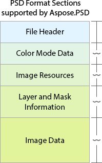

# **Features of Aspose.PSD**
Aspose.PSD supports all sections of the Adobe Photoshop PSD file format. You can read full [overview of PSD File Format](/psd/net/psd-format-overview/) and its Features

||
Aspose.PSD supports all sections of PSD Format.

1. PSD and PSB Headers in File Header

2. Most popular Color Modes

3. Big amount of Global Image Resources

4. All types of Layers and Mask* and their internal resources and rendering PSD file after the changes

5. Low-level manipulation API for Image Data including different compression algorithms

 

Aspose.PSD is the most complete PSD Format Manipulation SDK.

You can also read why it's better to use Aspose Components instead of others:

[Why not Adobe Photoshop SDK](/psd/net/why-not-adobe-photoshop-sdk-html/)

 
|
| :- | :- |
## **PSD Format Documentation**
The documentation contains information and examples for all PSD Sections.
### **File Header**
- [PSD and PSB Header Description](/psd/net/psd-and-psb-file-header/)
### **Color Mode Data**
- [Supported Color Mode / Bit Depth combination](/psd/net/supported-combination-of-color-modes-and-bit-depth-in-psd/)
- [Examples of how to convert between different Color Modes in Adobe Photoshop File](/psd/net/psd-convert-between-different-color-modes/)
- [ICC-Profile Conversions](https://docs.aspose.com/display/psdjava/Color+Space+Conversion+for+JPEG+through+ICC+Profiles)
### **Image Resources**
- [List of the Supported PSD Global Image Resources](/psd/net/list-of-the-supported-psd-global-image-resources/)
- Common operations with Image Resources
### **Layer and Mask Information**
Overview of [Layers and Mask Information Section](/psd/net/layers-and-mask-information-section-html/)

[Editing of Rater Layer Mask](/psd/net/editing-raster-layer-masks-in-psd-file-via-api/)

[List of Supported Layer Resources](/psd/net/list-of-psd-layer-resources/)

Supported PSD Layers Types:

- Base [PSD Layer](/psd/net/psd-layer/)
- Text Layers
- Adjustment Layers
- Fill Layers
- Smart Objects
### **Image Data**
This section contains Adobe Photoshop Layer Data

