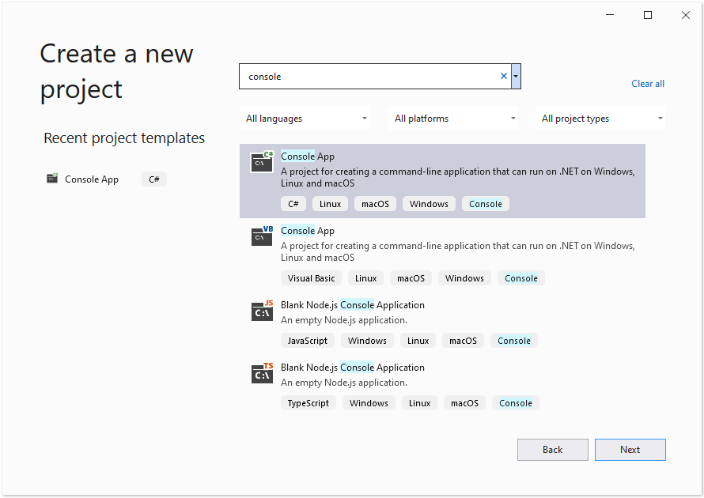

## Prerequisites

- Docker must be installed on your system. For information on how to install Docker on Windows or Mac, refer to the links in the "See Also" section.

- Visual Studio 2022.

- NET 6 SDK is used in the example.

- You can download completely working sample project on https://github.com/aspose-psd/Aspose.PSD-Docker-Sample

## Hello World Application

In this example, you create a simple Hello World console application that opens a psd file, updated text layer and draws using Graphics API. The described application can be built and run in Docker.

### Creating the Console Application

To create the Hello World program, follow the steps below:
1. Once Docker is installed, make sure that it uses Linux Containers (default). If necessary, select the Switch to Linux containers option from the Docker Desktops menu.
1. In Visual Studio, create a NET 6 console application. 
 
1. Install the latest Aspose.PSD version from NuGet. 
 
1. Since the application will be run on Linux, you may be needed to install additional fonts. You could prefer ttf-mscorefonts-installer.
1. Please note, to use Text Rendering Features on the Linux you need to add the following packages: apt-transport-https, libgdiplus, libc6-dev. Commands to add them can be found in the dcokerfile
1. When all required dependencies are added, write a simple program that opens the PSD File, updates Text Layer and then Draws something using graphics: 



Note that to edit text layers you need to get the license. You can get temporary license, using the following article: https://purchase.aspose.com/temporary-license
 
### Configuring a Dockerfile

The next step is to create and configure the Dockerfile.

1. Create the Dockerfile and place it next to the solution file of your application. Keep this file name without extension (the default).
1. In the Dockerfile, specify:


#See https://aka.ms/containerfastmode to understand how Visual Studio uses this Dockerfile to build your images for faster debugging.

FROM mcr.microsoft.com/dotnet/runtime:6.0 AS base
WORKDIR /app

# To use the ability to update the text layers you need to add the following packages to your container
RUN apt-get update
RUN yes | apt-get install -y apt-transport-https
RUN yes | apt-get install -y libgdiplus
RUN yes | apt-get install -y libc6-dev

FROM mcr.microsoft.com/dotnet/sdk:6.0 AS build

WORKDIR /src
COPY ["AsposePsdDockerSample/AsposePsdDockerSample.csproj", "AsposePsdDockerSample/"]
RUN dotnet restore "AsposePsdDockerSample/AsposePsdDockerSample.csproj"
COPY . .
WORKDIR "/src/AsposePsdDockerSample"
RUN dotnet build "AsposePsdDockerSample.csproj" -c Release -o /app/build

FROM build AS publish
RUN dotnet publish "AsposePsdDockerSample.csproj" -c Release -o /app/publish

FROM base AS final
WORKDIR /app
COPY --from=publish /app/publish .
ENTRYPOINT ["dotnet", "AsposePsdDockerSample.dll"]


The above is a simple Dockerfile, which contains the following instructions:

- The SDK image to be used. Here it is the Microsoft .Net 6 image. Docker will download it when the build is run. The version of SDK is specified as a tag.
- Then you add the dependencies to render the text.
- After, you may need to install Fonts because the SDK image contains very few fonts. Also, you can use local fonts copied to docker image.
- The working directory, which is specified in the next line.
- The command to copy everything to container, publish the application, and specify the entry point.

### Building and Running the Application in Docker

#### Using Visual Studio
The simplest way to try Aspose.PSD in Docker is open Visual Studio and launch the app using Docker support

#### Using Command Prompt
The application can be built and run in Docker using command prompt. Open your favorite command prompt, change directory to the folder with the application (folder where the solution file and the Dockerfile are placed) and run the following command:


docker build -t asposepsddocker .


The first time this command is executed it may take longer, since Docker needs to download the required images. Once the previous command is completed, run the following command:


docker run --name asposepsdcontainer asposepsddocker; docker cp asposepsddocker:/app/Output.psd .; docker cp asposepsddocker:/app/Output.png .; docker rm asposepsdcontainer


{} 

Pay attention to the mount argument, because, as mentioned earlier, a folder on the host machine is mounted into the container's folder, to easily see the results of the application execution. Paths in Linux are case sensitive.

{}

## More Examples

For more samples of how you can use Aspose.PSD in Docker, see the [examples](https://github.com/aspose-psd/Aspose.PSD-for-.NET).

## See Also

- [Install Docker Desktop on Windows](https://docs.docker.com/docker-for-windows/install/)
- [Install Docker Desktop on Mac](https://docs.docker.com/docker-for-mac/install/)
- [Visual Studio 2022, NET 6 SDK](https://docs.microsoft.com/en-us/dotnet/core/install/windows?tabs=net60#dependencies)
- [Switch to Linux containers](https://docs.docker.com/docker-for-windows/#switch-between-windows-and-linux-containers) option
- Additional information on [.NET Core SDK](https://hub.docker.com/_/microsoft-dotnet-sdk)
