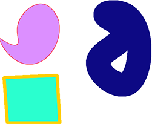

Usando Aspose.PSD puedes convertir versiones compatibles de archivos AI al formato Png. Png es un formato de archivo de gráficos rasterizados que admite compresión de datos sin pérdidas. Además, Png admite la transparencia. La [rasterización de los archivos Ai](/psd/es/net/converting-ai-image-to-raster-format/) en el servidor puede automatizarse. Para exportar Ai, necesitas utilizar el siguiente fragmento de código:

El código de muestra proporcionado a continuación demuestra cómo exportar el archivo AI al formato Png de forma programática.



Con Aspose.PSD puedes especificar el nivel de compresión de Png. Puedes utilizar la compresión progresiva de Png y cambiar el [Tipo de Color](https://reference.aspose.com/psd/net/aspose.psd.imageoptions/pngoptions/properties/colortype) del archivo Png. Las [Opciones de Png](https://reference.aspose.com/psd/net/aspose.psd.imageoptions/pngoptions) tienen diferentes propiedades para cualquier caso de Exportación de AI.

El formato Ai admite cambiar la opacidad para los datos vectoriales, y Png admite semitransparencia, por lo que una combinación de estos dos formatos puede ayudarte a automatizar el formato de archivo.
## **Ejemplos de las actuales capacidades de exportación de archivos AI a Png**
-----

|**Ejemplo**|**Descripción**|
| :- | :- |
||
La exportación de archivos AI incluye la capacidad

de renderizar primitivas de Postscript 

con diferentes rellenos y trazos con

cualquier peso personalizado.
|
||
Renderización de trayectorias complejas desde el archivo AI

usando la API de C# sin Adobe Illustrator
|
