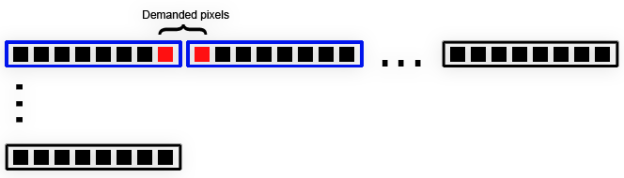
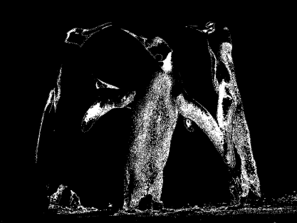

## **Procesamiento de Datos sin Procesar**
Para mejorar el rendimiento de la API Aspose.PSD, introdujimos un método para el procesamiento de datos sin procesar con la versión 2.4.0. El procesamiento de datos sin procesar se utiliza internamente y tiene una API externa para que pueda ser utilizada desde fuera de la biblioteca para mejorar el rendimiento general. A veces, el procesamiento puede volverse un poco complicado y necesitar alguna explicación. Actualmente, el procesamiento de datos sin procesar solo está disponible para formatos BMP.

Para ayudar a los desarrolladores a obtener el mejor rendimiento, la API de Aspose.PSD proporciona un sistema de procesamiento de datos sin procesar que tiene una API externa para personalización. Los desarrolladores llaman a la familia de métodos [LoadRawData](https://reference.aspose.com/psd/net/aspose.psd/rasterimage/methods/loadrawdata/index) y [SaveRawData](https://reference.aspose.com/psd/net/aspose.psd/rasterimage/methods/saverawdata) para usar el procesamiento de datos sin procesar. Estos métodos también requieren que se configure el formato de datos sin procesar deseado utilizando la clase [RawDataSettings](https://reference.aspose.com/psd/net/aspose.psd/rawdatasettings). La clase RawDataSettings permite a los desarrolladores especificar cualquier formato de datos sin procesar. Sin embargo, para lograr el mejor rendimiento, es necesario utilizar el formato de datos en el que los datos están almacenados. Los RawDataSettings definidos en la clase [RasterImage](https://reference.aspose.com/psd/net/aspose.psd/rasterimage) ayudan a determinar el formato de datos sin procesar de la imagen ([formato de píxeles](https://reference.aspose.com/psd/net/aspose.psd/rawdatasettings/properties/pixeldataformat)). Al pasar la instancia de RawDataSettings al método LoadRawData, los datos se devuelven tal como están, sin que se aplique ninguna conversión, lo que puede mejorar el rendimiento. Por otro lado, es necesario tener en cuenta todos los posibles formatos de datos sin procesar, lo cual puede ser a veces un poco complicado.

Para simplificar el proceso de manejo, a costa de una penalización en el rendimiento, puede especificar los RawDataSettings deseados instanciando e inicializando la clase con la configuración de datos sin procesar deseada. Hay casos en los que no es posible devolver los datos sin procesar en el formato especificado (por ejemplo, la conversión del espacio de color CMYK a RGB no está disponible en la versión 2.4.0). Además, puede haber escenarios en los que el procesamiento de datos sin procesar no esté disponible en absoluto para un formato de imagen. Para determinar si puede usar la familia de métodos LoadRawData y SaveRawData, debe consultar la propiedad [IsRawDataAvailable](https://reference.aspose.com/psd/net/aspose.psd/rasterimage/properties/israwdataavailable).

### **Visión**
Para el formato de datos de píxeles RGB, hay formatos de datos sin procesar basados en paleta e RGB disponibles. Los formatos de datos sin procesar basados en paleta contienen índices de entrada de paleta en el rango 0..(2^bis count – 1). Los formatos de datos sin procesar basados en paleta son de 1, 2, 4 y 8 bits por píxel. El resto son formatos de datos sin procesar basados en RGB. Al cargar datos sin procesar, asegúrese de que haya suficientes bytes disponibles para cargar los datos; de lo contrario, se lanzará una excepción adecuada. Puede estimar el tamaño del array de bytes multiplicando el tamaño de línea por las líneas requeridas. El tamaño de la línea puede variar y depende del formato de almacenamiento de datos sin procesar.

Para lograr el mejor rendimiento, siempre use un tamaño de línea de datos sin procesar igual al valor de propiedad [RasterImage.RawLineSize](https://reference.aspose.com/psd/net/aspose.psd/rasterimage/properties/rawlinesize). Sin embargo, a veces puede ser necesario agregar relleno adicional a las filas de datos sin procesar, o reducirlo, y en este caso, se puede utilizar un tamaño de línea diferente. Si se requiere un subconjunto de un rectángulo delimitador de una imagen, entonces tenga en cuenta los desplazamientos de bits que pueden ocurrir para los formatos de píxeles RGB indexados. Por ejemplo, consideremos una imagen con dimensiones de 100x100 píxeles y un formato de datos sin procesar de 1 bit por píxel. Desea cargar un rectángulo de datos sin procesar con la ubicación (7,0) y dimensiones (2,1), o en otras palabras, necesita 2 píxeles comenzando desde x=7 e y=0. En este caso, debería recibir el siguiente diseño de datos:

Esto significa que recibe 2 bytes donde el primer byte contiene 7 píxeles no deseados, luego 1 píxel deseado, y el segundo byte contiene 1 píxel deseado y luego 7 no deseados. Podría preguntarse por qué no hemos realizado un cambio de datos y puesto esos 2 píxeles en un solo byte. La respuesta es simple: para mantener un alto rendimiento. Normalmente, todo el procesamiento interno se realiza con todos los datos que comienzan desde el primer píxel y terminan con el último píxel disponible. Hay situaciones raras en las que se requiere un subconjunto de píxeles. Además, no tenemos idea de cómo se procesarán esos píxeles posteriormente, por lo que el cambio de posición reduciría el rendimiento y haría que el código fuera innecesariamente complejo. Siempre estime el bit correcto (no es necesario determinar el byte correcto ya que los datos siempre vienen con el primer byte lleno) donde comenzarán los píxeles requeridos. Para calcular el bit correcto, se puede usar una fórmula simple: (rect.Left * bitsCount) % 8.

### **Conversión de Color RGB Indexado**
Para obtener el mayor rendimiento posible, siempre use la misma configuración de datos sin procesar de origen y destino, formatos de píxeles y tamaños de línea. Sin embargo, a veces puede ser necesario realizar una conversión de datos. Por ejemplo, puede cargar una imagen RGB de 1 bit por píxel y guardarla con 2 bits por píxel, o cargar una imagen RGB de 4 bits y reducir su rango de color a 2 bits por píxel. En ambos casos, se debe aplicar una conversión de color. La conversión de imágenes RGB indexadas a veces puede ser complicada y no se puede realizar sin aplicar algunas configuraciones. Necesitamos determinar cómo se asigna el rango de colores de origen al espacio de color de destino. Para llevar a cabo esta tarea, tenemos diferentes [modos](https://reference.aspose.com/psd/net/aspose.psd/ditheringmethods):

- Mapeo de paleta (DitheringMethods.PaletteConversion)
- Mapeo de datos sin procesar (DitheringMethods.PaletteIgnore)
- Conversor personalizado (DitheringMethods.CustomConverter)

Cuando se utiliza la conversión de paleta, el espacio de color de origen intenta coincidir lo más posible con el espacio de color de destino. Por ejemplo, asumamos que tenemos una imagen de 4 bits con los siguientes colores:
[0] RGB=0, 0, 0
[1] RGB=17, 17, 17
[2] RGB=34, 34, 34
[3] RGB=51, 51, 51
[4] RGB=68, 68, 68
[5] RGB=85, 85, 85
[6] RGB=102, 102, 102
[7] RGB=119, 119, 119
[8] RGB=136, 136, 136
[9] RGB=153, 153, 153
[10] RGB=170, 170, 170
[11] RGB=187, 187, 187
[12] RGB=204, 204, 204
[13] RGB=221, 221, 221
[14] RGB=238, 238, 238
[15] RGB=255, 255, 255

La imagen de origen se ve de la siguiente manera:

Y convertimos la imagen de 4 bits a la imagen de 1 bit con los siguientes colores de paleta definidos:

[0] RGB = 0, 0, 0
[1] RGB = 255, 255, 255

En el modo de conversión de paleta, el convertidor lee el color de origen y determina el índice de destino utilizando el método [GetNearestColorIndex](https://reference.aspose.com/psd/net/aspose.psd/icolorpalette/methods/getnearestcolorindex/index) de la paleta de destino. El valor de la propiedad [RasterImage.RawFallbackIndex](https://reference.aspose.com/psd/net/aspose.psd/rasterimage/properties/rawfallbackindex) se utiliza en caso de que el método GetNearestColorIndex de la paleta dé un índice fuera de rango. Esto convierte los colores de origen a los colores de destino más cercanos en cuanto a los valores de intensidad. La imagen de destino se ajusta lo más posible a la imagen de origen. Puede ver el siguiente resultado:

En el modo de mapeo de datos sin procesar se utiliza un escenario diferente. Simplemente se ignoran las paletas de colores de origen y destino y se asignan los índices de origen a los índices de destino. Cuando se encuentra un valor que no se puede asignar al rango de destino (al reducir la cantidad de bits), se utiliza el valor de la propiedad RasterImage.RawFallbackIndex. El valor es 0 de forma predeterminada y se asignará al primer color de la paleta de destino. Si este valor de propiedad se encuentra fuera del rango de destino, se lanzará una excepción apropiada. Esto conduce a resultados menos predecibles que se pueden mostrar en la siguiente imagen:

El modo de conversión de paleta es una solución más correcta para el problema de mapeo de colores, pero tarda un poco más en completarse, ya que se deben realizar cálculos para estimar el mapeo correcto de paletas. (Típicamente, hay una diferencia de rendimiento muy pequeña entre los dos métodos). Por otro lado, el modo de mapeo sin procesar se ejecuta un poco más rápido y puede usarse para conversiones de color más ásperas cuando el mapeo de colores exacto no es tan importante. Por ejemplo, hay casos en los que la paleta de colores de origen se ha reducido y puede convertirse de manera segura a un menor número de bits, ya que los bits adicionales no se han utilizado de todos modos.

Para utilizar cualquiera de estos enfoques, use la propiedad RawDitheringMethod de la clase RasterImage. De forma predeterminada, está configurada en el método de conversión de paleta para lograr los mejores resultados visuales. Puede cambiar esta propiedad antes de que ocurra cualquier conversión (por ejemplo, al guardar la imagen en un flujo). Tenga en cuenta que los métodos de dithering de conversión de paleta y de ignorar paleta no se aplicarán si ha cargado una imagen y ha reescrito algunos de los datos de píxeles originales, ya que los nuevos datos se almacenan en caché y la caché almacena los datos en el formato máximo disponible 32ARGB (según la versión 2.4.0, sujeto a cambios). Este formato se utiliza para superar problemas con posibles rangos de colores diferentes para las imágenes cargadas y guardadas. Además, los métodos de dithering de conversión de paleta e ignorar paleta se ignorarán cuando se cargue una imagen en modo RGB y se convierta a modo indexado o viceversa.

### **Convertidores de Color Personalizados**
A veces no es suficiente usar el enfoque estándar para la conversión de colores. Es posible que desee utilizar un algoritmo personalizado para tener completa libertad al usar rutinas de conversión de colores. Cuando los formatos de píxeles de las imágenes de origen y destino son ambos formatos RGB indexados, se puede usar una interfaz más simple, [IIndexedColorConverter](https://reference.aspose.com/psd/net/aspose.psd/iindexedcolorconverter). Debe configurar la propiedad [RasterImage.RawIndexedColorConverter](https://reference.aspose.com/psd/net/aspose.psd/rasterimage/properties/rawindexedcolorconverter) en una instancia de la interfaz IIndexedColorConverter y usar el [DitheringMethods](https://reference.aspose.com/psd/net/aspose.psd/ditheringmethods).CustomConverter para el valor de la propiedad RawDitheringMethod. Cuando se implique esta combinación, cualquier conversión de color indexado pasará a través de esa instancia especificada de IIndexedColorConverter. El convertidor de color indexado personalizado tiene el siguiente método definido:



 void FillIndexedtoIndexedMap(byte[] map, PixelDataFormat sourceFormat, PixelDataFormat destFormat);



El método FillIndexedtoIndexedMap se llama cuando se requiere la conversión de una imagen RGB indexada a un formato de imagen RGB indexada (cuando se convierte cualquier cantidad de bits de 1, 2, 4 o 8 entre sí). El array map tiene una longitud que equivale al recuento de todas las entradas posibles del formato de origen. Debe completar ese array para mapear desde la entrada de paleta de color de origen a la entrada de paleta de color de destino. Tenga cuidado de que el valor del índice de destino esté en el rango 0..(bits count - 1), o se lanzará una excepción adecuada.

Si se necesita realizar un escenario más personalizado de conversión de color, entonces la propiedad [RasterImage.RawCustomColorConverter](https://reference.aspose.com/psd/net/aspose.psd/rasterimage/properties/rawcustomcolorconverter) debe configurarse en una instancia de la interfaz [IColorConverter](https://reference.aspose.com/psd/net/aspose.psd/icolorconverter). La propiedad RawCustomColorConverter siempre anula la propiedad RawIndexedColorConverter si ambas están configuradas y no se utilizará un convertidor de color indexado en dicho caso. IColorConverter tiene un único método:



 int Convert(PixelDataFormat sourceFormat, byte[] data, int offset, int bitStart, int samplesCount, int linesCount, PixelDataFormat destFormat, byte[] outputData, int outputOffset); 



Se llama al método Convert cada vez que se necesita una conversión de color. El método recibe los datos sin procesar de origen en el formato de origen y tiene un búfer de salida para recibir el formato de color convertido al destino. El búfer de destino debe ser suficiente para recibir los datos convertidos (si la llamada a la interfaz se realiza internamente por la biblioteca Aspose.PSD) y debe contener los datos sin procesar convertidos al regresar del método. El método Convert puede ser llamado varias veces hasta que se cubran todos los datos de origen.