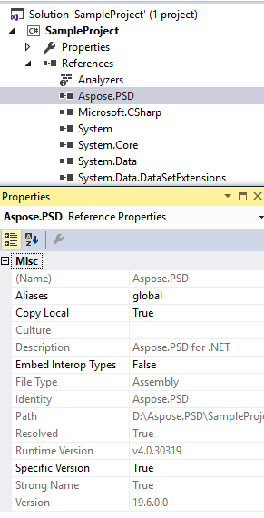

## **Instalando Aspose.PSD para .NET a través de NuGet**
NuGet es la forma más fácil de descargar e instalar las API de Aspose para .NET. Abra Microsoft Visual Studio y el administrador de paquetes NuGet. Busque "aspose" para encontrar la API de Aspose deseada. Haga clic en "Instalar", la API seleccionada se descargará y se hará referencia en su proyecto.

## **Instalar o Actualizar Aspose.PSD usando la Consola del Administrador de Paquetes**
Puede seguir los pasos a continuación para hacer referencia a la [API de Aspose.PSD](https://www.nuget.org/packages/Aspose.psd/) utilizando la consola del administrador de paquetes:

1. Abra su solución/proyecto en Visual Studio.
1. Seleccione Herramientas -> Administrador de Paquetes de Bibliotecas -> Consola del Administrador de Paquetes en el menú para abrir la consola del administrador de paquetes.

Escriba el comando "**Install-Package Aspose.Psd**" y presione Enter para instalar la última versión completa en su aplicación. Alternativamente, puede agregar el sufijo "**-prerelease**" al comando para especificar que la última versión, incluidas las correcciones más recientes, también se instale.

Verá que aparece la sugerencia **"Instalación de Aspose.PSD"** en la parte inferior de la ventana, indicando que la descarga está en proceso.

Una vez descargado, verá los siguientes mensajes de confirmación. Si no está familiarizado con la [EULA de Aspose](https://company.aspose.com/legal/eula), es una buena idea leer la licencia referenciada en la URL.

Ahora debería encontrarse que Aspose.PSD se ha agregado y referenciado con éxito en su aplicación.

En la consola del administrador de paquetes, también puede usar el comando "**Update-Package Aspose.Psd**" y presionar Enter para verificar si hay actualizaciones disponibles para el paquete Aspose.Psd e instalarlas si están presentes. También puede agregar el sufijo "-prerelease" para actualizar a la última versión.
## **Consideraciones al Ejecutar en un Entorno de Servidor Compartido**
Se recomienda que todos los componentes de Aspose .NET se ejecuten con el conjunto de permisos de Trust Completo. Esto se debe a que los componentes de Aspose .NET a veces necesitan acceder a la configuración del registro y archivos ubicados en lugares distintos al directorio virtual, por ejemplo, para leer fuentes, etc. Además, los componentes de Aspose.NET se basan en las clases del sistema principal de .NET, algunas de las cuales también requieren permisos de Trust Completo para ejecutarse en algunos casos.

Los proveedores de servicios de Internet que alojan múltiples aplicaciones de diferentes empresas en su mayoría hacen cumplir un nivel de seguridad de Trust Medio. En el caso de .NET 2.0, dicho nivel de seguridad puede imponer las siguientes restricciones que podrían afectar la capacidad de Aspose.Words para funcionar correctamente.

- **RegistryPermission** no está disponible. Esto significa que no se puede acceder al registro, lo que es necesario para enumerar las fuentes instaladas al renderizar documentos.
- **FileIOPermission** está restringido. Esto significa que solo se puede acceder a archivos en la jerarquía de directorios virtuales de su aplicación. Esto potencialmente significa que las fuentes no se pueden leer durante la exportación.

Por las razones especificadas anteriormente, se recomienda que Aspose.PSD se ejecute en permisos de Trust Completo. Es posible que algunas funciones de la biblioteca funcionen al realizar diferentes tareas en Trust Medio mientras que otras no (como la renderización), que puede ser debida a las llamadas a procesamiento de imágenes GDI+.

## **Trabajando con DLLs de .NET Core instaladas a través del paquete MSI**

**Tenga en cuenta:** si utiliza una DLL de .Net Standard instalada a través del paquete MSI, deberá agregar las dependencias necesarias para trabajar con la versión de .Net Standard.

|**Captura de pantalla de las dependencias de Visual Studio**|**Fragmento del archivo CsProj:**|
| :- | :- |
||<ItemGroup>

`    `<PackageReference Include="System.Drawing.Common" Version="4.5.1" />

`    `<PackageReference Include="System.Text.Encoding.CodePages" Version="4.5.0" />

</ItemGroup>|
## **Requisitos del Sistema**
### **Sistemas Operativos Compatibles:**
- Microsoft Windows 2000 Professional y Server (se recomienda el SP2)
- Microsoft Windows XP Professional y Home Edition
- Microsoft Windows 2003 Server
- Microsoft Windows Vista
- Microsoft Windows 2008 Server
- Microsoft Windows 2008 Server R2
- Microsoft Windows 7
- Microsoft Windows 8
- Microsoft Windows 10
- Microsoft Windows 11
### **Plataformas Compatibles:**
- Formularios de Windows
- Formularios Web
- Visual Studio 2005
- Visual Studio 2008
- Visual Studio 2010
- Visual Studio 2012
- Visual Studio 2013
- Visual Studio 2015
- Visual Studio 2017
- Visual Studio 2019
- Visual Studio 2022

Aspose.PSD funciona para las versiones x86 y x64 de los sistemas operativos listados anteriormente.
### **Frameworks Compatibles:**
Aspose.PSD para .NET es compatible con los siguientes frameworks de .NET:

- Versión del Framework .NET 2.0 o superior
- .NET Standard 2.0
