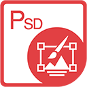

{} 

****

**خوش آمدید به Aspose.PSD برای جاوا**

‍Aspose.PSD برای جاوا به شما امکان انجام تلاش های گسترده ای بر روی فرمت های فایل PSD می دهد. این محصول نیازی به نصب Adobe Photoshop ندارد. Aspose.PSD برای جاوا امکان ویرایش فایل های PSD، به روزرسانی ویژگی های لایه، اضافه کردن ابرنشان، انجام عملیات گرافیکی و تبدیل یک فرمت فایل به دیگری را فراهم می کند. این محصول همچنین از سناریوهای اتوماسیون مختلف پشتیبانی می کند که توسعه دهندگان را در مسیر خود کمک می کند.

هم اکنون Aspose.PSD برای جاوا از فرمت های فایل PSD و PSB برای بارگیری و انجام تلاش پشتیبانی می کند. نسخه های آتی اجازه بارگیری فرمت های فایل PSD بیشتری را خواهد داد. Aspose.PSD برای جاوا اجازه صدور به فرمت های فایل پیکسلی مختلف از جمله TIFF، JPEG، JPEG2000، PNG، GIF و BMP را فراهم می کند. این محصول از الگوریتم هایی استفاده می کند که امکان ویرایش فایل های PSD را به نحوی کارآمد فراهم می کند و عملکرد خوبی را حفظ می کند. این محصول تحت توسعه فعال قرار دارد و بسیاری از ویژگی های مفید برای تامین نیازهای بازار اضافه خواهد شد.

{} 

## **منابع Aspose.PSD برای جاوا**

در زیر پیوندهایی به برخی منابع مفیدی آورده شده اند که ممکن است برای انجام کارهای خود نیاز داشته باشید.

- [مستندات آنلاین Aspose.PSD برای جاوا](psd/fa/java/)
- [ویژگی های Aspose.PSD برای جاوا](psd/fa/java/features/)
- [یادداشت های نسخه های Aspose.PSD برای جاوا](psd/fa/java/release-notes/)
- [صفحه محصول Aspose.PSD برای جاوا](https://products.aspose.com/psd/java)
- [دانلود Aspose.PSD برای جاوا](https://repository.aspose.com/webapp/#/artifacts/browse/tree/General/repo/com/aspose/aspose-psd)
- [نصب Aspose.PSD برای جاوا از مخزن Maven](psd/fa/java/installation/)
- [راهنمای مرجع API Aspose.PSD برای جاوا](https://reference.aspose.com/java/psd)
- [دانلود مثال ها از مخزن GitHub](https://github.com/aspose-psd/Aspose.PSD-for-Java)
- [انجمن پشتیبانی رایگان Aspose.PSD برای جاوا](https://forum.aspose.com/c/psd)
- [دفترچه راهنمای پشتیبانی پولی Aspose.PSD برای جاوا](https://helpdesk.aspose.com/)
