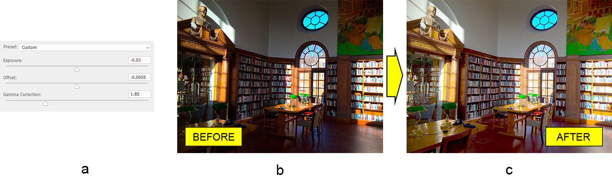

# کار با لایه تنظیم نوردهی فتوشاپ در جاوا

در این مقاله قصد داریم یک لایه تنظیم نوردهی را به سند Adobe® Photoshop® اضافه کنیم، با استفاده از Aspose.PSD برای جاوا - کتابخانه تلاش برای فرمت فایل PSD. این کتابخانه بدون نیاز به نصب ویرایشگر فتوشاپ کار می‌کند زیرا از الگوریتم‌های پردازش تصویر خود استفاده می‌کند. ما همچنین جزئیاتی مرتبط با API تنظیم نوردهی کتابخانه را یاد گرفته‌ایم.

## مروری بر API

لایه تنظیم نوردهی توسط کلاس [ExposureLayer](https://reference.aspose.com/psd/java/com.aspose.psd.fileformats.psd.layers.adjustmentlayers/exposurelayer) پیکربندی می‌شود که شامل ویژگی‌های زیر برای کار با تنظیم نوردهی است: 

- نحوه نوردهی عکس را با فشردن یا کشش کل هیستوگرام نسبت به قسمت‌های سیاه تعیین می‌کند. بنابراین، به طور اصلی بر روی نقاط روشنی تأثیر می‌گذارد.
- عیناً تأثیر آفست نوردهی بیشتر بر روی سایه‌ها اثر می‌گذارد.
- اصلاح گاما. این مشکلات روشنایی تصویر را اصلاح می‌کند.

## تصحیح نوردهی

تصحیح نوردهی و ویژگی‌های مرتبط همچنین به اندازه تغییر ویژگی‌های کلاس ساده است. اجازه دهید برخی تنظیمات نوردهی (آ) را به یک عکس زیر نورنشان کتابخانه (ب) اعمال کنیم تا قابل فهم برای چشم انسان (ج) شود.

تمام تنظیمات به طور اصلی با استفاده از اصلاح گاما انجام می‌شود. با این حال، نوردهی و آفست نیز کمی تنظیم می‌شوند. هر آنچه که باید انجام دهید، تنظیم مقادیر مناسب برای ویژگی‌های گفته شده از قبل است:

    ExposureLayer exposureLayer = psdImage.addExposureAdjustmentLayer();
    exposureLayer.setExposure(-0.03f);
    exposureLayer.setOffset(-0.0005f);
    exposureLayer.setGammaCorrection(1.85f);

توجه داشته باشید که نوردهی باید در محدوده -20.0 تا 20.0 باشد، مقدار آفست باید در محدوده -0.5 تا 0.5 و محدوده مقدار اصلاح گاما باید بین 9.99 تا 0.01 باشد.

برای کسب اطلاعات بیشتر به [مرجع API لایه تنظیم نوردهی](https://reference.aspose.com/psd/java/com.aspose.psd.fileformats.psd.layers.adjustmentlayers/ExposureLayer) مراجعه کنید.

## نتیجه

در این مقاله یاد گرفتیم چگونه لایه تنظیم نوردهی را به یک فایل PSD اضافه کنیم تا تصویر را روشن‌تر کنیم و همچنین برخی جزئیات API را در نظر گرفتیم.
