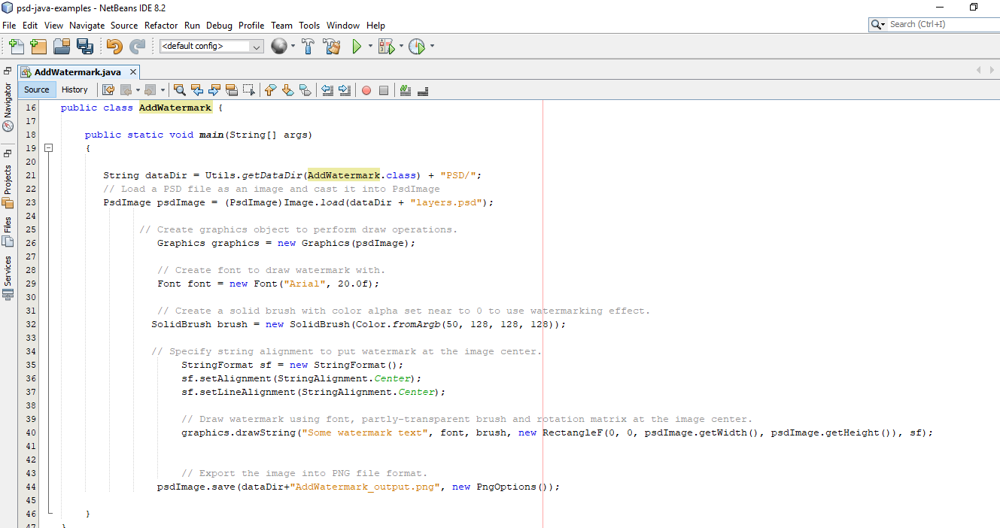

## **دریافت از گیت‌هاب**
تمامی مثال‌های Aspose.PSD برای Java روی [GitHub](https://github.com/aspose-psd/Aspose.PSD-for-Java) قرار دارند. شما می‌توانید یا مخزن را با استفاده از مشتری Github کلون کنید یا فایل ZIP را از [اینجا](https://github.com/aspose-psd/Aspose.PSD-for-Java/archive/master.zip) دانلود کنید.

محتویات فایل ZIP را در کامپیوتر خود اکسترکت کنید. شما پوشه **Examples** را خواهید دید. تمامی مثال‌ها در پوشه **Examples** قرار دارند.

شما می‌توانید این مثال‌ها را با هر محیط توسعه ای (IDE) که دوست دارید اجرا کنید، با این حال برای اهداف نمایشی، ما از **NetBeans** استفاده می‌کنیم. از گزینه **File -> Open** **Project** برای وارد کردن مثال دلخواه خود و مشخص کردن مسیر استفاده کنید.

فایل‌های jar مورد نیاز (کتابخانه‌ها) را به پروژه اضافه کنید.

پوشه **Resources** حاوی اسناد/فایل‌های ورودی مورد استفاده در مثال است.

{} 

همچنین می‌توانید مثال‌ها را مستقیما از مخزن GitHub وارد کنید.

{} 

## **همکاری**
اگر می‌خواهید یک مثال اضافه یا بهبود بخشید، شما را تشویق می‌کنیم که به پروژه کمک کنید. تمامی مثال‌ها و پروژه‌های نمایشی در این مخزن متن باز هستند و می‌توانند به آزادی در برنامه‌های خود استفاده شوند.

برای همکاری، شما می‌توانید مخزن را fork کنید، کد منبع را ویرایش کنید و یک درخواست pull ایجاد کنید. ما تغییرات را بررسی کرده و آن‌ها را در مخزن اضافه می‌کنیم اگر مفید بودند.
