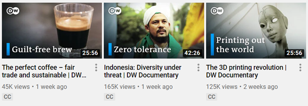

## **مقدمه**
هدف از این سند، نشان دادن استفاده از API برخی ابزارهای ترکیبی [Aspose.PSD برای جاوا](https://products.aspose.com/psd/java) در یک مثال واقعی است. در این مقاله، **یک برنامه ساده جاوا که تصاویر بنرهای YouTube را تولید می‌کند** برای کانال [DW Documentary](https://www.youtube.com/channel/UCW39zufHfsuGgpLviKh297Q) نوشته و توضیح داده خواهد شد. این کانال از جهان واقعی برای نشان دادن استفاده از چند ابزار ترکیبی محبوب Aspose.PSD برای جاوا (به عنوان مثال افکت [سایه افکت](/psd/fa/java/manipulating-photoshop-formats/#manipulatingphotoshopformats-supportdropshadoweffect)، پرکردن گرادیان شعاعی، رسم متن و اشکال) انتخاب شده است:

## **چگونگی عملکرد به طور خلاصه**
یک برنامه ساده جاوا دو آرگومان را به عنوان ورودی می‌گیرد: یک عنوان و یک تصویر. یک **سند فتوشاپ در حافظه (PSD) از آن ورودی با استفاده از Aspose.PSD برای جاوا** تولید می‌شود. سپس برنامه **سند را از فرمت PSD به فرمت فایل PNG تبدیل می‌کند** تا یک بنر YouTube با ابعاد 1280x720 پیکسل دریافت کند. تصویر خروجی مشابه تصویر زیر خواهد بود:

## **نیازمندی‌های فنی**
فن آوری‌های زیر برای موفقیت در اجرای کد این مقاله ضروری است:

- Java 6+
- [Aspose.PSD برای جاوا](/psd/fa/java/installation/) (جدیدترین)

## **آغاز کار**
همانطور که قبلاً اشاره شد، برنامه از PSD در حافظه برای تولید یک تصویر بنر استفاده می‌کند. بنابراین، اجازه دهید **یک سند PSD ایجاد کنیم** و با آن شروع کنیم:

PsdImage psdImage = new PsdImage(1280, 720);

اگر به دقت بیشتری به تصویر بنر YouTube بالا نگاه کنید ممکن است **متوجه شوید که از چندین مؤلفه تشکیل شده است**:

1. یک تصویر پس‌زمینه (ماسک چاپ)
1. یک گرادیان psd شعاعی (نقطه نوردرنگ انتهایی سمت راست بالا)
1. یک لوگو با افکت سایه
1. یک عنوان و یک نقاشی ساده (مستطیل آبی)

اجازه دهید عمیق‌تر بپردازیم تا ببینیم چگونه هر یک از این مؤلفه‌ها را با استفاده از Aspose.PSD برای جاوا در بخش‌های بعدی پیاده‌سازی می‌کنیم.

## **1. اضافه کردن یک تصویر پس‌زمینه**
ترتیب لایه‌ها اهمیت دارد. بنابراین، ابتدا باید یک تصویر پس‌زمینه اضافه شود تا بقیه لایه‌ها را نپوشاند. توجه داشته باشید که تنها [فرمت‌های فایل رستری پشتیبانی می‌شوند](/psd/fa/java/supported-file-formats/) در حال حاضر.
### **1.1. اضافه کردن یک تصویر پس‌زمینه به یک لایه فتوشاپ**
برای **اضافه کردن تصویر معایب به PSD**، باید یک جریان ورودی به عنوان آرگومان در زمان ساخت لایه ارسال شود (برای دیدن مثال‌های بیشتر از بارگذاری تصاویر رستری مراجعه کنید):



1.2. تنظیم تصویر پس‌زمینه برای کانواس

این 2 اقدام (تغییر اندازه دهی و مکان‌دهی) برای مواقعی کاربردی است که **اندازه تصویر با اندازه کانواس متفاوت است**، اگرچه در این مقاله تصویر با اندازه مساوی کانواس است (فرض کنید همیشه اینطور نیست).

مطمئن شوید که تصویر بارگذاری‌شده **به اندازه کانواس می‌خورد** (برای دیدن مثال‌های بیشتر از تغییر اندازه دهی مراجعه کنید):



بعد از تغییر اندازه دهی، مکان تصویر تغییر می‌کند. بنابراین، برای **بازنشانی مکان تصویر**، تصویری که تغییر اندازه دهی شده، به گوشه بالا سمت چپ منتقل شود:



## **2. اضافه کردن یک گرادیان شعاعی**
دو روش برای اضافه کردن گرادیان شعاعی وجود دارد، استفاده از:

- یک [افکت لایه‌ی ابر گرادیان](/psd/fa/java/aspose-psd-for-java-20-4-release-notes/#-~-text=psdjava-163) بر روی یک لایه موجود (افکت گرادیانی که به لایه فعلی بسته می‌شود و بر روی محتوای آن اعمال می‌شود)
- یک لایه پرکردن [گرادیانی تکمیلی](/psd/fa/java/support-of-fill-layers/#supportoffilllayers-supportoffilllayerswithgradientfill) (یک لایه جدید پرکردنی که پیکربندی مستقل گرادیان را نگه می‌دارد)

به اندازه استفاده از افکت گرادیان لایه ابر برای این مثال کافی است. با این حال، برای جذاب‌تر کردن این مقاله و مفیدتر کردن آن **از لایه پرکردن گرادیان استفاده می‌کنیم** زیرا همه اثرات لایه به همان نحو اعمال می‌شوند و از یک اثر لایه دیگر در بخش بعد استفاده خواهد شد.

### **2.1. اضافه کردن یک لایه پرکردن گرادیان شعاعی**
فرایند اضافه کردن یک لایه پرکردن گرادیان جدید از 2 مرحله زیر تشکیل می‌شود:

\1. به **تعیین تنظیمات پرکردن گرادیان** نیاز است زیرا تنظیمات از پیش تعیین‌شده وجود ندارد. پیکربندی حداقل مورد نیاز به شکل زیر است (یعنی نوع گرادیان، مقیاس، رنگ و نقاط شفافیت نقطه منتظرنگری):



پیکربندی بالا یک گرادیان شعاعی اعلام می‌کند که در لبه‌ها شفاف است و در مرکز نیرو کشی‌شده. موقعیت گرادیان به صورت پیش‌فرض در وسط کانواس قرار دارد.

برای معکوس کردن گرادیان و کمی به بالا و سمت راست آن انتقال دادن از خواص اختیاری مربوطه استفاده شود:



\2. هنگامی که پیکربندی انجام شد، یک لایه پرکردن گرادیان را به همراه تنظیماتش به PSD اضافه کنید:



## **اضافه کردن یک لوگو با افکت سایه**
**سایه افکت** امکان اضافه کردن یک سایه سفارشی در طول محیط شی (تصویر، متن و غیره) را فراهم می‌کند.
### **3.1. اضافه کردن یک لوگو به لایه فتوشاپ**
همان رویکرد بخش 1.1. می‌تواند برای **اضافه کردن یک لوگو به PSD** استفاده شود:



### **3.2. مکان لوگو**
تصویر بارگذاری‌شده به طور نزدیک به گوشه بالا سمت چپ به صورت پیش‌فرض چسبیده شده است. با این حال، برای اینکه شکل لوگو در بنر اصلی YouTube کانال به نظر بیاید باید از **حاشیه دادن کمی** استفاده شود و مکان تصویر باید از لبه‌های لایه دور شود:



### **3.3. افزودن افکت سایه به لوگو**
ممکن است لوگو نامرئی باشد اگر از یک تصویر پشت زمینه روشن استفاده شود. بنابراین، مطلوب است **یک افکت سایه افزود** به لوگو از طریق خواص افکت‌های ترکیبی (برای دیدن مثال‌های بیشتر از سایه‌دهی مراجعه کنید):



افکت سایه الزامیت مشخصات مورد نیاز را ندارد به دلیل پیکربندی پیش‌فرض (شبیه به فتوشاپ). با این حال، سایه فوق به نظر میرسد که مرز نیمه شفاف و بلوری دارد.

## **4. اضافه کردن ترسیمات متن و یک شکل**
### **3.1. ایجاد یک لایه تصویری**
رسم مستقیماً از طریق یک لایه معمولی پشتیبانی نمی‌شود. بنابراین، بجای لایه معمولی کنار لایه از موتور گرافیکی استفاده می‌شود تا **یک API برای ترسیم فراهم کند** (برای دیدن مثال‌های بیشتر از ترسیم مراجعه کنید):

Layer graphicLayer = psdImage.addRegular