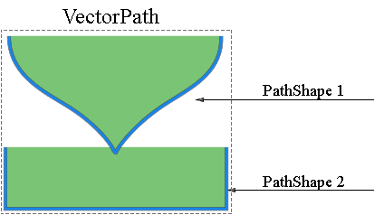
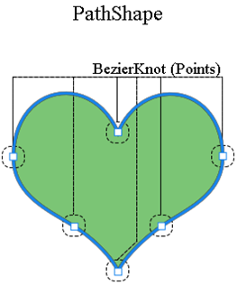

## **بررسی مختصر لایه برداری**
یک ماسک برداری مسیری است که بسته به رزولوشن محتوای لایه را برش می‌زند. ماسک‌های برداری معمولاً دقیق‌تر از آن است که با ابزار‌های مبتنی بر پیکسل ایجاد شده باشند. شما می‌توانید ماسک‌های برداری را با استفاده از ابزار خودکار یا اشکال ایجاد کنید.

Aspose.PSD پشتیبانی از تولید و اعمال ماسک‌های برداری را ارائه می‌دهد. شما می‌توانید ماسک‌های برداری را از طریق ویرایش مسیرهای برداری تغییر دهید.
## **مسیر برداری در Aspose.PSD**
دسترسی به مسیرهای برداری در Aspose.PSD از طریق منابع [VsmsResouce](https://reference.aspose.com/psd/net/aspose.psd.fileformats.psd.layers.layerresources/vsmsresource) و [VmskResouce](https://reference.aspose.com/psd/net/aspose.psd.fileformats.psd.layers.layerresources/vmskresource) فراهم می‌شود که کلاس‌های فرزند [VectorPathDataResource](https://reference.aspose.com/psd/net/aspose.psd.fileformats.psd.layers.layerresources/vectorpathdataresource) هستند.

## **چگونگی ویرایش مسیر برداری؟**
### **ساختار مسیر برداری**
ساختار پایه برای کنترل مسیرها [VectorPathRecord](https://reference.aspose.com/psd/net/aspose.psd.fileformats.core.vectorpaths/vectorpathrecord) است. اما برای راحتی خودتان، راه‌حل زیر توصیه می‌شود.

برای ویرایش آسان مسیرهای برداری، باید از کلاس [VectorPath](https://gist.github.com/aspose-com-gists/8a4c9d34ce856d1642fc7c0ce974175c#file-examples-csharp-aspose-workingwithvectorpaths-classestomanipulatevectorpathobjects-classestomanipulatevectorpathobjects-cs) استفاده کنید که شامل متدهایی برای ویرایش راحت داده‌های برداری در منابع مشتق‌شده از VectorPathDataResource است.

شروع کار با ایجاد یک شی از نوع VectorPath.

برای راحتی، می‌توانید از متد استاتیک [VectorDataProvider.CreateVectorPathForLayer](https://gist.github.com/aspose-com-gists/8a4c9d34ce856d1642fc7c0ce974175c#file-examples-csharp-aspose-workingwithvectorpaths-classestomanipulatevectorpathobjects-classestomanipulatevectorpathobjects-cs) استفاده کنید، که یک منبع برداری در لایه ورودی پیدا کرده و بر اساس آن یک شی VectorPath ایجاد خواهد کرد.

پس از تمامی ویرایش‌ها، می‌توانید شی VectorPath با تغییرات را به لایه با استفاده از متد استاتیک [VectorDataProvider.UpdateLayerFromVectorPath](https://gist.github.com/aspose-com-gists/8a4c9d34ce856d1642fc7c0ce974175c#file-examples-csharp-aspose-workingwithvectorpaths-classestomanipulatevectorpathobjects-classestomanipulatevectorpathobjects-cs) اعمال کنید.



نوع VectorPath شامل یک لیست از المان‌های [PathShape](https://gist.github.com/aspose-com-gists/8a4c9d34ce856d1642fc7c0ce974175c#file-examples-csharp-aspose-workingwithvectorpaths-classestomanipulatevectorpathobjects-classestomanipulatevectorpathobjects-cs) است و یک تصویر برداری کلی را که ممکن است از یک یا چند شکل تشکیل شده باشد، توصیف می‌کند.

هر PathShape یک فیگور برداری است که از یک مجموعه جداگانه از گره‌های بزیری تشکیل شده است.

گره‌ها اشیاء از نوع [BezierKnot](https://gist.github.com/aspose-com-gists/8a4c9d34ce856d1642fc7c0ce974175c#file-examples-csharp-aspose-workingwithvectorpaths-classestomanipulatevectorpathobjects-classestomanipulatevectorpathobjects-cs) هستند که به طور اصولی نقاطی هستند که فیگور از آن ساخته می‌شود.

مثال کد زیر نشان می‌دهد چگونه به یک فیگور و نقاط دسترسی پیدا کنید.


### **چگونگی ایجاد یک شکل؟**
برای ویرایش یک شکل، نیاز است که یک شکل موجود را از لیست [VectorPath.Shapes](https://gist.github.com/aspose-com-gists/8a4c9d34ce856d1642fc7c0ce974175c#file-examples-csharp-aspose-workingwithvectorpaths-classestomanipulatevectorpathobjects-classestomanipulatevectorpathobjects-cs) دریافت کنید یا با ایجاد یک نمونه [PathShape](https://gist.github.com/aspose-com-gists/8a4c9d34ce856d1642fc7c0ce974175c#file-examples-csharp-aspose-workingwithvectorpaths-classestomanipulatevectorpathobjects-classestomanipulatevectorpathobjects-cs) و اضافه کردن آن به لیست [Shapes](https://gist.github.com/aspose-com-gists/8a4c9d34ce856d1642fc7c0ce974175c#file-examples-csharp-aspose-workingwithvectorpaths-classestomanipulatevectorpathobjects-classestomanipulatevectorpathobjects-cs) اضافه کنید.


### **چگونگی اضافه کردن گره‌ها (نقاط)؟**
شما می‌توانید نقاط های شکل را به عنوان عناصری از یک لیست عادی با استفاده از خاصیت PathShape.Points، به عنوان مثال، می‌توانید نقاط شکل را اضافه کنید:



BezierKnot حاوی نقطه محور و دو نقطه کنترل است.

اگر نقطه محور و نقاط کنترل مقادیر یکسانی داشته باشند، آن گره زاویه تیزی خواهد داشت.

برای تغییر موقعیت نقطه محور همراه با نقاط کنترل (مشابه Photoshop)، BezierKnot دارای یک متد Shift است.

مثال کد زیر حرکت سراسری یک گره بزیری بیزیر را به صورت عمودی با کردن Y نشان می‌دهد:

می‌توانید نقاط شکل را به عنوان عناصر یک لیست عادی با استفاده از خاصیت PathShape.Points تغییر دهید. به عنوان مثال، می‌توانید نقاط شکل را اضافه کنید:



## **ویژگی‌های PathShape**
ویرایش PathShape به ویرایش گره‌ها محدود نمی‌شود، این نوع دارای ویژگی‌های دیگری است.
### **PathOperations (عملیات بولی)**
ویژگی [PathOperations](https://reference.aspose.com/psd/net/aspose.psd.fileformats.core.vectorpaths/pathoperations) یک عملیات بولی مشهور است که تغییر مقدار آن تعیین می‌کند که چگونه چندین شکل با یکدیگر ترکیب می‌شوند.

مقادیر ممکن عبارتند از:

- 0 = ExcludeOverlappingShapes (عملیات XOR).
- 1 = CombineShapes (عملیات OR).
- 2 = SubtractFrontShape (عملیات NOT).
- 3 = IntersectShapeAreas (عملیات AND).

### **ویژگی IsClosed**
همچنین، با استفاده از خصوصیت PathShape.IsClosed، می‌توانیم تشخیص دهیم که آیا گره اول و آخر یک شکل به هم وصل هستند یا خیر.

|**شکل بسته**|**شکل باز**|
| :- | :- |
|||
### **FillColor Property**
هیچ فیگوری نمی‌تواند رنگ خودش را داشته باشد، پس می‌توانید رنگ تمام مسیر برداری را با خصوصیت VectorPath.FillColor تغییر دهید.

می‌توانید نقاط شکل را به عنوان عناصر یک لیست عادی با استفاده از خاصیت PathShape.Points تغییر دهید. به عنوان مثال، می‌توانید نقاط شکل را اضافه کنید:



## **اینجا منبع کد VectorDataProvider و کلاس‌های مرتبط را پیدا خواهید کرد:**
 
