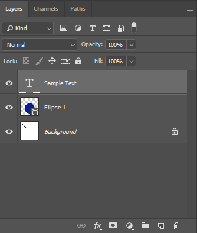

## **مرور**
لایه PSD Adobe® Photoshop® یکی از بهترین مفاهیم در پردازش گرافیکی است. لایه‌ها اطلاعاتی در مورد پیکسل‌ها دارند، می‌توانند شمارش مختلفی از کانال‌ها داشته باشند.

یکی از مهمترین بخش‌های لایه در سند فتوشاپ، منابع لایه است. شما می‌توانید لیست کاملی از [منابع لایه](psd/fa/net/list-of-psd-layer-resources/) پشتیبانی شده در PSD را از مستندات ما دریافت کنید.

شما می‌توانید رابط کاربری برای مدیریت لایه را در عکس زیر پیدا کنید:

اما Aspose.PSD در مورد مدیریت برنامه‌ای لایه PSD از طریق [C# ](psd/fa/net/home/) و [Java](https://docs.aspose.com/display/psdjava/Aspose.PSD+for+Java+Home) تخصص دارد.

مستندات اضافی می‌توانند در این مقاله پیدا شوند: [ویرایش تصاویر](psd/fa/net/manipulating-images-html/). تمام ویرایش‌ها می‌توانند به پیش‌نمایش PSD و لایه پرداخته شوند، اطلاعات بیشتری را در [مرجع API تصویری Raster Aspose.PSD](https://reference.aspose.com/psd/net/aspose.psd/rasterimage) پیدا خواهید کرد.
## **API لایه PSD در دسترسست**
- اثرات لایه
- ویژگی‌های مشترک لایه
- فهرست از لایه
## **مثال‌های ویرایش لایه از طریق C#**
### **اضافه کردن لایه جدید**
اگر می‌خواهید یک لایه خالی به [پرونده PSD باز](psd/fa/net/psd-file/) اضافه کنید، می‌توانید از کد زیر استفاده کنید.

اضافه کردن لایه جدید به پرونده PSD با استفاده از API


### **اضافه کردن لایه جدید از فایل‌های Jpeg، Png، Gif، Ai، Tiff، Bmp**
فایل‌های هر [فرمت پشتیبانی‌شده](psd/fa/net/supported-file-formats/) با اضافه کردن به عنوان یک لایه جدید به تصویر شما می‌تواند افزوده شود. اما نمی‌توانید آن را به طور مستقیم بارگیری کنید.

می‌توانید از کد زیر برای اضافه کردن لایه جدید PSD از فایل هر فرمت پشتیبانی‌شده از جریان استفاده کنید


### **تراکم کلیه لایه‌ها یا گروه‌های لایه**
اگر نمی‌خواهید یک پرونده PSD قابل ویرایش را به کاربران خود بدهید، این کار مفید خواهد بود. همچنین، می‌توانید از طریق API شناسایی کنید که آیا پرونده تراکم شده است یا خیر.

لایه تراکم کلیه لایه‌های پرونده PSD:


