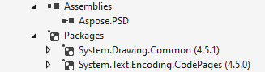

## **نصب Aspose.PSD برای .NET از طریق NuGet**
NuGet راحت‌ترین راه برای دانلود و نصب API های Aspose برای .NET است. مایکروسافت ویژوال استودیو و مدیر پکیج NuGet را باز کنید. جستجو کنید "aspose" تا API مورد نظر Aspose را پیدا کند. بر روی "نصب" کلیک کنید، API انتخاب شده دانلود و به پروژه‌ی شما ارجاع داده می‌شود.

## **نصب یا به‌روزرسانی Aspose.PSD با استفاده از کنسول استودیو پکیج**
می‌توانید مراحل زیر را دنبال کنید تا [API Aspose.PSD](https://www.nuget.org/packages/Aspose.psd/) را با استفاده از کنسول مدیر پکیج مرجع‌گذاری کنید:

1. پروژه/راه‌حل خود را در ویژوال استودیو باز کنید.
1. ابزار -> مدیر پکیج کتابخانه -> کنسول مدیر پکیج از منو را انتخاب کنید تا کنسول مدیر پکیج را باز کنید.

دستور "Install-Package Aspose.Psd" را تایپ کنید و اینتر را بزنید تا آخرین نسخه کامل را به برنامه‌ی شما نصب کنید. به صورت جایگزین می‌توانید پسوند "-prerelease" را به دستور اضافه کنید تا مشخص کنید که آخرین نسخه شامل رفع خرابی‌های گرم نصب شود.

مشاهده خواهید کرد که "نصب Aspose.PSD" در پایین پنجره نمایان می‌شود که نشان می‌دهد دانلود در حال انجام است.

پس از دانلود، پیام تأیید بالا را مشاهده خواهید کرد. اگر با [EULA Aspose](https://company.aspose.com/legal/eula) آشنا نیستید، خواندن لایسنس مرجع شده در URL ایده خوبی است.

باید اکنون متوجه شوید که Aspose.PSD با موفقیت به برنامه شما افزوده و مرجع گردیده است.

در کنسول مدیر پکیج نیز می‌توانید از دستور "Update-Package Aspose.Psd" استفاده کرده و اینتر را بزنید تا به دنبال به‌روزرسانی‌های پکیج Aspose.Psd بگردید و آن‌ها را نصب کنید اگر وجود داشته باشند. همچنین می‌توانید پسوند "-prerelease" را برای به‌روزرسانی آخرین نسخه نیز اضافه کنید.
## **در نظر گرفتن در هنگام اجرا در محیط سرورهای مشترک**
تمامی مؤلفه‌های Aspose .NET پیشنهاد می‌شود با مجوز اعتماد کامل (Full Trust) اجرا شوند. این امر به این دلیل است که مؤلفه‌های Aspose .NET گاهی نیازمند دسترسی به تنظیمات رجیستری و پرونده‌های اصطلاحاً در مکان‌های دیگر از فهرست مجازی نظیر برای خواندن فونت‌ها می‌باشد. علاوه براین، مؤلفه‌های Aspose.NET بر اساس کلاس‌های سیستمی اصلی .NET استوار است، برخی از آن‌ها نیز در برخی مواقع برای اجرا به اجازه‌ی اعتماد کامل نیاز دارند.

سرویس‌دهنده‌های اینترنتی که از شرکت‌های مختلف برنامه ریزی اجرا می‌کنند بیش‌تر در سطح امنیتی Trust متوسط اجرا می‌کنند. در مورد .NET 2.0، چنین سطح امنیتی ممکن است محدودیت‌های زیر را تنظیم کند که ممکن است بر قابلیت اجرای مناسب Aspose.Words تأثیر بگذارد.

- **RegistryPermission** در دسترس نیست. این به این معناست که نمی‌توانید به رجیستری دسترسی یابید که برای شمارش فونت‌های نصب شده هنگام پردازش اسناد لازم است.
- **FileIOPermission** محدود شده است. این به این معناست که فقط می‌توانید به پرونده‌ها در سلسله‌مراتب دایرکتوری مجازی برنامه خود دسترسی داشته باشید. این به معنای احتمالی است که فونت‌ها در هنگام صادرات نتواند خوانده شود.

به دلایل مشخص شده بالا، پیشنهاد می‌شود که Aspose.PSD بر روی مجوزهای اعتماد کامل اجرا شود. شما ممکن است متوجه شوید که بعضی از ویژگی‌های کتابخانه هنگام انجام وظایف مختلف در مجوز Trust متوسط کار می‌کنند در حالی که بعضی از آن‌ها (به‌عنوان مثال، رندرینگ) اجرا نمی‌شوند که ممکن است ناشی از تماس‌ها به پردازش تصاویر GDI+ باشد.

## **کار با DLL های .NET Core نصب شده از طریق بسته MSI**

**لطفا توجه نمایید:** اگر از .Net Standard dll استفاده می‌کنید که توسط بسته MSI نصب شده است باید وابستگی‌های لازم را برای کار با نسخه .Net Standard اضافه کنید.

|**عکس وابستگی‌های ویژوال استودیو**|**قطعه کد CsProj:**|
| :- | :- |
||<ItemGroup>

`    `<PackageReference Include="System.Drawing.Common" Version="4.5.1" />

`    `<PackageReference Include="System.Text.Encoding.CodePages" Version="4.5.0" />

</ItemGroup>|

## **نیازمندی‌های سیستم**
### **سیستم‌های عامل پشتیبانی شده:**
- ویندوز 2000 حرفه‌ای و سرور (پیشنهاد شده SP2)
- ویندوز XP حرفه‌ای و خانگی
- ویندوز 2003 سرور
- ویندوز ویستا
- ویندوز 2008 سرور
- ویندوز 2008 سرور R2
- ویندوز 7
- ویندوز 8
- ویندوز 10
- ویندوز 11
### **پلتفرم‌های پشتیبانی شده:**
- فرم‌های ویندوز
- فرم‌های وب
- ویژوال استودیو 2005
- ویژوال استودیو 2008
- ویژوال استودیو 2010
- ویژوال استودیو 2012
- ویژوال استودیو 2013
- ویژوال استودیو 2015
- ویژوال استودیو 2017
- ویژوال استودیو 2019
- ویژوال استودیو 2022

Aspose.PSD برای نسخه‌های x86 و x64 سیستم‌عامل‌های فوق نصب موردی است.
### **چارچوب‌های پشتیبانی شده:**
Aspose.PSD برای .NET نسخه‌های 2.0 یا بالاتر و Net Standard 2.0 پشتیبانی می‌شود.
