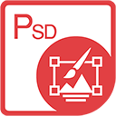

{} 

****

**Bienvenue dans Aspose.PSD pour .NET**

Aspose.PSD pour .NET est un produit qui permet une manipulation extensive des formats de fichiers PSD. Le produit ne nécessite pas l'installation d'Adobe Photoshop. Aspose.PSD pour .NET permet de modifier les fichiers PSD, de mettre à jour les propriétés des calques, d'ajouter des filigranes, d'effectuer des opérations graphiques ou de convertir un format de fichier en un autre. Ce produit permet différentes scénarios d'automatisation qui aident les développeurs dans leur travail.

Actuellement, Aspose.PSD pour .NET prend en charge les formats de fichiers PSD et PSB pour le chargement et la manipulation. Les futures versions permettront de charger davantage de formats de fichiers PSD. Aspose.PSD pour .NET permet l'exportation vers divers formats de fichiers raster tels que TIFF, JPEG, JPEG2000, PNG, GIF, BMP et d'autres formats de fichiers pris en charge pour l'exportation seront ajoutés. Le produit utilise des algorithmes qui permettent de modifier les fichiers PSD de manière efficace et d'assurer de bonnes performances. Le produit est activement développé et de nombreuses fonctionnalités utiles seront ajoutées pour répondre aux demandes du marché. Par exemple, le support de .NET Core est activement développé.

{} 

## **Ressources Aspose.PSD pour .NET**

Voici les liens vers certaines ressources utiles que vous pourriez avoir besoin pour accomplir vos tâches.

- [Documentation en ligne Aspose.PSD pour .NET](/psd/fr/net/)
- [Fonctionnalités Aspose.PSD pour .NET](/psd/fr/net/features/)
- [Notes de version Aspose.PSD pour .NET](/psd/fr/net/release-notes/)
- [Page du produit Aspose.PSD pour .NET](https://products.aspose.com/psd/net)
- [Installer le package NuGet Aspose.PSD pour .NET](https://www.nuget.org/packages/Aspose.PSD/)
- [Guide de référence de l'API Aspose.PSD pour .NET](https://reference.aspose.com/net/psd)
- [Télécharger des exemples dans le dépôt GitHub](https://github.com/aspose-psd/Aspose.PSD-for-.NET)
- [Forum de support gratuit Aspose.PSD pour .NET](https://forum.aspose.com/c/psd)
- [Helpdesk de support payant Aspose.PSD pour .NET](https://helpdesk.aspose.com/)

{} 

****

**Bienvenue dans Aspose.PSD pour Java** 

Aspose.PSD pour Java permet une manipulation extensive des formats de fichiers PSD. Le produit ne nécessite pas l'installation d'Adobe Photoshop. Aspose.PSD pour Java permet de modifier les fichiers PSD, de mettre à jour les propriétés des calques, d'ajouter des filigranes, de réaliser des opérations graphiques et de convertir un format de fichier en un autre. Le produit prend également en charge différents scénarios d'automatisation qui aident les développeurs dans leur travail.

Actuellement, Aspose.PSD pour Java prend en charge les formats de fichiers PSD et PSB pour le chargement et la manipulation. Les futures versions permettront de charger davantage de formats de fichiers PSD. Aspose.PSD pour Java permet l'exportation vers divers formats de fichiers raster tels que TIFF, JPEG, JPEG2000, PNG, GIF et BMP. Le produit utilise des algorithmes qui permettent une édition efficace des fichiers PSD et garantissent de bonnes performances. Le produit est activement développé et de nombreuses fonctionnalités utiles seront ajoutées pour répondre aux demandes du marché.

{} 

## **Ressources Aspose.PSD pour Java**

Voici les liens vers certaines ressources utiles que vous pourriez avoir besoin pour accomplir vos tâches.

- [Documentation en ligne Aspose.PSD pour Java](/psd/fr/java/)
- [Fonctionnalités Aspose.PSD pour Java](/psd/fr/java/features/)
- [Notes de version Aspose.PSD pour Java](/psd/fr/java/release-notes/)
- [Page du produit Aspose.PSD pour Java](https://products.aspose.com/psd/java)
- [Télécharger Aspose.PSD pour Java](https://repository.aspose.com/webapp/#/artifacts/browse/tree/General/repo/com/aspose/aspose-psd)
- [Installer Aspose.PSD pour Java à partir du dépôt Maven](/psd/fr/java/installation/)
- [Guide de référence de l'API Aspose.PSD pour Java](https://reference.aspose.com/java/psd)
- [Télécharger des exemples dans le dépôt GitHub](https://github.com/aspose-psd/Aspose.PSD-for-Java)
- [Forum de support gratuit Aspose.PSD pour Java](https://forum.aspose.com/c/psd)
- [Helpdesk de support payant Aspose.PSD pour Java](https://helpdesk.aspose.com/)

{} 

**Bienvenue dans Aspose.PSD pour Python via .NET**

Aspose.PSD pour Python via .NET propose un ensemble complet de fonctionnalités pour manipuler les formats de fichiers PSD. Il offre une expérience fluide sans avoir besoin d'installer Adobe Photoshop. Avec Aspose.PSD pour Python via .NET, vous pouvez facilement éditer les fichiers PSD, PSB et AI, mettre à jour les propriétés des calques, appliquer des filigranes, effectuer diverses opérations graphiques et convertir des fichiers d'un format à un autre. Le produit propose également un support pour différents scénarios d'automatisation, permettant aux développeurs d'optimiser leur flux de travail.

Actuellement, Aspose.PSD pour Python via .NET prend en charge le chargement et la manipulation des formats de fichiers PSD, PSB et AI. Cependant, les futures versions du produit étendront ses fonctionnalités pour inclure le support de fonctionnalités supplémentaires des fichiers PSD. La qualité du support du format AI augmente constamment. Aspose.PSD a commencé à prendre en charge le format AI moderne. De plus, Aspose.PSD pour Python via .NET permet d'exporter vers divers formats de fichiers raster, notamment TIFF, JPEG, JPEG2000, PNG, GIF et BMP. Le produit intègre des algorithmes efficaces qui garantissent des performances optimales lors de l'édition de fichiers PSD. Aspose.PSD pour Python via .NET évolue continuellement, de nouvelles fonctionnalités étant ajoutées pour répondre aux demandes du marché.

{} 

## **Ressources Aspose.PSD pour Python via .NET**

Voici les liens vers certaines ressources utiles que vous pourriez avoir besoin pour accomplir vos tâches.

- [Documentation en ligne Aspose.PSD pour Python](/psd/fr/python-net/)
- [Fonctionnalités Aspose.PSD pour Python](/psd/fr/python-net/features/)
- [Notes de version Aspose.PSD pour Python](/psd/fr/python-net/release-notes/)
- [Page du produit Aspose.PSD pour Python](https://products.aspose.com/psd/python-net)
- [Télécharger Aspose.PSD pour Python](https://repository.aspose.com/webapp/#/artifacts/browse/tree/General/repo/com/aspose/aspose-psd)
- [Installer Aspose.PSD pour Python depuis le dépôt Maven](/psd/fr/python-net/installation/)
- [Guide de référence de l'API Aspose.PSD pour Python](https://reference.aspose.com/python-net/psd)
- [Télécharger des exemples dans le dépôt GitHub](https://github.com/aspose-psd/Aspose.PSD-for-Python-Net)
- [Forum de support gratuit Aspose.PSD pour Python](https://forum.aspose.com/c/psd)
- [Helpdesk de support payant Aspose.PSD pour Python](https://helpdesk.aspose.com/)
