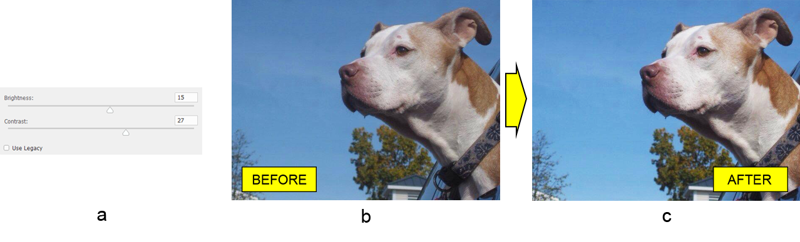

# Travailler avec la couche d'ajustement de luminosité/contraste de Photoshop en Java

Dans cet article, nous allons appliquer un ajustement de luminosité/contraste à un document Adobe® Photoshop® en utilisant la bibliothèque Aspose.PSD pour Java®. En outre, nous en apprendrons davantage sur les fonctionnalités de la bibliothèque liées à ce type de couche d'ajustement.

Mais d'abord, un peu de théorie.

La couche d'ajustement de luminosité/contraste modifie la luminosité et le contraste de l'image. Mais attendez une minute, qu'est-ce que cela signifie réellement ? Augmenter la luminosité éclaircit la valeur de la couleur jusqu'au blanc et diminuer la luminosité assombrit la valeur de la couleur jusqu'au noir. Augmenter le contraste augmentera à son tour la différence entre les couleurs claires et les couleurs sombres, et diminuer le contraste diminuera respectivement cette différence ; cela signifie que les couleurs claires deviennent plus claires et les couleurs sombres deviennent plus sombres.

## Support du mode couleur

La bibliothèque permet d'ajouter une couche d'ajustement de luminosité/contraste aux images en mode couleur RGB, CMJN ou Lab.

## Comportement actuel et hérité

L'implémentation actuelle de la bibliothèque (v20.6 au moment de la rédaction) utilise l'algorithme par défaut de Photoshop qui préserve la plage tonale complète des ombres aux hautes lumières, mais ne prend pas encore en charge le comportement hérité. Cela signifie que la bibliothèque prend en charge la couche d'ajustement de luminosité/contrast dans les documents créés dans les dernières versions de Photoshop (CS4 et supérieures). Cependant, vous pouvez [demander la mise en œuvre héritée de la couche d'ajustement de luminosité/contraste](https://forum.aspose.com/c/psd) sur notre forum si vous en avez besoin.

## Ajuster la luminosité et le contraste

Expliquons maintenant comment fonctionne l'API de haut niveau de la couche d'ajustement de luminosité/contraste (avant, l'API est simple). La classe PsdImage contient une méthode factory (addBrightnessContrastAdjustmentLayer) pour instancier la classe BrightnessContrastLayer qui est la passerelle pour l'ajustement de luminosité et de contraste. La classe BrightnessContrastLayer ne contient que deux méthodes getters et setters pour accéder aux propriétés de luminosité et de contraste ainsi que pour changer leurs valeurs.

Ainsi, prenons une image d'un chien (b), par exemple, pour ajuster sa luminosité1 et son contraste2 (a), en utilisant uniquement la méthode factory avec les arguments correspondants, pour finalement obtenir une image (c) qui semble plus vivante :

BrightnessContrastLayer brightnessContrastLayer = psdImage.addBrightnessContrastAdjustmentLayer(15, 27);

Remarques :

1. La valeur de la luminosité doit être comprise entre -150 et 150.
2. La valeur du contraste doit être comprise entre -50 et 100.

Consultez la documentation de [BrightnessContrastLayer](https://reference.aspose.com/psd/java/com.aspose.psd.fileformats.psd.layers.adjustmentlayers/BrightnessContrastLayer) pour plus de détails.

## Conclusion

Dans cet article, nous avons eu un bref aperçu de la couche d'ajustement de luminosité/contraste et appris comment ajuster la luminosité et le contraste de l'image à l'aide de la méthode factory.

Consultez notre série d'[articles sur les APIs de couche d'ajustement](/psd/fr/java/layer-types/adjustment-layer/) d'Aspose.PSD pour Java pour en savoir plus.
