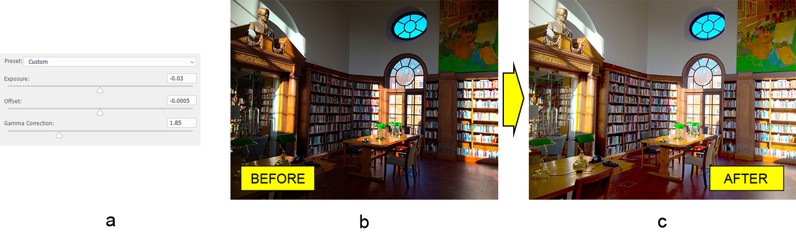

# Travailler avec la couche d'ajustement d'exposition de Photoshop en Java

Dans cet article, nous allons ajouter une couche d'ajustement d'exposition au document Adobe® Photoshop® en utilisant Aspose.PSD pour Java - une bibliothèque de manipulation de formats de fichiers PSD. La bibliothèque fonctionne sans éditeur Photoshop installé car elle utilise ses propres algorithmes de traitement d'image. Nous avons également appris quelques détails concernant l'API d'ajustement de l'exposition de la bibliothèque.

## Aperçu de l'API

La couche d'ajustement d'exposition se configure à travers la classe [ExposureLayer](https://reference.aspose.com/psd/java/com.aspose.psd.fileformats.psd.layers.adjustmentlayers/exposurelayer) qui contient les propriétés suivantes pour travailler avec l'ajustement de l'exposition :

- Elle définit la quantité de lumière que la photo contient en comprimant ou en étirant tout l'histogramme par rapport aux noirs. Ainsi, elle affecte principalement les hautes lumières.
- Contrairement au décalage d'exposition qui affecte principalement les ombres.
- Correction gamma. Elle corrige la luminance de l'image.

## Correction de l'exposition

La correction de l'exposition et des propriétés associées est aussi simple que de changer quelques propriétés de la classe. Appliquons donc un ajustement d'exposition (a) à une photo sous-exposée d'une bibliothèque (b) pour la rendre perceptible à l'œil humain (c).

L'ajustement global se fait principalement en utilisant la correction gamma. Cependant, l'exposition et le décalage sont également ajustés légèrement. Il vous suffit de définir des valeurs appropriées aux propriétés déjà mentionnées :

    ExposureLayer exposureLayer = psdImage.addExposureAdjustmentLayer();
    exposureLayer.setExposure(-0.03f);
    exposureLayer.setOffset(-0.0005f);
    exposureLayer.setGammaCorrection(1.85f);

Notez que l'exposition doit être comprise entre -20,0 et 20,0, la valeur de décalage doit être comprise entre -0,5 et 0,5 et la plage de valeurs de correction gamma doit être comprise entre 9,99 et 0,01.

Consultez la [référence de l'API de la couche d'ajustement d'exposition](https://reference.aspose.com/psd/java/com.aspose.psd.fileformats.psd.layers.adjustmentlayers/ExposureLayer) pour plus de détails.

## Conclusion

Dans cet article, nous avons appris comment ajouter une couche d'ajustement d'exposition à un fichier PSD pour éclaircir l'image et avons examiné quelques détails de l'API.
