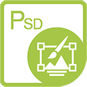

{} 

****

**Bienvenue chez Aspose.PSD pour .NET**

Aspose.PSD pour .NET est un produit qui permet une manipulation étendue des formats de fichiers PSD. Le produit ne nécessite pas l'installation d'Adobe Photoshop. Aspose.PSD pour .NET permet de modifier les fichiers PSD, mettre à jour les propriétés des calques, ajouter des filigranes, effectuer des opérations graphiques ou convertir un format de fichier en un autre. Ce produit permet différents scénarios d'automatisation qui aident les développeurs dans leur travail.

Actuellement, Aspose.PSD pour .NET prend en charge les formats de fichiers PSD et PSB pour le chargement et la manipulation. Les futures versions permettront le chargement de plus de formats de fichiers PSD. Aspose.PSD pour .NET permet l'exportation vers divers formats de fichiers raster tels que TIFF, JPEG, JPEG2000, PNG, GIF, BMP et d'autres formats de fichier pris en charge pour l'exportation seront ajoutés. Le produit utilise des algorithmes qui permettent de modifier les fichiers PSD de manière efficace tout en maintenant de bonnes performances. Le produit est activement développé et de nombreuses fonctionnalités utiles seront ajoutées pour répondre aux demandes du marché. Par exemple, le support de .NET Core est activement développé.

{} 

{} 

****

**Veuillez consulter les [Adaptateurs Aspose.PSD](/psd/fr/net/adapters) pour .NET si vous avez besoin de traiter des formats supplémentaires dans Aspose.PSD.**

Les Adaptateurs Aspose.PSD pour .NET sont des packages Nuget spéciaux qui vous permettent d'écrire du code d'intégration avec d'autres produits Aspose de manière plus simple.

Par exemple, habituellement, pour ouvrir un format non pris en charge par Aspose.PSD comme SVG ou WEBP, vous devez charger ces formats en utilisant Aspose.Imaging, puis écrire un code d'intégration pour les convertir en format pris en charge par Aspose.PSD. Les Adaptateurs éliminent la nécessité de code supplémentaire et vous aident à gagner du temps.

{} 

## **Ressources Aspose.PSD pour .NET**

Voici les liens vers quelques ressources utiles dont vous pourriez avoir besoin pour accomplir vos tâches.

- [Documentation en ligne Aspose.PSD pour .NET](/psd/fr/net/)
- [Fonctionnalités Aspose.PSD pour .NET](/psd/fr/net/features/)
- [Notes de version Aspose.PSD pour .NET](/psd/fr/net/release-notes/)
- [Page du produit Aspose.PSD pour .NET](https://products.aspose.com/psd/net)
- [Installer le package NuGet Aspose.PSD pour .NET](https://www.nuget.org/packages/Aspose.PSD/)
- [Guide de référence de l'API Aspose.PSD pour .NET](https://reference.aspose.com/net/psd)
- [Télécharger des exemples dans le dépôt GitHub](https://github.com/aspose-psd/Aspose.PSD-for-.NET)
- [Forum de support gratuit Aspose.PSD pour .NET](https://forum.aspose.com/c/psd)
- [Helpdesk de support payant Aspose.PSD pour .NET](https://helpdesk.aspose.com/)
