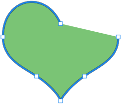

## **Aperçu du masque de vectorisation de calque**
Un masque vectoriel est un tracé indépendant de la résolution qui recadre le contenu du calque. Les masques vectoriels sont généralement plus précis que ceux créés avec des outils à base de pixels. Vous créez des masques vectoriels avec les outils de plume ou de formes.

Aspose.PSD prend en charge le rendu et l'application des masques vectoriels. Vous pouvez modifier les masques vectoriels en modifiant les chemins vectoriels.

## **Chemin vectoriel dans Aspose.PSD**
L'accès aux chemins vectoriels dans Aspose.PSD est fourni via les ressources [VsmsResouce](https://reference.aspose.com/psd/net/aspose.psd.fileformats.psd.layers.layerresources/vsmsresource) et [VmskResouce](https://reference.aspose.com/psd/net/aspose.psd.fileformats.psd.layers.layerresources/vmskresource) qui sont des classes enfant de [VectorPathDataResource](https://reference.aspose.com/psd/net/aspose.psd.fileformats.psd.layers.layerresources/vectorpathdataresource).

## **Comment modifier un chemin vectoriel ?**
### **Structure du chemin vectoriel**
La structure de base pour manipuler les chemins est [VectorPathRecord.](https://reference.aspose.com/psd/net/aspose.psd.fileformats.core.vectorpaths/vectorpathrecord) Mais pour votre commodité, la solution suivante est suggérée.

Pour faciliter l'édition des chemins vectoriels, vous devriez utiliser la classe [VectorPath](https://gist.github.com/aspose-com-gists/8a4c9d34ce856d1642fc7c0ce974175c#file-examples-csharp-aspose-workingwithvectorpaths-classestomanipulatevectorpathobjects-classestomanipulatevectorpathobjects-cs), qui contient des méthodes pour l'édition confortable des données vectorielles dans les ressources dérivées de VectorPathDataResource.

Commencez par créer un objet de type VectorPath.

Pour votre confort, vous pouvez utiliser la méthode statique [VectorDataProvider.CreateVectorPathForLayer](https://gist.github.com/aspose-com-gists/8a4c9d34ce856d1642fc7c0ce974175c#file-examples-csharp-aspose-workingwithvectorpaths-classestomanipulatevectorpathobjects-classestomanipulatevectorpathobjects-cs), elle trouvera une ressource vectorielle dans le calque en entrée et créera un objet VectorPath basé sur celle-ci.

Après toutes les modifications, vous pouvez appliquer l'objet VectorPath avec les changements de retour au calque en utilisant la méthode statique [VectorDataProvider.UpdateLayerFromVectorPath](https://gist.github.com/aspose-com-gists/8a4c9d34ce856d1642fc7c0ce974175c#file-examples-csharp-aspose-workingwithvectorpaths-classestomanipulatevectorpathobjects-classestomanipulatevectorpathobjects-cs).



Le type VectorPath contient une liste d'éléments de [PathShape](https://gist.github.com/aspose-com-gists/8a4c9d34ce856d1642fc7c0ce974175c#file-examples-csharp-aspose-workingwithvectorpaths-classestomanipulatevectorpathobjects-classestomanipulatevectorpathobjects-cs) et décrit une image vectorielle entière pouvant être composée d'une ou plusieurs formes.

Chaque PathShape est une figure vectorielle qui se compose d'un ensemble séparé de points de bezier (nœud).

Les nœuds sont des objets de type [BezierKnot](https://gist.github.com/aspose-com-gists/8a4c9d34ce856d1642fc7c0ce974175c#file-examples-csharp-aspose-workingwithvectorpaths-classestomanipulatevectorpathobjects-classestomanipulatevectorpathobjects-cs) qui sont essentiellement les points à partir desquels la figure est construite.

L'exemple de code suivant montre comment accéder à une figure et des points.


### **Comment créer une forme ?**
Pour éditer une forme, vous devez obtenir une déjà existante dans la liste des [VectorPath.Shapes](https://gist.github.com/aspose-com-gists/8a4c9d34ce856d1642fc7c0ce974175c#file-examples-csharp-aspose-workingwithvectorpaths-classestomanipulatevectorpathobjects-classestomanipulatevectorpathobjects-cs), ou ajouter une nouvelle forme en créant une instance de [PathShape](https://gist.github.com/aspose-com-gists/8a4c9d34ce856d1642fc7c0ce974175c#file-examples-csharp-aspose-workingwithvectorpaths-classestomanipulatevectorpathobjects-classestomanipulatevectorpathobjects-cs) et en l'ajoutant à la liste des [Shapes](https://gist.github.com/aspose-com-gists/8a4c9d34ce856d1642fc7c0ce974175c#file-examples-csharp-aspose-workingwithvectorpaths-classestomanipulatevectorpathobjects-classestomanipulatevectorpathobjects-cs).


### **Comment ajouter des nœuds (points) ?**
Vous pouvez manipuler les points de la forme en tant qu'éléments d'une liste régulière en utilisant la propriété PathShape.Points, par exemple, vous pouvez ajouter des points de forme :



BezierKnot contient un point d'ancrage et deux points de contrôle.

Si les points d'ancrage et de contrôle ont les mêmes valeurs, alors ce nœud aura un angle aigu.

Pour changer la position du point d'ancrage ainsi que des points de contrôle (similaire à ce qui se passe dans Photoshop), le BezierKnot possède une méthode Shift.

L'exemple de code suivant démontre le déplacement de tout le nœud de bezier vers le haut verticalement par coordonnée Y:

Vous pouvez manipuler les points de la forme en tant qu'éléments d'une liste régulière en utilisant la propriété PathShape.Points, par exemple, vous pouvez ajouter des points de forme :



## **Propriétés de PathShape**
L'édition de PathShape ne se limite pas à l'édition des nœuds, ce type a également d'autres propriétés.
### **Opérations de chemin (Opérations booléennes)**
La propriété [PathOperations](https://reference.aspose.com/psd/net/aspose.psd.fileformats.core.vectorpaths/pathoperations) est une opération dite booléenne, en changeant la valeur de laquelle définit comment plusieurs formes sont mélangées.

Il existe les valeurs possibles suivantes :

- 0 = ExclureLesFormesQuiSeChevauchent (opération XOR).
- 1 = CombinerLesFormes (opération OR).
- 2 = SoustraireLaFormeAvant (opération NOT).
- 3 = IntersecterLesAiresDesFormes (opération AND).

### **Propriété IsClosed**
Également, en utilisant la propriété PathShape.IsClosed, nous pouvons déterminer si le premier et le dernier nœud d'une forme sont connectés.

| **Forme fermée** | **Forme ouverte** |
| :- | :- |
|||
### **Propriété FillColor**
Aucune figure ne peut avoir sa propre couleur, vous pouvez donc changer la couleur de l'ensemble du chemin vectoriel avec la propriété VectorPath.FillColor.

Vous pouvez manipuler les points de la forme en tant qu'éléments d'une liste régulière en utilisant la propriété PathShape.Points, par exemple, vous pouvez ajouter des points de forme :



## **Vous trouverez ici le code source de VectorDataProvider et des classes associées :**

