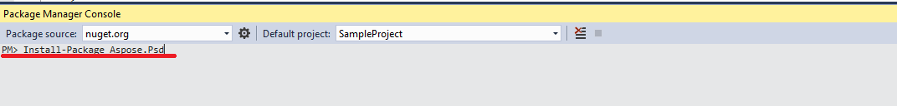

## **Installation d'Aspose.PSD pour .NET via NuGet**
NuGet est le moyen le plus simple de télécharger et d'installer les APIs Aspose pour .NET. Ouvrez Microsoft Visual Studio et le gestionnaire de packages NuGet. Recherchez "aspose" pour trouver l'API Aspose souhaitée. Cliquez sur "Installer", l'API sélectionnée sera téléchargée et référencée dans votre projet.

## **Installer ou Mettre à jour Aspose.PSD en utilisant la Package Manager Console**
Vous pouvez suivre les étapes ci-dessous pour référencer l'[API Aspose.PSD](https://www.nuget.org/packages/Aspose.psd/) en utilisant la console du gestionnaire de packages :

1. Ouvrez votre solution/projet dans Visual Studio.
1. Sélectionnez Outils -> Gestionnaire de package NuGet -> Package Manager Console dans le menu pour ouvrir la console du gestionnaire de packages.

Tapez la commande "**Install-Package Aspose.Psd**" et appuyez sur Entrée pour installer la dernière version complète dans votre application. Vous pouvez également ajouter le suffixe "**-prerelease**" à la commande pour spécifier que la dernière version incluant des correctifs est également installée.

Vous verrez apparaître le conseil **"Installation d'Aspose.PSD"** en bas de la fenêtre, indiquant que le téléchargement est en cours.

Une fois téléchargé, vous verrez les messages de confirmation suivants. Si vous n'êtes pas familier avec l'[EULA Aspose](https://company.aspose.com/legal/eula), il est conseillé de lire la licence référencée dans l'URL.

Vous devriez désormais constater qu'Aspose.PSD a été ajouté avec succès et référencé dans votre application.

Dans la console du gestionnaire de packages, vous pouvez également utiliser la commande "**Update-Package Aspose.Psd**" et appuyez sur entrée pour vérifier les mises à jour éventuelles du package Aspose.Psd et les installer le cas échéant. Vous pouvez également ajouter le suffixe "-prerelease" pour mettre à jour vers la dernière version.
## **Considérations lors de l'exécution dans un environnement de serveur partagé**
Il est recommandé que tous les composants Aspose .NET s'exécutent avec l'ensemble d'autorisations Full Trust. Cela est nécessaire car les composants Aspose .NET ont parfois besoin d'accéder aux paramètres du registre et aux fichiers situés dans des endroits autres que le répertoire virtuel, par exemple pour la lecture des polices, etc. De plus, les composants Aspose.NET sont basés sur des classes système .NET de base, certaines d'entre elles nécessitent également l'autorisation Full Trust pour s'exécuter dans certains cas.

Les fournisseurs de services Internet hébergeant plusieurs applications de différentes sociétés appliquent généralement un niveau de sécurité de confiance moyenne. Dans le cas de .NET 2.0, un tel niveau de sécurité peut définir les contraintes suivantes qui pourraient affecter la capacité d'Aspose.Words à fonctionner correctement.

- **Permission du Registre** n'est pas disponible. Cela signifie que vous ne pouvez pas accéder au registre, ce qui est nécessaire pour énumérer les polices installées lors du rendu des documents.
- **Permission du système de fichiers** est restreinte. Cela signifie que vous ne pouvez accéder qu'aux fichiers dans la hiérarchie du répertoire virtuel de votre application. Cela signifie potentiellement que les polices ne peuvent pas être lues lors de l'exportation.

Pour ces raisons spécifiées ci-dessus, il est recommandé qu'Aspose.PSD s'exécute avec les autorisations Full Trust. Vous constaterez peut-être que certaines fonctionnalités de la bibliothèque fonctionneront lors de l'exécution de différentes tâches en confiance moyenne alors que d'autres ne le feront pas (par exemple, le rendu) en raison d'appels au traitement d'images GDI+.
## **Travailler avec des DLL .NET Core installées via un package MSI**

**Veuillez noter :** si vous utilisez une dll .Net Standard installée via un package MSI, vous devez ajouter les dépendances nécessaires pour fonctionner avec la version .Net Standard.

|**Capture d'écran des dépendances de Visual Studio**|**Fragment du fichier CsProj :**|
| :- | :- |
||<ItemGroup>

`    `<PackageReference Include="System.Drawing.Common" Version="4.5.1" />

`    `<PackageReference Include="System.Text.Encoding.CodePages" Version="4.5.0" />

</ItemGroup>|
## **Configuration requise**
### **Systèmes d'exploitation pris en charge :**
- Microsoft Windows 2000 Professional et Server (SP2 recommandé)
- Microsoft Windows XP Professionnel et Édition Familiale
- Microsoft Windows 2003 Server
- Microsoft Windows Vista
- Microsoft Windows 2008 Server
- Microsoft Windows 2008 Server R2
- Microsoft Windows 7
- Microsoft Windows 8
- Microsoft Windows 10
- Microsoft Windows 11
### **Plateformes prises en charge :**
- Formulaires Windows
- Formulaires Web
- Visual Studio 2005
- Visual Studio 2008
- Visual Studio 2010
- Visual Studio 2012
- Visual Studio 2013
- Visual Studio 2015
- Visual Studio 2017
- Visual Studio 2019
- Visual Studio 2022

Aspose.PSD fonctionne pour les versions x86 et x64 des systèmes d'exploitation mentionnés ci-dessus.
### **Frameworks pris en charge :**
Aspose.PSD pour .NET prend en charge le framework .NET comme suit :

- Version du framework .NET 2.0 ou ultérieure
- .NET Standard 2.0
