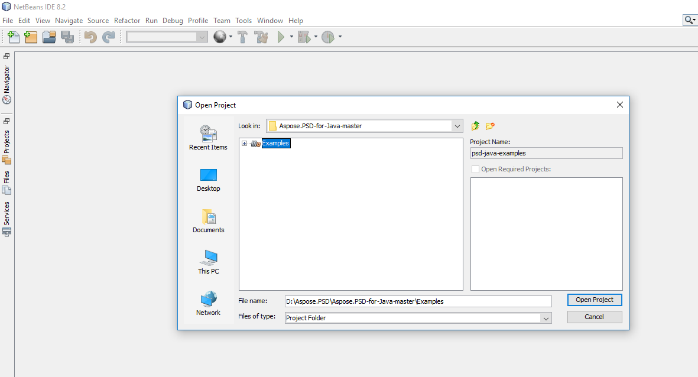

## **הורד מ-GitHub**
כל דוגמאות עבור Aspose.PSD ל-Java מתארכנים ב-[Github](https://github.com/aspose-psd/Aspose.PSD-for-Java). תוכלו לשכפל את המאגר באמצעות קליינט של GitHub או להוריד את קובץ ה-ZIP מ[כאן](https://github.com/aspose-psd/Aspose.PSD-for-Java/archive/master.zip).

חלץ את תוכן קובץ ה-ZIP במחשב שלך. תמצא את תיקיית **דוגמאות**. כל הדוגמאות ממוקמות בתוך תיקיית **דוגמאות**.

ניתן להפעיל/להריץ את הדוגמאות אלה עם כל IDE שבחרת, אך לצרכי הדגמה, אנו משתמשים ב-**NetBeans**. השתמש באפשרות **קובץ -> פתח -> פרויקט** כדי לייבא את הדוגמה שבחרת ולציין את הנתיב.

הוסף את קבצי ה-jar הנדרשים (ספריות) לפרויקט.

תיקיית **משאבים** מכילה מסמכי קלט/קבצים המתייחסים בדוגמה.

{} 

תוכל גם לייבא את הדוגמאות ישירות ממאגר ה-GitHub.

{} 

## **תרמו**
אם ברצונך להוסיף או לשפר דוגמה, אנו מבקשים ממך לתרום לפרויקט. כל הדוגמאות והפרויקטים המוצגים במאגר זה הם פתוחי מקור וניתן להשתמש בהם בחינם ביישומים שלך.

כדי לתרום, תוכל לעשות fork למאגר, לערוך את קוד המקור וליצור בקשת משיכה (pull request). אנו נבדוק את השינויים ונכלול אותם במאגר אם נמצאים מועילים.
