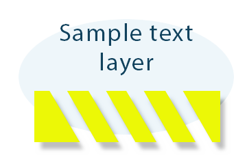

Aspose.PSD היא חבילת SDK לפורמט PSD ו-API לעריכת תמונות Photoshop ב-C# .NET, שיכולה להמיר מפורמט PSD לפורמט PNG.

להמרת PSD זו, עליך להשתמש בקוד C# הבא:

הקוד המדוגם להלן מדגיש איך להמיר PSD ל-Png:



ניתן לציין את רמת דחיסת פורמט Png מ-0 עד 9, כאשר 9 היא הדחיסה הגבוהה ביותר. ניתן להשתמש בדחיסת Png Progressive ולשנות את סוג הצבע בקובץ Png. ל[Png Options](https://reference.aspose.com/psd/net/aspose.psd.imageoptions/pngoptions) יש מאפיינים שונים למקרים של ייצוא PSD.

שימוש ב-Png שקול חצי שקיפות עם ערוץ אלפא לאתרך או לעבודתך הוא פתרון טוב. קובץ Adobe Photoshop יכול להיות מיוצא בצורה מושלמת עם אפשרות [מצב קריאה בלבד](https://reference.aspose.com/psd/net/aspose.psd.imageloadoptions/psdloadoptions/properties/readonlymode)

להלן דוגמה של קובץ PSD שייצא עם [מסכה שהופעלה](https://docs.aspose.com/display/psdjava/Apply+Masking), [שכבת טקסט](https://reference.aspose.com/psd/net/aspose.psd.fileformats.psd.layers/textlayer) ו-[שכבת צבע מילוי](https://reference.aspose.com/psd/net/aspose.psd.fileformats.psd.layers.filllayers/filllayer) שקופה (Aspose.PSD תומכת בכל סוגי [שכבות המילוי של Adobe Photoshop](https://docs.aspose.com/display/psdjava/Support+of+Fill+Layers)). כמו כן, ניתן לראות את [אפקט הצל](/psd/he/net/shadow-effects-in-psd-file/) על שכבת הצורה בקובץ PSD.

