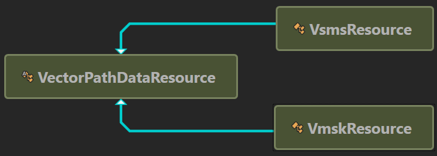

## **סקירת מסיכת שכבת הווקטור**
מסיכת וקטור היא נתיב אינפנטי שמחסם את תוכן השכבה. מסיכות ווקטור כללית יותר מדויקות מאלה שנוצרו עם כלי פיקסלים. ניתן ליצור מסיכות וקטור בעזרת כלי העט או צורות.

Aspose.PSD תומך בהצגה ובהחלה של מסיכת וקטור. באפשרותך לערוך מסיכת וקטור דרך עריכת מסלולי וקטור.
## **מסלול הווקטור ב-Aspose.PSD**
גישה למסלולים הווקטור ב-Aspose.PSD ניתנת דרך [VsmsResouce](https://reference.aspose.com/psd/net/aspose.psd.fileformats.psd.layers.layerresources/vsmsresource) ו-[VmskResouce](https://reference.aspose.com/psd/net/aspose.psd.fileformats.psd.layers.layerresources/vmskresource) שהם מחלקת בנות של [VectorPathDataResource](https://reference.aspose.com/psd/net/aspose.psd.fileformats.psd.layers.layerresources/vectorpathdataresource).

## **כיצד לערוך מסלול וקטור?**
### **מבנה מסלול וקטור**
המבנה הבסיסי לניהול מסלולים הוא [VectorPathRecord](https://reference.aspose.com/psd/net/aspose.psd.fileformats.core.vectorpaths/vectorpathrecord). אך לנוחותך, מוצעת הפתרון הבא.

לצורך עריכת מסלולים הווקטור בנפוץ להשתמש במחלקת [VectorPath](https://gist.github.com/aspose-com-gists/8a4c9d34ce856d1642fc7c0ce974175c#file-examples-csharp-aspose-workingwithvectorpaths-classestomanipulatevectorpathobjects-classestomanipulatevectorpathobjects-cs), שמכילה שיטות לעריכה נוחה של נתוני וקטור במשאבים המקוריים מ-VectorPathDataResource.

התחילו ביצירת אובייקט מסוג VectorPath.

לנוחותך, תוכל להשתמש בשיטת הסטטית [VectorDataProvider.CreateVectorPathForLayer](https://gist.github.com/aspose-com-gists/8a4c9d34ce856d1642fc7c0ce974175c#file-examples-csharp-aspose-workingwithvectorpaths-classestomanipulatevectorpathobjects-classestomanipulatevectorpathobjects-cs), שתמצא משאב וקטור בשכבת הקלט ותיצור אובייקט VectorPath על פיו.

לאחר עריכות, ניתן להחיל את אובייקט ה-VectorPath עם השינויים בחזרה לשכבה בעזרת השיטה הסטטית [VectorDataProvider.UpdateLayerFromVectorPath](https://gist.github.com/aspose-com-gists/8a4c9d34ce856d1642fc7c0ce974175c#file-examples-csharp-aspose-workingwithvectorpaths-classestomanipulatevectorpathobjects-classestomanipulatevectorpathobjects-cs).



סוג ה-VectorPath מכיל רשימה של אלמנטי [PathShape](https://gist.github.com/aspose-com-gists/8a4c9d34ce856d1642fc7c0ce974175c#file-examples-csharp-aspose-workingwithvectorpaths-classestomanipulatevectorpathobjects-classestomanipulatevectorpathobjects-cs) ומתאר תמונת וקטור שכוללת צורות אחת או יותר.

כל PathShape הוא צורה וקטורית המורכבת מסט נפרד של קשרים בז'יה (נקודה).

הקשרים הם אובייקטים מהסוג [BezierKnot](https://gist.github.com/aspose-com-gists/8a4c9d34ce856d1642fc7c0ce974175c#file-examples-csharp-aspose-workingwithvectorpaths-classestomanipulatevectorpathobjects-classestomanipulatevectorpathobjects-cs) שבגדות בעצם הנקודות שממנה נבנית הצורה.

דוגמת הקוד הבאה מציגה כיצד לגשת לצורה ולנקודות.


### **כיצד ליצור צורה?**
כדי לערוך צורה, עליך לקבל אחת קיימת מרשימת [VectorPath.Shapes](https://gist.github.com/aspose-com-gists/8a4c9d34ce856d1642fc7c0ce974175c#file-examples-csharp-aspose-workingwithvectorpaths-classestomanipulatevectorpathobjects-classestomanipulatevectorpathobjects-cs), או להוסיף צורה חדשה על ידי יצירת מופע [PathShape](https://gist.github.com/aspose-com-gists/8a4c9d34ce856d1642fc7c0ce974175c#file-examples-csharp-aspose-workingwithvectorpaths-classestomanipulatevectorpathobjects-classestomanipulatevectorpathobjects-cs) ולהוסיף אותה לרשימת [Shapes](https://gist.github.com/aspose-com-gists/8a4c9d34ce856d1642fc7c0ce974175c#file-examples-csharp-aspose-workingwithvectorpaths-classestomanipulatevectorpathobjects-classestomanipulatevectorpathobjects-cs).


### **כיצד להוסיף קשרים (נקודות)?**
ניתן לנהל את הנקודות של צורה כאילמנטים ברשימה רגילה באמצעות נכס PathShape.Points, לדוגמה, ניתן להוסיף נקודות צורה:



בייז'ר נחתב חולק לנקודת יציבה ושתי נקודות שליטה.

אם נקודת היציבה ונקודות השליטה כולן ישיהן את אותו הערך, אז הקוד הנ"ל יכיל זווית חדה.

כדי לשנות את מיקום נקודת היציבה יחד עם נקודות השליטה (בדומה לכיצד זה קורה בפוטושופ), ל-BezierKnot יש שיטת העברה.

הקוד הבא מדגים איך להעביר קשר בז'יה למעלה בציר Y:

ניתן לנהל את הנקודות של צורה כאילמנטים ברשימה רגילה באמצעות נכס PathShape.Points, לדוגמה, ניתן להוסיף נקודות צורה:



## **מאפייני PathShape**
עריכת PathShape אינה מוגבלת לעריכת צמתים, סוג זה כולל מאפיינים נוספים.
### **PathOperations (פעולות בוליאניות)**
המאפיין [PathOperations](https://reference.aspose.com/psd/net/aspose.psd.fileformats.core.vectorpaths/pathoperations) הוא פעולה בוליאנית, שינוי ערכה מגדיר איך צורות מרובות מתערבות.

קיימים שלושה ערכים אפשריים:

- 0 = אילול פתיחות המרוקעים (פעולת XOR).
- 1 = שילוב של צורות (פעולת OR).
- 2 = חיסור צורת החזית (פעולת NOT).
- 3 = אזורי חיתוך של הצורה (פעולת AND).

### **מאפיין IsClosed**
בנוסף, באמצעות מאפיין PathShape.IsClosed, ניתן לקבוע אם הצומת הראשית והאחרונה של צורה מחוברות.

|**צורה סגורה**|**צורה פתוחה**|
| :- | :- |
|||
### **מאפיין FillColor**
לא כל צורה יכולה לכלול את צבעה, לכן ניתן לשנות את צבע כל המסלול הווקטורי באמצעות מאפיין VectorPath.FillColor.

ניתן לנהל את הנקודות של צורה כאילמנטים ברשימה רגילה באמצעות נכס PathShape.Points, לדוגמה, ניתן להוסיף נקודות צורה:



## **כאן תמצא את קוד המקור של VectorDataProvider והמחלקות הקשורות:**

