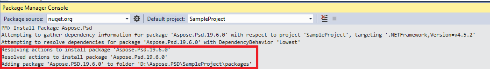

## **התקנת Aspose.PSD עבור .NET דרך NuGet**
NuGet הוא הדרך הקלה ביותר להוריד ולהתקין API של Aspose עבור .NET. פתחו את Microsoft Visual Studio ומנהל החבילות של NuGet. חפשו "aspose" כדי למצוא את ה־API שאתם מחפשים. לחצו על "התקן", ה־API שנבחר יורד ויתייחס בפרויקט שלכם.

## **התקנה או עדכון של Aspose.PSD באמצעות חלון הפקודות של ניהול החבילות (Package Manager Console)**
ניתן לעקוב אחר השלבים הבאים כדי לתייחס ל־[API Aspose.PSD](https://www.nuget.org/packages/Aspose.psd/) באמצעות חלון ניהול החבילות:

1. פתחו את הפתרון/הפרויקט שלכם ב־Visual Studio.
1. בחרו Tools -> Library Package Manager -> Package Manager Console מהתפריט כדי לפתוח את חלון ניהול החבילות.

הקלידו את הפקודה "**Install-Package Aspose.Psd**" ולחצו על Enter כדי להתקין גרסה מלאה ביותר לאפליקציתכם. כתובת נוספת, תוכלו להוסיף את הסיומת "**-prerelease**" לפקודה כדי לציין שההתקנה כוללת תיקוני פתיחה חמים.

תראו כי עצם העצמה מתקינה Aspose.PSD תופיע לכם בתחתית החלון, רומז להורדה שנעשית.

כאשר ההורדה מושלמת, תראו הודעות אישור באופן הבא. אם אינכם מוכנים עם [EULA של Aspose](https://company.aspose.com/legal/eula) אז כדאי לכם לקרוא את הרישיון המצוין בקישור.

עתה תמצאו כי Aspose.PSD התווסף והתייחס בהצלחה לאפליקציתכם.

בחלון ניהול החבילות, תוכלו גם להשתמש בפקודה "**Update-Package Aspose.Psd**" וללחוץ על Enter כדי לבדוק אם ישנן עדכונים לחבילת Aspose.Psd ולהתקינם אם הם זמינים. תוכלו גם להוסיף את הסיומת "-prerelease" כדי לעדכן לגרסה העדכנית ביותר.

## **ניתונים לשימוש כאשר הרצת מערכת בשרת משותף**
כל רכיבי ה־.NET של Aspose מומלצים לרוץ עם מערכת אישור Full Trust. הסיבה לכך היא שרכיבי .NET של Aspose לעיתים קרובות צריכים לגשת להגדרות רישום וקבצים הנמצאים במקומות שונים מהספריית הוירטואלית, לדוגמה לקריאת גופנים וכדומה. נוסף על כך, רכיבי .NET של Aspose מבוססים על מחלקות הערכתי .NET ללא פשטות, חלק מהם דורשים רישות Full Trust לריצה במקרים מסוימים.

ספקי שירותי אינטרנט שמארחים יישומים מרובים מחברות שונות לעיתים קרובות מכריחים רמת אבטחה Medium Trust. במקרה של .NET 2.0, רמת אבטחה זו עלולה להגדיר את החוסן הבא אשר עשוי לפגוע באיכות הביצוע של Aspose.PSD.

- **הרשאת הרישום** אינה זמינה. פעולה זו משמעותה אי-אפשרות הגישה לרישום, אשר דרוש לפרטור פונטים מותקנים בעת יצירת כתבי פורמט.
- השגשוג הק־־  אופגשת. כך שניתן לגשת אל קובצים בירושת סדר ה־הפקות הוירטואלית של היישום שלכם. במקרה זה תיתכן מצוקת קריאה של פונטים בעת הייצוא.

לסיבות שצוינו לעיל, מומלץ להריץ את Aspose.PSD בהרשאת Trust מלאה. תגלו שחלק מתכוני הספריה יעבדו בביצועים טובים ב־Trust בינונית בעוד שחלק לא (כגון יציאה לדוגמה), המוסב לשיחות לעיבוד תמונות GDI+.

## **עבודה עם DLL ב־.NET Core המותקנים דרך חבילת MSI**

**שימו לב:** אם אתם משתמשים ב־.Net Standard dll המותקן דרך חבילת MSI, עליכם להוסיף תלותים נחוצות לעבודה עם גרסת .Net Standard.

|**תמונת מסך של תלותי Visual Studio**|**חתיכת קובץ CsProj:**|
| :- | :- |
||<ItemGroup>

`    `<PackageReference Include="System.Drawing.Common" Version="4.5.1" />

`    `<PackageReference Include="System.Text.Encoding.CodePages" Version="4.5.0" />

</ItemGroup>|

## **דרישות מערכת**
### **מערכות הפעלה נתמכות:**
- Microsoft Windows 2000 Professional ו־Server (נמלצת SP2)
- Microsoft Windows XP Professional ו־Home Edition
- Microsoft Windows 2003 Server
- Microsoft Windows Vista
- Microsoft Windows 2008 Server
- Microsoft Windows 2008 Server R2
- Microsoft Windows 7
- Microsoft Windows 8
- Microsoft Windows 10
- Microsoft Windows 11
### **פלטפורמות נתמכות:**
- WinForms
- טופסי אינטרנט
- Visual Studio 2005
- Visual Studio 2008
- Visual Studio 2010
- Visual Studio 2012
- Visual Studio 2013
- Visual Studio 2015
- Visual Studio 2017
- Visual Studio 2019
- Visual Studio 2022

Aspose.PSD עובדת לשתי הגרסאות, x86 ו־x64, של מערכות ההפעלה הנ"ל.
### **גרסאות .NET הנתמכות:**
Aspose.PSD עבור .NET תומך במסגרת הספרייה הבאה:

- גרסת .NET Framework 2.0 או גבוהה יותר
- .NET Standard 2.0
