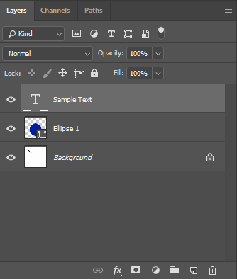

## **Ikhtisar**
Lapisan PSD Adobe® Photoshop® adalah salah satu konsep terbaik dalam pemrosesan grafis. Lapisan mengandung informasi tentang piksel, dapat memiliki jumlah saluran yang berbeda.

Salah satu bagian terpenting dari Lapisan dalam Dokumen Photoshop adalah Sumber Daya Lapisan. Anda dapat mendapatkan daftar lengkap dari [Sumber Daya Lapisan](/psd/id/net/list-of-psd-layer-resources/) yang didukung dalam PSD dari dokumentasi kami.

Anda dapat menemukan antarmuka pengguna untuk memanipulasi lapisan pada tangkapan layar berikut:

Tetapi Aspose.PSD mengkhususkan diri dalam pemipilan programatik Lapisan PSD melalui [C#](/psd/id/net/home/) dan [Java](https://docs.aspose.com/display/psdjava/Aspose.PSD+for+Java+Home).

Dokumentasi tambahan dapat ditemukan dalam Artikel ini: [Memanipulasi Gambar](/psd/id/net/manipulating-images-html/). Semua manipulasi dapat diproses ke Pratinjau PSD dan Lapisan, Anda akan menemukan informasi lebih lanjut di [Referensi API Gambar Raster Aspose.PSD](https://reference.aspose.com/psd/net/aspose.psd/rasterimage).

## **API Lapisan PSD yang Tersedia**
- Efek Lapisan
- Properti umum Lapisan
- Metadata Lapisan

## **Contoh Pengeditan Lapisan melalui C#**
### **Menambahkan Lapisan Baru**
Jika Anda ingin menambahkan Lapisan kosong ke [Berkas PSD](/psd/id/net/psd-file/) yang dibuka, Anda dapat menggunakan kode berikut.

Menambahkan Lapisan Baru ke Berkas PSD menggunakan API



### **Menambahkan Lapisan Baru dari Berkas Jpeg, Png, Gif, Ai, Tiff, Bmp**
Berkas dari [format yang didukung](/psd/id/net/supported-file-formats/) apa pun dapat ditambahkan sebagai lapisan baru ke gambar Anda. Tetapi Anda tidak dapat memuatnya secara langsung.

Anda dapat menggunakan kode di bawah ini untuk menambahkan Lapisan PSD baru dari berkas format yang didukung dari aliran



### **Meratakan semua lapisan atau grup lapisan**
Ini bisa berguna jika Anda tidak ingin memberikan berkas PSD yang dapat diedit kepada pengguna Anda. Juga, Anda dapat mengidentifikasi melalui API apakah berkas sudah diratakan.

Meratakan Lapisan dari Berkas PSD:


