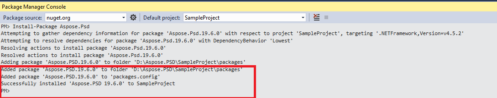

## **Menginstal Aspose.PSD untuk .NET melalui NuGet**
NuGet adalah cara tercepat untuk mendownload dan menginstal API Aspose untuk .NET. Buka Microsoft Visual Studio dan manajer paket NuGet. Cari "aspose" untuk menemukan API Aspose yang diinginkan. Klik "Install", API yang dipilih akan diunduh dan dirujuk dalam proyek Anda.

## **Pasang atau Perbarui Aspose.PSD menggunakan Package Manager Console**
Anda dapat mengikuti langkah-langkah di bawah ini untuk merujuk [API Aspose.PSD](https://www.nuget.org/packages/Aspose.psd/) menggunakan package manager console:

1. Buka solusi/proyek Anda di Visual Studio.
1. Pilih Tools -> Library Package Manager -> Package Manager Console dari menu untuk membuka package manager console.

Ketik perintah “**Install-Package Aspose.Psd**” dan tekan enter untuk menginstal rilis penuh terbaru ke aplikasi Anda. Sebagai alternatif, Anda dapat menambahkan akhiran "**-prerelease**" pada perintah untuk menentukan bahwa rilis terbaru termasuk perbaikan cepat akan diinstal juga.

Anda akan melihat bahwa tip **"Menginstal Aspose.PSD"** muncul di bagian bawah jendela menunjukkan bahwa proses unduhan sedang berlangsung. 

Setelah diunduh, Anda akan melihat pesan konfirmasi berikut. Jika Anda tidak familiar dengan [EULA Aspose](https://company.aspose.com/legal/eula) maka disarankan untuk membaca lisensi yang dirujuk dalam URL tersebut. 

Anda seharusnya sekarang menemukan bahwa Aspose.PSD berhasil ditambahkan dan dirujuk dalam aplikasi Anda.

Di package manager console, Anda juga dapat menggunakan perintah “**Update-Package Aspose.Psd**” dan tekan enter untuk memeriksa pembaruan paket Aspose.Psd dan menginstalnya jika ada. Anda juga dapat menambahkan akhiran "-prerelease" untuk memperbarui rilis terbaru.
## **Pertimbangan Ketika Menjalankan di Lingkungan Server Bersama**
Semua komponen Aspose .NET disarankan dijalankan dengan set izin Full Trust. Hal ini karena komponen Aspose .NET kadang-kadang perlu mengakses pengaturan registri dan file yang terletak di tempat lain selain direktori virtual misalnya untuk membaca font dll. Selain itu, komponen Aspose.NET didasarkan pada kelas sistem .NET inti, beberapa di antaranya juga memerlukan izin Full Trust untuk berjalan dalam beberapa kasus.

Penyedia Layanan Internet yang meng-hosting banyak aplikasi dari perusahaan yang berbeda kebanyakan memberlakukan tingkat keamanan Medium Trust. Pada kasus .NET 2.0, tingkat keamanan seperti itu mungkin memberlakukan batasan-batasan berikut yang dapat mempengaruhi kemampuan Aspose.Words untuk beroperasi dengan baik.

- **RegistryPermission** tidak tersedia. Ini berarti Anda tidak dapat mengakses registry, yang diperlukan untuk menghitung font yang diinstal saat merender dokumen.
- **FileIOPermission** dibatasi. Ini berarti Anda hanya dapat mengakses file dalam hirarki direktori virtual aplikasi Anda. Ini berpotensi berarti font tidak dapat dibaca saat diekspor.

Untuk alasan-alasan yang disebutkan di atas, disarankan agar Aspose.PSD berjalan pada izin Full Trust. Anda mungkin menemukan bahwa beberapa fitur perpustakaan akan berfungsi saat melakukan tugas berbeda dalam Trust Medium sementara beberapa tidak akan (seperti render) yang mungkin disebabkan oleh pemanggilan pemrosesan gambar GDI+.

## **Bekerja dengan DLL .NET Core yang diinstal melalui paket MSI**

**Harap dicatat:** jika Anda menggunakan dll .Net Standard yang diinstal melalui paket MSI Anda harus menambahkan dependensi yang diperlukan untuk bekerja dengan versi .Net Standard.

|**Screenshot dependensi Visual Studio**|**Fragment file CsProj:**|
| :- | :- |
||<ItemGroup>

`    `<PackageReference Include="System.Drawing.Common" Version="4.5.1" />

`    `<PackageReference Include="System.Text.Encoding.CodePages" Version="4.5.0" />

</ItemGroup>|
## **Persyaratan Sistem**
### **Sistem Operasi yang Didukung:**
- Microsoft Windows 2000 Professional dan Server (disarankan SP2)
- Microsoft Windows XP Professional dan Home Edition
- Microsoft Windows 2003 Server
- Microsoft Windows Vista
- Microsoft Windows 2008 Server
- Microsoft Windows 2008 Server R2
- Microsoft Windows 7
- Microsoft Windows 8
- Microsoft Windows 10
- Microsoft Windows 11
### **Platform yang Didukung:**
- Formulir Windows
- Formulir Web
- Visual Studio 2005
- Visual Studio 2008
- Visual Studio 2010
- Visual Studio 2012
- Visual Studio 2013
- Visual Studio 2015
- Visual Studio 2017
- Visual Studio 2019
- Visual Studio 2022

Aspose.PSD bekerja untuk versi x86 dan x64 dari sistem operasi yang terdaftar di atas.
### **Framework yang Didukung:**
Aspose.PSD untuk .NET mendukung kerangka .NET sebagai berikut:

- Versi .NET Framework 2.0 atau lebih tinggi
- .NET Standard 2.0
