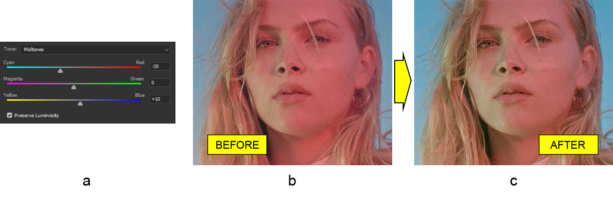

# Lavorare con lo strato di regolazione del bilanciamento del colore di Photoshop in Java

In questo articolo andremo ad **aggiustare il bilanciamento del colore dell'immagine** nel formato file PSD in Java. Utilizzeremo una libreria speciale chiamata Aspose.PSD per Java che è un toolkit per la manipolazione dei documenti Photoshop.

Poiché la libreria lavora con il formato file PSD, essa contiene quasi [tutte le funzionalità](https://docs.aspose.com/psd/java/features/) disponibili nell'editor Photoshop e lo **strato di regolazione del bilanciamento del colore**, che è assolutamente adatto per questo compito, non fa eccezione.

Lo strato di regolazione del bilanciamento del colore rende possibile cambiare il bilanciamento tra i colori primari (RGB) e i colori sottrattivi (CMY) per le ombre, le mezze tonalità e i punti in evidenza in modo semplice e veloce.

## Regolare il bilanciamento del colore

Come già accennato, lo strato di regolazione del bilanciamento del colore in Aspose.PSD per Java è proprio quello che è **un bilanciere tra i colori primari e sottrattivi**. Ciò significa che ci sono tre scale per ogni coppia di colori (ciano/rosso, magenta/verde, giallo/blu). L'intensità di un particolare colore nella coppia aumenterà se il valore si sposterà verso di esso e viceversa. Inoltre, queste tre coppie sono inherentemente legate a ciascuna area dell'intervallo tonale (ombre, mezze tonalità e punti in evidenza) che aumenta la flessibilità di questo tipo di regolazione.

Quindi, applichiamo questa conoscenza nella pratica. Per esempio, scegliamo una foto rossiccia del viso di una donna (b). Il viso è molto rossiccio e andremo a correggerlo **aggiungendo uno strato di regolazione del bilanciamento del colore** per diminuire il rosso e aumentare principalmente il ciano (a) per ottenere un viso che sembri più naturale (c). Di nuovo, c'è molto lavoro da fare con questa immagine, ma all'interno di questo articolo è tutto ciò che faremo.

 L'API dello strato di regolazione del bilanciamento del colore ha un design piatto. Pertanto, la classe [ColorBalanceAdjustmentLayer](https://reference.aspose.com/psd/java/com.aspose.psd.fileformats.psd.layers.adjustmentlayers/colorbalanceadjustmentlayer) è tutto ciò di cui hai bisogno. Innanzitutto, preserva la luminosità perché è disabilitata per impostazione predefinita. Successivamente, aggiungi un po' di verde e più giallo per le ombre utilizzando i metodi corrispondenti (i nomi dei quali consistono nel nome dell'area dell'intervallo tonale particolare e i nomi dei colori nella coppia di colori), quindi aggiungi più ciano e un po' di blu per le mezze tonalità, e infine aggiungi ancora più ciano oltre a un po' di magenta e blu:

    ColorBalanceAdjustmentLayer colorBalanceAdjustmentLayer = psdImage.addColorBalanceAdjustmentLayer();
    colorBalanceAdjustmentLayer.setPreserveLuminosity(true);
    colorBalanceAdjustmentLayer.setShadowsMagentaGreenBalance((short)5);
    colorBalanceAdjustmentLayer.setShadowsYellowBlueBalance((short)-20);
    colorBalanceAdjustmentLayer.setMidtonesCyanRedBalance((short)-20);
    colorBalanceAdjustmentLayer.setMidtonesYellowBlueBalance((short)10);
    colorBalanceAdjustmentLayer.setHighlightsCyanRedBalance((short)-20);
    colorBalanceAdjustmentLayer.setHighlightsMagentaGreenBalance((short)-5);
    colorBalanceAdjustmentLayer.setHighlightsYellowBlueBalance((short)5);

Ora, abbiamo ottenuto l'immagine desiderata! È così semplice, vero?

Fai attenzione che _il valore di ciascuna coppia di colori deve essere compreso tra -100 e 100_ che sono valori negativi per i colori sottrattivi e positivi per i colori primari rispettivamente, proprio come nell'editor di Photoshop.

Consultare il nostro riferimento API per conoscere ulteriori dettagli tecnici su [Color Balance adjustment layer](https://reference.aspose.com/psd/java/com.aspose.psd.fileformats.psd.layers.adjustmentlayers/colorbalanceadjustmentlayer).

## Conclusione

In questo articolo abbiamo visto come regolare il bilanciamento del colore dell'immagine programmaticamente in Java utilizzando la libreria Aspose.PSD per Java. La libreria contiene un'API completa per lavorare con gli strati di regolazione del bilanciamento del colore nei documenti Photoshop.
