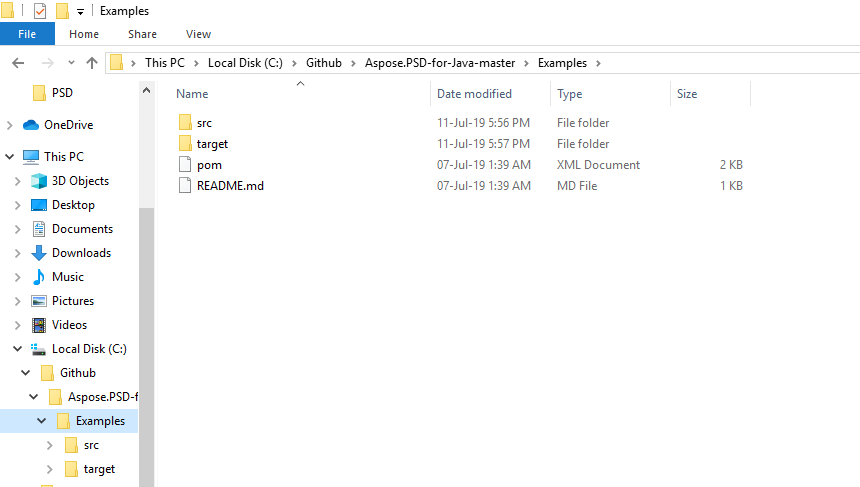

## **Scarica da GitHub**
Tutti gli esempi di Aspose.PSD per Java sono ospitati su [Github](https://github.com/aspose-psd/Aspose.PSD-for-Java). Puoi clonare il repository usando il client di Github o scaricare il file ZIP da [qui](https://github.com/aspose-psd/Aspose.PSD-for-Java/archive/master.zip).

Estrai i contenuti del file ZIP sul tuo computer. Troverai la cartella **Esempi**. Tutti gli esempi si trovano nella cartella **Esempi**.

Puoi eseguire questi esempi con qualsiasi IDE a tua scelta, tuttavia, a scopo dimostrativo, stiamo utilizzando **NetBeans**. Usa l'opzione **File -> Apri Progetto** per importare l'esempio di tua scelta e specifica il percorso.

Aggiungi i file jar richiesti (Librerie) nel progetto.

La cartella **Risorse** contiene i documenti/file di input citati nell'esempio.

{} 

Puoi anche importare gli esempi direttamente dal repository GitHub.

{} 

## **Contribuire**
Se desideri aggiungere o migliorare un esempio, ti incoraggiamo a contribuire al progetto. Tutti gli esempi e i progetti di vetrina in questo repository sono open source e possono essere liberamente utilizzati nelle tue applicazioni.

Per contribuire, puoi fare il fork del repository, modificare il codice sorgente e creare una pull request. Esamineremo le modifiche e le includeremo nel repository se ritenuto utile.
