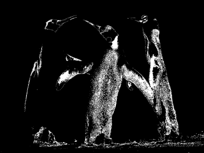

## **Elaborazione Dati Grezzi**
Per migliorare le prestazioni dell'API Aspose.PSD abbiamo introdotto un metodo per l'elaborazione dei dati grezzi con la versione 2.4.0. L'elaborazione dei dati grezzi è ora utilizzata internamente ed ha un'API esterna in modo che possa essere utilizzata al di fuori della libreria per migliorare le prestazioni complessive. A volte l'elaborazione diventa un po' complicata e richiede qualche spiegazione. Attualmente l'elaborazione dei dati grezzi è disponibile solo per il formato BMP.

Per aiutare gli sviluppatori a ottenere le migliori prestazioni, l'API Aspose.PSD fornisce un sistema di elaborazione dei dati grezzi che ha un'API esterna per la personalizzazione. Gli sviluppatori chiamano la famiglia di metodi [LoadRawData](https://reference.aspose.com/psd/net/aspose.psd/rasterimage/methods/loadrawdata/index) e [SaveRawData](https://reference.aspose.com/psd/net/aspose.psd/rasterimage/methods/saverawdata) per utilizzare l'elaborazione dei dati grezzi. Questi metodi richiedono anche il formato dei dati grezzi desiderato da impostare utilizzando la classe [RawDataSettings](https://reference.aspose.com/psd/net/aspose.psd/rawdatasettings). La classe RawDataSettings consente agli sviluppatori di specificare qualsiasi formato di dati grezzi. Tuttavia, per ottenere le migliori prestazioni è necessario utilizzare il formato di dati grezzi in cui i dati sono memorizzati. Le RawDataSettings definite nella classe [RasterImage](https://reference.aspose.com/psd/net/aspose.psd/rasterimage) aiutano a determinare il formato dei dati grezzi dell'immagine. Quando si passa l'istanza RawDataSettings al metodo LoadRawData, i dati vengono restituiti così come sono, senza alcuna conversione applicata, e possono migliorare le prestazioni. D'altra parte, è necessario occuparsi di tutti i possibili layout dei formati dei dati grezzi, che possono essere a volte un po' complicati.

Per semplificare il processo di gestione, a discapito di una piccola penalità sulle prestazioni, è possibile specificare le RawDataSettings desiderate istanziando e inizializzando la classe con le impostazioni dei dati grezzi desiderate. Ci sono situazioni in cui non è possibile restituire i dati grezzi nel formato specificato (ad esempio la conversione dallo spazio colore CMYK a RGB non è disponibile nella versione 2.4.0). Inoltre, potrebbero esserci scenari in cui l'elaborazione dei dati grezzi non è disponibile affatto per un formato di immagine. Per determinare se è possibile utilizzare la famiglia di metodi LoadRawData e SaveRawData è necessario verificare la proprietà [IsRawDataAvailable](https://reference.aspose.com/psd/net/aspose.psd/rasterimage/properties/israwdataavailable) .
### **Approfondimento**
Per il formato dei [dati dei pixel](https://reference.aspose.com/psd/net/aspose.psd/pixeldataformat) RGB ci sono disponibili formati dati grezzi basati su palette e basati su RGB. I formati dati grezzi basati su palette contengono indici di voci di palette nell'intervallo 0..(2^conteggio di bit - 1). I formati dati grezzi basati su palette sono a 1, 2, 4 e 8 bit per pixel. Gli altri formati sono basati su RGB. Durante il caricamento dei dati grezzi, assicurati che ci siano abbastanza byte disponibili per caricare i dati, in caso contrario verrà generata un'eccezione appropriata. È possibile stimare semplicemente la dimensione del vettore di byte moltiplicando la dimensione della linea per le righe richieste. La dimensione della linea può variare e dipende dal formato di memorizzazione dei dati grezzi.

Per ottenere le migliori prestazioni, utilizza sempre una dimensione della linea dei dati grezzi uguale al valore della proprietà [RasterImage.RawLineSize](https://reference.aspose.com/psd/net/aspose.psd/rasterimage/properties/rawlinesize). Tuttavia, a volte potresti aver bisogno di aggiungere imbottiture aggiuntive alle righe dei dati grezzi, o ridurle, e in tal caso potrebbe essere necessario utilizzare una dimensione della linea diversa. Se è richiesto un sottoinsieme di un rettangolo di delimitazione di un'immagine, allora considera gli spostamenti di bit che possono verificarsi per i formati dei pixel RGB indicizzati. Ad esempio, consideriamo un'immagine con le dimensioni 100x100 pixel e un formato dati grezzi a 1 bit per pixel. Vuoi caricare un rettangolo di dati grezzi con la posizione (7,0) e le dimensioni (2,1), o in altre parole, richiedi 2 pixel a partire da x=7 e y=0. In questo caso, dovresti ricevere il seguente layout dei dati:

Ciò significa che ricevi 2 byte dove il primo byte contiene 7 pixel indesiderati, poi 1 pixel desiderato, e il secondo byte contiene 1 pixel desiderato e quindi 7 indesiderati. Potresti chiederti perché non abbiamo eseguito uno spostamento dati e messo quei 2 pixel in un singolo byte? La risposta è semplice: per mantenere alte le prestazioni. Tutto il processo interno viene tipicamente eseguito con tutti i dati a partire dal primo pixel e terminando con l'ultimo pixel disponibile. Ci sono rare situazioni in cui è richiesto un sottoinsieme di pixel. Inoltre, non sappiamo come verranno elaborati quei pixel successivamente, quindi lo spostamento ridurrebbe le prestazioni e renderebbe il codice inutilmente complesso. Stimare sempre il bit giusto (non è necessario determinare il byte giusto poiché i dati arrivano sempre con il primo byte riempito) da cui inizieranno i pixel richiesti. Per calcolare il bit giusto può essere utilizzata una semplice formula: (rect.Left * conteggio di bit) % 8.
### **Conversione Colore RGB Indicizzata**
Per ottenere le massime prestazioni possibili, utilizza sempre le stesse impostazioni di dati grezzi di origine e di destinazione, formati dei pixel e dimensioni delle linee. Tuttavia, a volte potresti aver bisogno di eseguire una conversione dei dati. Ad esempio, potresti caricare un'immagine RGB a 1 bit per pixel e salvarla con 2 bit per pixel, oppure caricare un'immagine RGB a 4 bit e ridurre il suo intervallo di colori a 2 bit per pixel. In entrambi i casi, va applicata una conversione del colore. La conversione di immagini RGB indicizzate può essere a volte complicata e non può essere eseguita senza alcune impostazioni applicate. Dobbiamo determinare come l'intervallo di colori di origine viene mappato nello spazio colore di destinazione. Per completare questa attività abbiamo diversi [modi](https://reference.aspose.com/psd/net/aspose.psd/ditheringmethods):

- Mappatura della palette (DitheringMethods.PaletteConversion)
- Mappatura dei dati grezzi (DitheringMethods.PaletteIgnore)
- Conversione personalizzata (DitheringMethods.CustomConverter)

Quando viene utilizzata la conversione della palette, lo spazio colore di origine cerca di corrispondere il più possibile allo spazio colore di destinazione. Ad esempio supponiamo di avere un'immagine a 4 bit con i seguenti colori:
[0] RGB=0, 0, 0
[1] RGB=17, 17, 17
[2] RGB=34, 34, 34
[3] RGB=51, 51, 51
[4] RGB=68, 68, 68
[5] RGB=85, 85, 85
[6] RGB=102, 102, 102
[7] RGB=119, 119, 119
[8] RGB=136, 136, 136
[9] RGB=153, 153, 153
[10] RGB=170, 170, 170
[11] RGB=187, 187, 187
[12] RGB=204, 204, 204
[13] RGB=221, 221, 221
[14] RGB=238, 238, 238
[15] RGB=255, 255, 255

L'immagine di origine appare come segue:

E convertiamo l'immagine a 4 bit all'immagine a 1 bit con i seguenti colori di tabella definiti:

[0] RGB = 0, 0, 0
[1] RGB = 255, 255, 255

Nella modalità di conversione della palette il convertitore legge il colore di origine e determina l'indice di destinazione utilizzando il metodo [GetNearestColorIndex](https://reference.aspose.com/psd/net/aspose.psd/icolorpalette/methods/getnearestcolorindex/index) della tabella dei colori di destinazione. Il valore della proprietà [RasterImage.RawFallbackIndex](https://reference.aspose.com/psd/net/aspose.psd/rasterimage/properties/rawfallbackindex) viene utilizzato nel caso in cui il metodo GetNearestColorIndex della tabella dei colori dia un indice fuori dall'intervallo. Questo converte i colori di origine nei colori di destinazione più vicini in termini di valori di intensità. L'immagine di destinazione corrisponde il più possibile all'immagine di origine. Puoi vedere il risultato seguente:

Nella modalità di mappatura dei dati grezzi viene utilizzato uno scenario diverso. Le tabelle dei colori di origine e di destinazione vengono semplicemente ignorate e gli indici di origine vengono mappati su indici di destinazione. Quando viene trovato un valore che non può essere mappato nell'intervallo di destinazione (quando si riducono i bit di conteggio) viene utilizzato il valore della proprietà [RasterImage.RawFallbackIndex](https://reference.aspose.com/psd/net/aspose.psd/rasterimage/properties/rawfallbackindex). Il valore predefinito è 0 e verrà mappato sul primo colore della tavolozza di destinazione. Se il valore di questa proprietà si trova al di fuori dell'intervallo di destinazione, verrà generata un'eccezione appropriata. Questo porta a risultati meno prevedibili che possono essere mostrati sull'immagine seguente:

La modalità di conversione della palette è una soluzione più corretta per il problema della mappatura dei colori, ma richiede anche un po' più di tempo per essere completata poiché devono essere eseguiti calcoli per stimare la mappatura delle tavolozze corretta. (Tipicamente c'è una differenza di prestazioni molto piccola tra i due metodi.) D'altro canto, la modalità di mappatura dei dati grezzi esegue un po' più velocemente e può essere utilizzata per una conversione più approssimativa dei colori quando la mappatura esatta dei colori non è così importante. Ad esempio, ci sono casi in cui la tavolozza dei colori di origine è ridotta e può essere convertita in conteggi di bit inferiori poiché i bit extra non sono stati utilizzati comunque.

Per utilizzare uno di questi approcci, utilizza la proprietà RawDitheringMethod della classe RasterImage. Per impostazione predefinita, è impostata sul metodo conversione della palette per ottenere i risultati migliori in termini di aspetto. È possibile modificare questa proprietà prima che avvenga qualsiasi conversione (ad esempio salvando l'immagine su un flusso). Si noti che i metodi di diffusione della conversione di colori della tavolozza e di ignorare la tavolozza di conversione non verranno utilizzati se si è caricata un'immagine e si è sovrascritto alcuni dei dati di pixel originali poiché i nuovi dati vanno nella cache e la cache memorizza i dati nel formato massimale disponibile 32ARGB (a partire dalla versione 2.4.0, soggetto a modifiche). Questo formato viene utilizzato per superare eventuali problemi con possibili diversi intervalli di colori per le immagini caricate e salvate. Inoltre i metodi di diffusione conversione della palette e ignorare la tavolozza di conversione non verranno ignorati quando un'immagine viene caricata in modalità RGB e convertita in modalità indicizzata o viceversa.
### **Convertitori di Colore Personalizzati**
A volte non è sufficiente utilizzare l'approccio standard per la conversione dei colori. Potresti voler utilizzare un algoritmo personalizzato per avere la massima libertà nell'utilizzo delle routine di conversione del colore. Quando i formati dei pixel delle immagini di origine e di destinazione sono entrambi formati RGB indicizzati, può essere utilizzata un'interfaccia più semplice, [IIndexedColorConverter](https://reference.aspose.com/psd/net/aspose.psd/iindexedcolorconverter). È necessario impostare la proprietà [RasterImage.RawIndexedColorConverter](https://reference.aspose.com/psd/net/aspose.psd/rasterimage/properties/rawindexedcolorconverter) su un'istanza dell'interfaccia IIndexedColorConverter e utilizzare [DitheringMethods](https://reference.aspose.com/psd/net/aspose.psd/ditheringmethods).CustomConverter per il valore della proprietà RawDitheringMethod. Quando viene applicata questa combinazione, qualsiasi conversione dei colori indicizzati passa attraverso quella specificata istanza di IIndexedColorConverter. Il convertitore di colori indicizzati personalizzato ha il seguente metodo definito:



 void FillIndexedtoIndexedMap(byte[] map, PixelDataFormat sourceFormat, PixelDataFormat destFormat);



Il metodo FillIndexedtoIndexedMap viene chiamato quando è richiesta la conversione da immagine RGB indicizzata a formato di immagine RGB indicizzata (quando uno qualsiasi dei conteggi di bit 1, 2, 4 o 8 viene convertito tra loro). L'array mappa ha la lunghezza di tutti i possibili conteggi di voci di formato di origine. È necessario compilare tale array per mappare dall'entry della tavolozza dei colori di origine all'entry della tavolozza di destinazione. Assicurati che il valore dell'indice di destinazione si trovi nell'intervallo 0..(conteggio di bit - 1), altrimenti verrà generata un'eccezione appropriata.

Se è necessario eseguire uno scenario di conversione dei colori più personalizzato, allora la proprietà [RasterImage.RawCustomColorConverter](https://reference.aspose.com/psd/net/aspose.psd/rasterimage/properties/rawcustomcolorconverter) deve essere impostata su un'istanza dell'interfaccia [IColorConverter](https://reference.aspose.com/psd/net/aspose.psd/icolorconverter). La proprietà RawCustomColorConverter sovrascrive sempre la proprietà RawIndexedColorConverter se entrambe sono impostate e un convertitore di colori indicizzati non verrà utilizzato in tal caso. L'IColorConverter ha un unico metodo:



 int Convert(PixelDataFormat sourceFormat, byte[] data, int offset, int bitStart, int contatoreCampioni, int righeConteggio, PixelDataFormat destFormat, byte[] outputData, int outputOffset); 



Il metodo Convert viene chiamato ogni volta che è richiesta la conversione del colore. Il metodo riceve i dati grezzi di origine nel formato di origine e dispone di un buffer di output per ricevere il formato di colore convertito in destinazione. Il buffer di destinazione dovrebbe essere sufficiente per ricevere i dati convertiti (se la chiamata dell'interfaccia viene fatta internamente dalla libreria Aspose.PSD) e dovrebbe contenere i dati grezzi convertiti al ritorno del metodo. Il metodo Convert può essere chiamato più volte fino a quando tutto il dato di origine è coperto.