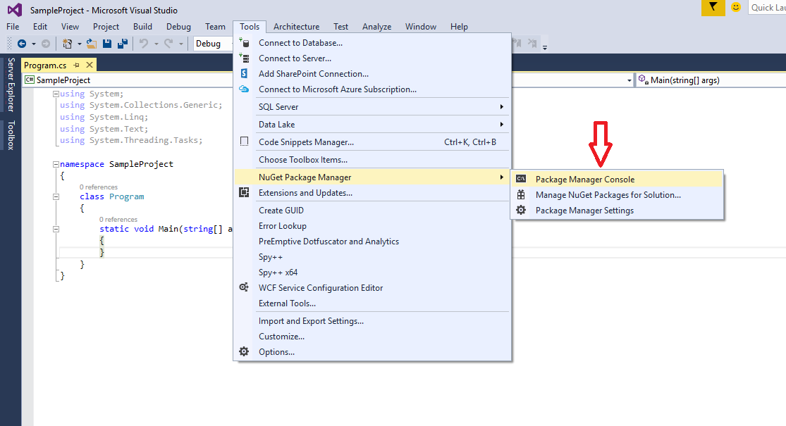

## **Installazione di Aspose.PSD per .NET tramite NuGet**
NuGet è il modo più semplice per scaricare e installare le API Aspose per .NET. Apri Microsoft Visual Studio e il gestore dei pacchetti NuGet. Cerca "aspose" per trovare l'API Aspose desiderata. Clicca su "Installa", l'API selezionata verrà scaricata e referenziata nel tuo progetto.

## **Installare o Aggiornare Aspose.PSD usando il Package Manager Console**
Puoi seguire i passaggi di seguito per referenziare l'API [Aspose.PSD](https://www.nuget.org/packages/Aspose.psd/) utilizzando la console del package manager:

1. Apri la soluzione/progetto in Visual Studio.
1. Seleziona Strumenti -> Gestione pacchetti NuGet -> Console del package manager dal menu per aprire la console del package manager.

Digita il comando “**Install-Package Aspose.Psd**” e premi Invio per installare l'ultima versione completa nel tuo programma. In alternativa, puoi aggiungere il suffisso "**-prerelease**" al comando per specificare che deve essere installata anche l'ultima versione che include correzioni.

Vedrai che appare la nota **"Installazione di Aspose.PSD"** in basso nella finestra indicando che il download è in corso. 

Una volta scaricato, vedrai i seguenti messaggi di conferma. Se non sei familiare con l'[EULA di Aspose](https://company.aspose.com/legal/eula), è una buona idea leggere la licenza referenziata nell'URL. 

Dovresti ora trovare che Aspose.PSD è stato aggiunto e referenziato con successo nel tuo programma.

Nella console del package manager, puoi anche utilizzare il comando “**Update-Package Aspose.Psd**” e premere Invio per verificare la presenza di aggiornamenti al pacchetto Aspose.Psd e installarli se presenti. Puoi anche aggiungere il suffisso "-prerelease" per aggiornare all'ultima versione.

## **Considerazioni durante l'esecuzione su un Ambiente di Server Condiviso**
Tutti i componenti Aspose .NET sono consigliati per funzionare con il set di autorizzazioni Full Trust. Questo perché i componenti Aspose .NET a volte devono accedere alle impostazioni del registro e ai file situati in posizioni diverse dalla directory virtuale ad es. per leggere i font ecc. Inoltre, i componenti Aspose.NET si basano su classi di sistema .NET di base, alcune delle quali richiedono anche l'autorizzazione Full Trust per funzionare in alcuni casi.

I fornitori di servizi Internet che ospitano più applicazioni di diverse aziende spesso impongono il livello di sicurezza Medium Trust. Nel caso di .NET 2.0, tale livello di sicurezza può impostare i seguenti vincoli che potrebbero influire sulla capacità di Aspose.PSD di funzionare correttamente.

- **RegistryPermission** non è disponibile. Ciò significa che non è possibile accedere al registro, cosa richiesta per enumerare i font installati durante il rendering dei documenti.
- **FileIOPermission** è limitato. Ciò significa che è possibile accedere solo ai file nella gerarchia della directory virtuale dell'applicazione. Questo potenzialmente significa che i font non possono essere letti durante l'esportazione.

Per le ragioni specificate sopra, è consigliato che Aspose.PSD funzioni con le autorizzazioni Full Trust. Potresti notare che alcune funzionalità della libreria funzioneranno eseguendo diverse attività in Medium trust mentre altre no (ad esempio il rendering) che potrebbero dipendere dalle chiamate all'elaborazione delle immagini GDI+.

## **Lavorare con le DLL di .NET Core installate tramite pacchetto MSI**

**Si prega di notare:** se utilizzi una dll .Net Standard installata tramite il pacchetto MSI, dovresti aggiungere le dipendenze necessarie per funzionare con la versione .Net Standard.

| **Screenshot delle dipendenze di Visual Studio** | **Frammento del file CsProj:** |
| :- | :- |
||<ItemGroup>

`    `<PackageReference Include="System.Drawing.Common" Version="4.5.1" />

`    `<PackageReference Include="System.Text.Encoding.CodePages" Version="4.5.0" />

</ItemGroup>|

## **Requisiti di Sistema**
### **Sistemi Operativi Supportati:**
- Microsoft Windows 2000 Professional e Server (SP2 consigliato)
- Microsoft Windows XP Professional e Home Edition
- Microsoft Windows 2003 Server
- Microsoft Windows Vista
- Microsoft Windows 2008 Server
- Microsoft Windows 2008 Server R2
- Microsoft Windows 7
- Microsoft Windows 8
- Microsoft Windows 10
- Microsoft Windows 11
### **Piattaforme Supportate:**
- Windows forms
- Web forms
- Visual Studio 2005
- Visual Studio 2008
- Visual Studio 2010
- Visual Studio 2012
- Visual Studio 2013
- Visual Studio 2015
- Visual Studio 2017
- Visual Studio 2019
- Visual Studio 2022

Aspose.PSD funziona sia per le versioni x86 che x64 dei sistemi operativi elencati sopra.
### **Framework Supportati:**
Aspose.PSD per .NET supporta il framework .NET come segue:

- Versione del framework .NET 2.0 o superiore
- .NET Standard 2.0
