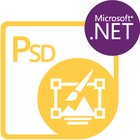

{} 

<iframe width="560" height="315" src="https://www.youtube.com/embed/B2Q3KOt4zQs?si=IMf0ZdirTw9BtPwe" title="Lettore video di YouTube" frameborder="0" allow="accelerometro; autoplay; clipboard-write; encrypted-media; giroscopio; picture-in-picture; web-share" referrerpolicy="strict-origin-when-cross-origin" allowfullscreen></iframe>

****

**Benvenuti in Aspose.PSD per Python via .NET**

Aspose.PSD per Python via .NET è un prodotto che consente una vasta manipolazione dei formati di file PSD e AI. Il prodotto non richiede l'installazione di Adobe Photoshop o Adobe Illustrator. Aspose.PSD per Python via .NET consente di modificare i file PSD, aggiornare le proprietà dei livelli, aggiungere filigrane, eseguire operazioni grafiche o convertire un formato di file in un altro. Supporta anche il formato AI e consente l'esportazione da AI ad altri formati supportati. Questo prodotto consente diversi scenari di automazione che aiutano gli sviluppatori nel loro percorso.

Attualmente Aspose.PSD per Python via .NET supporta i formati di file PSD e PSB per il caricamento e la manipolazione. Il formato Illustrator AI è supportato ma al momento sono disponibili solo le funzionalità di esportazione. Le future versioni permetteranno la manipolazione con il formato AI. Aspose.PSD per Python via .NET consente di esportare in vari formati di file raster come TIFF, JPEG, JPEG2000, PNG, GIF, BMP e saranno aggiunti ulteriori formati di file supportati per l'esportazione. Il prodotto utilizza algoritmi che permettono di modificare i file PSD in modo efficiente e mantenere alte prestazioni. Il prodotto è in continua evoluzione e molte utili funzionalità saranno aggiunte per supportare le esigenze del mercato. Ora l'API di manipolazione PSD è disponibile per Python.

{} 

## **Risorse Aspose.PSD per Python via .NET**

Di seguito sono riportati i link ad alcune risorse utili che potrebbero essere necessarie per completare i tuoi compiti.

- [Documentazione online di Aspose.PSD per Python via .NET](/psd/it/python-net/)
- [Funzionalità di Aspose.PSD per Python via .NET](/psd/it/python-net/features/)
- [Note sulla versione di Aspose.PSD per Python via .NET](/psd/it/python-net/release-notes/)
- [Pagina del prodotto Aspose.PSD per Python via .NET](https://products.aspose.com/psd/python-net)
- [Installa il pacchetto NuGet di Aspose.PSD per Python via .NET](https://pypi.org/project/aspose-psd/)
- [Guida di riferimento dell'API di Aspose.PSD per Python via .NET](https://reference.aspose.com/psd/python-net)
- [Scarica gli esempi nel repository GitHub](https://github.com/aspose-psd/Aspose.PSD-for-Python-Net)
- [Forum di supporto gratuito di Aspose.PSD per Python via .NET](https://forum.aspose.com/c/psd)
- [Servizio di assistenza a pagamento di Aspose.PSD per Python via .NET](https://helpdesk.aspose.com/)

